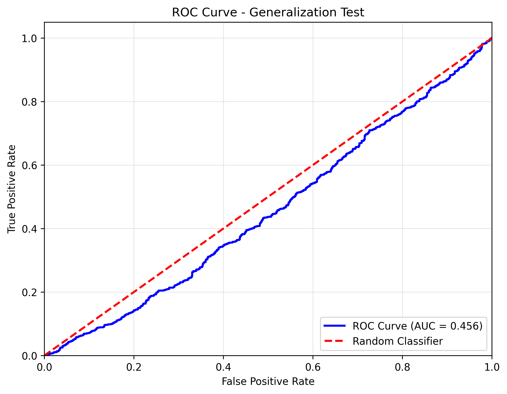
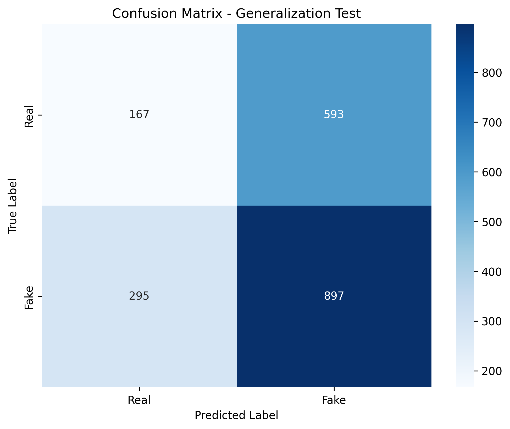
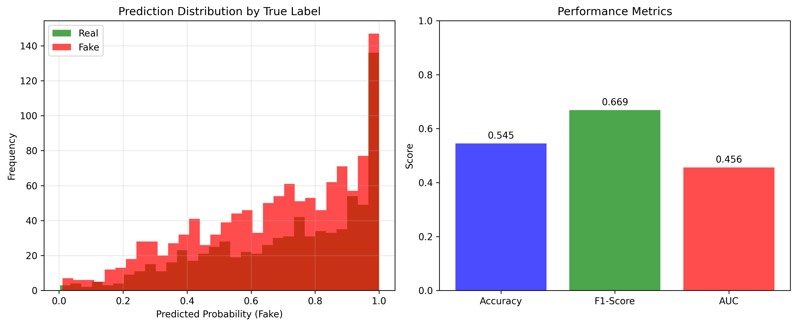

# Deepfake Detection Model Generalization Test Report

**Generated on**: 2025-10-11 17:35:12
**Model**: tf_efficientnetv2_b0
**Model Path**: experiments/epoch_5_20251005_152356_0085d119/checkpoints/best_model.pth
**Dataset**: Deepfake-Eval-2024
**Device**: cuda

## Executive Summary

### Key Performance Metrics
- **Accuracy**: 0.5451 (54.51%)
- **F1-Score**: 0.6689
- **AUC-ROC**: 0.4561
- **Precision**: 0.0000
- **Recall**: 0.0000

### Dataset Information
- **Total Samples**: 1975
- **Real Samples**: 767
- **Fake Samples**: 1208
- **Image Formats**: .jpg, .webp, .png, .jpeg, 

### Performance Analysis
- **Correct Predictions**: 1064/1952
- **False Positives**: 593 (Real incorrectly classified as Fake)
- **False Negatives**: 295 (Fake incorrectly classified as Real)

### Confusion Matrix
|              | Predicted Real | Predicted Fake |
|--------------|----------------|----------------|
| Actual Real  |            167 |            593 |
| Actual Fake  |            295 |            897 |

### Processing Performance
- **Average Time per Batch**: 1.892 seconds
- **Throughput**: 33.3 samples/second
- **Average Time per Sample**: 59.1 ms

### Generalization Assessment
**Overall Assessment**: Poor generalization ability
**AUC Interpretation**: The model achieves 0.456 AUC on unseen real-world data.

### Recommendations

❌ **Limited Generalization**: Model struggles with real-world data.
🚨 **Stage 01 Recommended**: Feature learning improvements are needed.
🚨 **Architecture Review**: Consider model architecture changes.

### Visualizations

#### Roc Curve

#### Confusion Matrix

#### Prediction Distribution

