# Introduction

Deepfakes pose growing risks to trust, safety, and platform integrity.
Synthetic face-swap videos and images, powered by increasingly
accessible generative models, are now routinely weaponized for
harassment, disinformation, financial fraud, and non-consensual intimate
content. Recent incidents highlight the real-world consequences:
politically motivated deepfakes have influenced elections ([Chandra et
al.]{.nocase} 2025), celebrity deepfakes have enabled large-scale scams,
and synthetic identity fraud has cost financial institutions millions.
Unlike traditional image manipulations, modern deepfakes---generated by
GANs, diffusion models, or advanced reenactment systems---can achieve
photorealistic quality that fools both human observers and naive
automated detectors.

At the same time, media consumption has shifted dramatically toward
mobile devices. Mobile phones account for over 60% of internet traffic
globally, with platforms like TikTok, Instagram, and WhatsApp serving
billions of users primarily through mobile apps. Consequently, practical
deepfake countermeasures must operate robustly and efficiently on
resource-constrained phones and tablets, often under limited
connectivity and strict privacy requirements. In many
deployments---especially in privacy-conscious regions or for offline
tools---media never leaves the device and only aggregate detection
signals are logged. This on-device constraint eliminates server-side
processing as a fallback and requires models to be simultaneously
accurate, compact, and fast.

Mobile platforms therefore face a fundamental tension between strong
detection accuracy and acceptable user experience. Models must achieve
high recall (low false negative rates) to prevent harmful content from
evading detection, yet they must also be small enough to fit within app
size budgets and fast enough to avoid noticeable latency or excessive
battery drain. Under distribution shift---when encountering manipulation
methods, compression pipelines, or content types absent from training
data---detectors must maintain robustness without escalating to
expensive fallback models for every sample. We target this on-device
deployment setting and focus on three primary challenges:
(i) cross-dataset generalization in the wild, (ii) low latency and small
footprint on commodity hardware, and (iii) strict control of false
negatives (missed fakes) under operational compute budgets.

From a modeling perspective, recent detectors increasingly adopt
Transformer or hybrid CNN-ViT architectures that improve accuracy but
raise compute and memory costs, complicating mobile
deployment ([Dosovitskiy et al.]{.nocase} 2021; Liu et al. 2021). At the
same time, cross-dataset evaluations consistently report notable
performance drops from curated benchmarks such as FaceForensics++ and
CelebDF-v2 to in-the-wild media (cross-dataset gap) (Rossler et al.
2019; Li et al. 2020; Zi et al. 2021; Pei et al. 2024). This gap is
further exposed by newer benchmarks such as Deepfake-Eval-2024, which
aggregate manipulated content from diverse websites and languages under
heterogeneous compression and editing pipelines. For practitioners
operating platforms, the central question is not only "What AUC can this
model reach on a held-out test set?" but "How often will a malicious
fake slip through under realistic load and latency constraints?" In
other words, the risk of missed fakes and the compute budget per sample
must be explicitly modeled.

Several strands of prior work are relevant to this goal.
Deepfake-specific detectors explore spatial, frequency, and
physiological cues (Pei et al. 2024; Durall et al. 2020; Qian et al.
2020), while lightweight vision models such as MobileNet and
EfficientNet families target efficient inference on ARM-class
hardware ([Howard et al.]{.nocase} 2024; Tan and Le 2021; Zhang et al.
2018; Ma et al. 2018). Separately, early-exit networks and cascaded
systems (Teerapittayanon et al. 2017; Huang et al. 2018; Kaya et al.
2019) show how to trade compute for accuracy by routing easy samples to
shallow branches. However, existing deepfake work rarely combines these
ingredients into an end-to-end, auditable system that is (i) trained
across multiple datasets, (ii) tuned with explicit risk and cost
metrics, and (iii) packaged as a reproducible mobile deployment
template. Most studies either evaluate a single heavy detector on
server-class GPUs or treat mobile optimization as a brief
post-processing step.

In this work we adopt a system-level perspective and design a cascaded
detector tailored for on-device deployment. Our goal is to expose
explicit knobs over recall, escalation rate, and compute while keeping
the training and evaluation pipeline reproducible from raw manifests to
mobile artifacts. Against this backdrop, we ask:

- *How can we design a deepfake detector that provides high recall under
  distribution shift while remaining deployable on resource-constrained
  mobile devices?*

- *Can a cascaded architecture with explicit thresholds offer
  interpretable trade-offs between compute and risk, without sacrificing
  reproducibility?*

- *What minimal set of scripts and artifacts is needed so that
  practitioners can audit, reproduce, and extend the full pipeline?*

- *How should we evaluate and report robustness---for example under
  compression, noise, and blur---and cross-dataset generalization in a
  way that directly informs deployment decisions?*

Existing works on mobile vision and early exits provide building blocks
(lightweight backbones, quantization, cascades), but rarely integrate
them into an end-to-end, auditable system tailored to deepfake detection
with multi-dataset training and out-of-distribution (OOD) evaluation.

#### Contributions.

We design **MobileDeepfake**, a cascaded detection system engineered for
mobile deployment and rigorous evaluation. Our contributions are:

- **A cost-aware, two-stage cascade with explicit risk controls.** A
  lightweight MobileNetV4 Stage 1 acts as a fast filter; ambiguous
  samples are escalated to an EfficientNetV2 expert (Stage 2), with an
  optional Stage 3 LightGBM meta-model. We define Stage 1 leakage (the
  fraction of fakes incorrectly accepted at Stage 1) and Stage 2
  escalation rate as primary system metrics, and use a simple
  two-threshold routing scheme coupled with a cost-sensitive grid search
  (formalised in
  Section [5.1](#sec:problem_formulation){reference-type="ref"
  reference="sec:problem_formulation"}) to expose interpretable
  trade-offs between false negative rate (FNR) and compute.

- **Multi-dataset training and cross-dataset evaluation, including
  Deepfake-Eval-2024.** We train on four academic datasets and hold out
  Deepfake-Eval-2024 for OOD validation and test, quantifying
  performance gaps and highlighting practical failure modes under
  in-the-wild distribution shift. Our experiments report both
  single-model baselines and cascaded results, with calibrated
  vs. uncalibrated comparisons when transferring thresholds across
  datasets.

- **An end-to-end, scriptable pipeline with hard-example mining,
  calibration, and robustness analysis.** The system includes data
  preprocessing, manifest generation, hard-sample mining, expert
  training, meta-model fitting, and threshold tuning, with scripts that
  generate the tables and figures used in this paper. Robustness sweeps
  over common corruptions (JPEG compression, noise, blur, brightness)
  and a Deepfake-Eval-2024 evaluation stage are integrated into the same
  pipeline.

- **A mobile-oriented export and integration template.** We provide a
  mobile optimization stage that applies quantization and knowledge
  distillation to shrink models, and a deployment stage that exports
  compact TorchScript artifacts (and ONNX bundles when needed) together
  with thresholds/temperature in a metadata file suitable for Android
  integration. While our focus is on methodology rather than a new
  backbone, the implementation illustrates how to turn deepfake research
  pipelines into deployable, auditable systems.

Concretely, MobileDeepfake follows a train  tune  deploy workflow across
six stages. The core online inference in our final system is a two-stage
cascade: Stage 1 trains a lightweight MobileNetV4 filter for fast
screening; Stage 2 builds an EfficientNetV2 expert and produces
per-sample logits/features. Stage 3 optionally fits a LightGBM
meta-model on K-fold meta-datasets to study fusion but is not part of
the default deployment. Stage 4 grid-searches routing thresholds to
minimize false negatives under an escalation-rate budget and logs
Stage 1 leakage alongside Stage 2 usage. Stage 5 conducts cross-dataset
and robustness evaluation (including Deepfake-Eval-2024), and Stage 6
exports quantized artifacts for on-device integration.

We focus on deployability rather than proposing a new backbone: the
contribution is a practical, auditable methodology that couples a
two-stage cascade with explicit threshold controls, calibration,
robustness analysis, and a mobile export path. We do explore stronger
hybrid CNN-Transformer experts such as GenConViT in our Stage 2
ensemble, but find that they offer limited and unstable gains relative
to EfficientNetV2-B3 under our constraints, so we relegate them to an
appendix and base the default cascade on MobileNetV4 + EfficientNetV2.
Subsequent sections detail the datasets and task, the cascaded method
and optimization objectives, the experimental setup, and empirical
results on in-distribution and out-of-distribution data, followed by a
discussion of limitations and deployment considerations.

# Background

Deepfake detection research spans spatial, frequency, temporal, and
multimodal cues, as well as dataset curation and evaluation protocols.
Recent comprehensive surveys (Verdoliva 2020; Pei et al. 2024; Chen et
al. 2024) highlight two persistent gaps that motivate our work:
(i) detectors that perform well on curated benchmarks often degrade
sharply under distribution shift, and (ii) most evaluations assume
server-class hardware rather than mobile devices. These gaps underscore
the need for system designs that treat cross-dataset generalization and
mobile constraints as first-class objectives rather than afterthoughts.

#### Deepfake Detection as a Problem Space.

Deepfake detection is fundamentally a binary classification task: given
an image or video frame, determine whether it depicts a real or
synthetically manipulated face. The challenge lies in the diversity of
manipulation techniques (face swapping, reenactment, attribute editing,
full synthesis) and the variability of real-world conditions
(compression artifacts, lighting, camera sensors, post-processing).
Early approaches relied on handcrafted forensic features such as head
pose inconsistencies (Yang et al. 2019), eye blinking patterns, or JPEG
compression artifacts (Cozzolino et al. 2019). Modern methods leverage
deep learning to extract hierarchical representations directly from
pixels or frequency spectra, achieving high accuracy on in-distribution
benchmarks (Rossler et al. 2019; Dolhansky et al. 2020; Li et al. 2020).

However, cross-dataset generalization remains elusive: models trained on
FaceForensics++ or CelebDF can exhibit AUC drops of 20--30% when
evaluated on in-the-wild datasets like WildDeepfake (Zi et al. 2021) or
Deepfake-Eval-2024 ([Chandra et al.]{.nocase} 2025). This performance
gap stems from dataset bias (e.g., training sets overrepresent specific
generators or compression settings), domain shift (e.g., social media
platforms apply proprietary compression pipelines), and the rapid
evolution of synthesis methods. Addressing these gaps requires
multi-dataset training protocols that expose models to diverse
artifacts, as well as rigorous cross-dataset and out-of-distribution
(OOD) evaluation protocols that measure robustness beyond
in-distribution accuracy.

#### Mobile Deployment Constraints.

Most deepfake detection research assumes unlimited computational
resources---models are evaluated on server GPUs with batch sizes and
latencies that are impractical for on-device inference. Yet many
real-world applications (e.g., live video verification, client-side
content moderation, edge forensics) require deployment on commodity
smartphones or embedded devices with constrained memory, power budgets,
and thermal envelopes. Mobile deployment introduces additional
challenges: (i) model size must fit within typical app bundles
(50--100 MB), (ii) per-frame latency must support real-time or
near-real-time inference (e.g., \<200 ms), and (iii) energy consumption
must preserve battery life across extended usage. These constraints
motivate the use of lightweight architectures, model compression
techniques, and adaptive inference strategies that balance accuracy and
efficiency.

#### Core Detection Approaches.

Modern deepfake detectors primarily use convolutional neural networks
(CNNs) or vision transformers (ViTs) as feature extractors. CNN-based
approaches (Rossler et al. 2019; Tan and Le 2019; Tan and Le 2021)
leverage hierarchical convolutional layers to capture spatial artifacts
such as blending boundaries, facial inconsistencies, and generative
noise patterns. The MobileNet ([Howard et al.]{.nocase} 2017, 2019;
Sandler et al. 2018; [Howard et al.]{.nocase} 2024) and
EfficientNet (Tan and Le 2019; Tan and Le 2021) families exemplify
architectures optimized for mobile and resource-constrained settings
through depthwise separable convolutions and compound scaling.

Frequency-domain methods (Durall et al. 2020; Qian et al. 2020; Luo et
al. 2024) exploit the observation that GAN-generated images often
exhibit distinctive patterns in their Fourier or DCT spectra, providing
complementary cues that survive spatial-domain compression. Recent work
demonstrates that combining spatial and frequency features improves
robustness to JPEG compression and other post-processing
operations (Wang et al. 2022; **zhang2024frequency_dcT?**).

Vision transformers ([Dosovitskiy et al.]{.nocase} 2021; Liu et al.
2021) offer global receptive fields that can capture long-range
dependencies and subtle manipulation cues across entire frames. Hybrid
CNN-Transformer architectures (Coccomini et al. 2022; Khan and
Dang-Nguyen 2022; [Heo and contributors]{.nocase} 2024) aim to combine
the inductive biases of CNNs (e.g., translation equivariance) with the
modeling capacity of transformers, though at the cost of increased
computational complexity.

Temporal modeling via 3D CNNs (Tran et al. 2015; Carreira and Zisserman
2017), LSTMs (Zhao et al. 2022; Li et al. 2022), or video
transformers (Bertasius et al. 2021) extends frame-level detection to
video sequences, enabling the use of inter-frame consistency and motion
artifacts as additional forensic signals. However, temporal approaches
typically require multi-frame context windows and are challenging to
deploy on mobile devices due to memory and latency constraints.

#### Model Compression and Efficiency.

To bridge the gap between research models and deployable systems,
practitioners rely on three primary compression techniques:

- **Pruning** (Han et al. 2015, 2016; Blalock et al. 2020): Removing
  redundant weights or channels to reduce model size and FLOPs.
  Structured pruning (removing entire filters) offers better hardware
  efficiency than unstructured (weight-level) pruning.

- **Quantization** (Jacob et al. 2017; Esser et al. 2020; Gholami et al.
  2021): Representing weights and activations with lower-precision data
  types (e.g., INT8 instead of FP32). Post-training quantization (PTQ)
  is fast but limited to 8-bit precision, while quantization-aware
  training (QAT) enables more aggressive compression (e.g., INT4) at the
  cost of retraining.

- **Knowledge distillation** (Hinton et al. 2015; Romero et al. 2015;
  Gou et al. 2021): Transferring knowledge from a large teacher model to
  a compact student model by matching soft probability distributions or
  intermediate feature representations.

Modern deep learning frameworks (PyTorch, TensorFlow, ONNX Runtime)
provide end-to-end toolchains for converting research models into
mobile-optimized INT8 variants and exporting them to Android (via ONNX,
TFLite) or iOS (via CoreML) runtimes.

#### Cascade and Adaptive Inference.

Cascade systems and early-exit networks (Teerapittayanon et al. 2017;
Huang et al. 2018; Han et al. 2024) offer an alternative efficiency
strategy: route easy samples through lightweight classifiers and
escalate hard ones to more expensive experts. Classical examples include
Viola-Jones face detection (Viola and Jones 2001), which uses a cascade
of progressively complex classifiers to reject non-faces early. In deep
learning, BranchyNet (Teerapittayanon et al. 2017) attaches shallow
classifiers to intermediate layers, enabling early termination for
confident predictions. Recent work on adaptive computation time
(ACT) (Graves 2016) and dynamic depth networks (Wang et al. 2018) learns
input-dependent routing policies.

However, most cascade work focuses on maximizing accuracy or minimizing
FLOPs on fixed test distributions, without exposing interpretable
operational metrics (e.g., escalation rate, Stage 1 leakage rate) that
platform operators need to tune cost--quality trade-offs. Furthermore,
cascade detectors for deepfake detection remain rare in the literature,
and seldom report performance under distribution shift.

#### Calibration and Distribution Shift.

Confidence calibration via temperature scaling (Guo et al. 2017;
Minderer et al. 2021) aligns predicted probabilities with empirical
frequencies, improving reliability diagrams and expected calibration
error (ECE). Well-calibrated models are particularly valuable for
cascade routing: thresholds set on calibrated probabilities better
reflect true uncertainty and generalize more robustly to OOD data.
However, calibration alone does not eliminate performance gaps under
domain shift (Pei et al. 2024); a well-calibrated model with 75%
accuracy on one distribution may still exhibit poor calibration if its
true accuracy on another distribution is 60%. Addressing cross-dataset
gaps fundamentally requires domain adaptation techniques (Ganin and
Lempitsky 2016; Li et al. 2021; Liu et al. 2025), diverse training data,
and transparent reporting of OOD performance.

#### Our Approach.

Given these challenges, we propose a two-stage cascade system for mobile
deepfake detection that explicitly optimizes for both detection quality
and deployment efficiency. Our Stage 1 filter uses MobileNetV4 ([Howard
et al.]{.nocase} 2024)---a lightweight CNN optimized for mobile
hardware---to perform fast frame-level screening. Samples with highly
confident Stage 1 predictions (very likely real or very likely fake)
receive immediate labels, while ambiguous cases escalate to a Stage 2
expert (EfficientNetV2-B3 (Tan and Le 2021) or optional GenConViT ([Heo
and contributors]{.nocase} 2024)) for high-fidelity classification. We
formulate threshold selection as a cost-sensitive optimization problem:
minimize false negative rate (FNR) subject to a bounded Stage 2
escalation budget, exposing interpretable trade-offs between recall and
compute cost.

We train both stages on a combined multi-dataset manifest (CelebDF-v2,
FaceForensics++, DFDC, DeeperForensics-1.0) to promote cross-dataset
generalization, experiment with hard example mining to focus Stage 2
capacity on cases where Stage 1 is uncertain, and validate the cascade
on the in-the-wild Deepfake-Eval-2024 benchmark ([Chandra et
al.]{.nocase} 2025) to measure OOD performance. In our main results and
public training script, we use the simpler standard configuration with
uniform sampling and treat hard-example mining as an ablation. For
mobile deployment, we apply post-training quantization (INT8) and export
calibrated ONNX models with fixed thresholds, achieving sub-200 ms
latency on a Xiaomi 13 smartphone (Snapdragon 8 Gen 2).

The remainder of this paper proceeds as follows: Section 3 surveys
related work in detail, positioning our contributions within the broader
landscape of deepfake detection, cascade architectures, and mobile
deployment. Section 4 describes our datasets and task formulation.
Section 5 presents our six-stage methodology, including formal problem
definitions, cascade optimization, and hard example mining. Sections 6
and 7 detail experimental setup and results on in-distribution
validation and OOD benchmarks. Section 8 reports ablation studies, and
Section 9 discusses mobile deployment specifics (ONNX export, on-device
latency, accuracy). Finally, Section 10 discusses limitations and future
work, and Section 11 concludes.

# Related Work

## Detection Architectures {#detection-architectures .unnumbered}

### CNN-Based Approaches {#cnn-based-approaches .unnumbered}

On early deepfake benchmarks such as FaceForensics++ and DFDC,
Xception-based CNNs became de facto baselines (Rossler et al. 2019;
Dolhansky et al. 2020; Li et al. 2020). EfficientNet (Tan and Le 2019)
and its successor EfficientNetV2 (Tan and Le 2021) achieved strong
performance through compound scaling that optimizes depth, width, and
resolution jointly. Recent studies (Zhao et al. 2022; Liu et al. 2024)
demonstrate that even lightweight architectures like MobileNetV3 (Howard
et al. 2019) can achieve competitive detection accuracy when properly
fine-tuned. ResNet-family models (He et al. 2016), including ResNeXt
variants, have been widely adopted for spatial feature extraction in
deepfake detection (**chandra2024dfeval?**). Informed by these CNN
architectures and mobile efficiency considerations, we adopt MobileNetV4
for our Stage 1 filter and EfficientNetV2 for our Stage 2 expert,
balancing detection accuracy with on-device latency constraints.

### Frequency-Domain Methods {#frequency-domain-methods .unnumbered}

Frequency analysis has emerged as a powerful approach for detecting
deepfake artifacts that survive spatial-domain compression. Durall et
al. (Durall et al. 2020) demonstrated that GAN-generated images exhibit
distinctive frequency patterns in their spectral distributions. Qian et
al. (Qian et al. 2020) proposed adaptive frequency filtering to
emphasize manipulation cues in the frequency domain. More recent
work (Luo et al. 2024; **zhang2024frequency_dcT?**) leverages Discrete
Cosine Transform (DCT) and Fast Fourier Transform (FFT) to extract
high-frequency artifacts as forensic fingerprints. FreqNet (Luo et al.
2024), introduced at AAAI 2024, applies convolutional layers to both
phase and amplitude spectra between FFT and inverse FFT operations,
achieving state-of-the-art generalization (+9.8% improvement) across 17
GANs. Studies using Discrete Fourier Transform (Jabłoński et al. 2024)
report classification accuracies exceeding 99% when frequency-domain
features are combined with traditional ML classifiers. Wang et al. (Wang
et al. 2022) proposed Adaptive Frequency learning (AFD) that dynamically
adjusts frequency emphasis during training to improve robustness under
compression. While we focus on spatial-domain CNN architectures for
simplicity and inference speed, frequency-domain extensions remain
compatible with our cascade framework and could provide complementary
robustness under post-processing.

### Vision Transformers and Hybrid Architectures {#vision-transformers-and-hybrid-architectures .unnumbered}

Vision Transformers (ViTs) have recently been adapted to deepfake
detection with promising results. Vanilla ViT ([Dosovitskiy et
al.]{.nocase} 2021) and hierarchical variants such as Swin
Transformer (Liu et al. 2021) provide global receptive fields that can
capture subtle manipulation artifacts across the entire image. A
comprehensive 2024 survey (S. A. Khan et al. 2024) categorizes 14
ViT-based deepfake detection models into standalone, sequential (e.g.,
MARLIN, ISTVT), and parallel (e.g., M2TR) architectures. UIA-ViT (Zhang
et al. 2022) achieved 99.33% AUC on FaceForensics++ by incorporating
uncertainty-informed attention mechanisms.

Hybrid CNN-Transformer architectures combine the inductive biases of
CNNs with the global modeling capacity of transformers. Coccomini et
al. (Coccomini et al. 2022) combined EfficientNet and vision
transformers for video deepfake detection in 2022, while Khan and
Dang-Nguyen (Khan and Dang-Nguyen 2022) proposed a Hybrid Transformer
Network that fuses convolutional features with transformer encodings.
GenConViT ([Heo and contributors]{.nocase} 2024), which we explore in
our Stage 2 expert ensemble, represents a generative convolutional
vision transformer that operates in dual modes (hybrid and pretrained).
Under our multi-dataset training and mobile deployment constraints,
GenConViT matched but did not consistently surpass EfficientNetV2-B3 and
exhibited higher training instability, so we treat it as an exploratory
component summarised in the appendix rather than part of the default
deployed cascade. CoAtNet-based ensembles (Naz et al. 2023) leverage
self-attention mechanisms in bagging frameworks for manipulated face
detection. Das et al. (Das et al. 2023) introduced masked autoencoding
with spatiotemporal transformers for enhanced video forgery detection.

### Attention Mechanisms and Multi-Scale Analysis {#attention-mechanisms-and-multi-scale-analysis .unnumbered}

Attention mechanisms have proven effective in focusing on manipulation
artifacts. Multi-attention networks (Zhao et al. 2025) combining
region-independent loss and attention-guided data augmentation achieved
state-of-the-art performance across multiple datasets. ReLAF-Net (J.
Wang et al. 2024) employs restricted self-attention on deep CNN features
to learn both fine-grained local relationships and global dependencies.
MobileNetV3 augmented with self-attention layers (A. Khan et al. 2024)
demonstrated that lightweight architectures can benefit significantly
from attention mechanisms while maintaining deployment efficiency.
Spatiotemporal attention mechanisms (Zhang, H. Liu, et al. 2024; Li et
al. 2022) have been integrated with ConvLSTM to capture and enhance
frame-to-frame correlations in video sequences.

### Temporal and Video-Level Detection {#temporal-and-video-level-detection .unnumbered}

Beyond spatial architectures, temporal modeling helps handle partial
manipulations and contextual cues in video (Zi et al. 2021; Saha et al.
2023). 3D CNNs (Tran et al. 2015) extend 2D convolutional filters to
spatiotemporal dimensions, enabling direct learning from video clips.
The I3D (Inflated 3D) model (Carreira and Zisserman 2017) modifies 2D
Inception networks by inflating convolutional and pooling kernels to 3D.
Hybrid CNN-LSTM architectures (Zhao et al. 2022; Zhou et al. 2025) use
CNNs for spatial feature extraction at the frame level, then feed
sequential features into LSTMs for temporal modeling. Xception-LSTM with
ConvLSTM (Li et al. 2022) incorporates spatiotemporal attention before
dimension reduction to preserve frame structure information.
EfficientNet-Bi-LSTM (Y. Wang et al. 2024) and similar approaches
extract spatial information via EfficientNet and acquire temporal
information through bidirectional LSTMs. TimeSformer (Bertasius et al.
2021) and other video transformers provide pure transformer-based
alternatives for spatiotemporal reasoning.

Parameter-efficient adapters (e.g., DeepFake-Adapter (Shao et al. 2023))
further improve transfer to in-the-wild data by tuning small sets of
adapter parameters on top of a frozen backbone, reducing computational
cost while maintaining generalization. Other lines exploit physiological
signals (e.g., eye blinking (Yang et al. 2019), head motion) and camera
fingerprints (Cozzolino et al. 2019), but typically rely on specialized
preprocessing pipelines. In this work we focus on frame-level
classification for reproducibility and mobile latency, using generic
image backbones (MobileNetV4 and EfficientNetV2) and optional GenConViT
experts. Our pipeline remains compatible with temporal post-processing
when budgets allow, but deliberately keeps the core inference path
simple enough for on-device deployment.

## Lightweight Models and Compression {#lightweight-models-and-compression .unnumbered}

### Efficient Architecture Design {#efficient-architecture-design .unnumbered}

Mobile vision emphasizes efficient backbones tailored to on-device
constraints. The MobileNet family ([Howard et al.]{.nocase} 2017, 2019;
Sandler et al. 2018) pioneered depthwise separable convolutions to
reduce computational cost while maintaining accuracy.
MobileNetV3 (Howard et al. 2019) incorporated hardware-aware NAS and
squeeze-and-excitation modules to optimize for mobile CPUs and GPUs. The
latest MobileNetV4 ([Howard et al.]{.nocase} 2024) further scales up
mobile CNNs with hybrid architectures and improved training recipes.
EfficientNet (Tan and Le 2019) and its successor EfficientNetV2 (Tan and
Le 2021) deliver strong accuracy under tight FLOPs budgets through
compound scaling that jointly optimizes network depth, width, and
resolution. ShuffleNet (Zhang et al. 2018; Ma et al. 2018) and
SqueezeNet (Iandola et al. 2016) provide alternative efficient designs
that prioritize inference speed on resource-constrained devices.

Hardware-aware neural architecture search (NAS) (Tan et al. 2019) and
once-for-all training (Cai et al. 2020) enable per-device specialization
from a single supernet, allowing practitioners to extract
task-and-device-specific sub-networks without retraining from scratch.
Recent real-time deepfake detection systems (Lanzino et al. 2024; Liu et
al. 2024) demonstrate that lightweight models such as MobileNetV3 and
binary neural networks can achieve competitive performance when combined
with attention mechanisms and proper fine-tuning strategies.

### Model Compression Techniques {#model-compression-techniques .unnumbered}

Pruning and sparsity methods reduce model size by removing redundant
weights and connections. Structured pruning removes entire channels or
filters, while unstructured pruning targets individual weights (Blalock
et al. 2020). Han et al. (Han et al. 2015, 2016) demonstrated that deep
networks can be compressed by 10-50× through iterative pruning,
quantization, and Huffman coding. The Lottery Ticket Hypothesis (Frankle
and Carbin 2019) suggests that dense networks contain sparse
sub-networks that can achieve comparable accuracy when trained from the
right initialization. Recent surveys (Blalock et al. 2020) provide
comprehensive comparisons of pruning methods and their impact on
inference efficiency.

Knowledge distillation (Hinton et al. 2015) transfers knowledge from a
large teacher model to a compact student model by matching soft
probability distributions or intermediate feature representations.
FitNets (Romero et al. 2015) extend this idea by matching hint layers at
intermediate depths, while Born-Again Networks (Furlanello et al. 2018)
apply multi-generation distillation where students can outperform
teachers. Recent surveys (Gou et al. 2021) synthesize these trends and
highlight that distillation is particularly effective when combined with
pruning and quantization. Studies on knowledge distillation for edge
deployment (Zhao et al. 2023; Liu et al. 2023) demonstrate that
distilled models can achieve 70% compression with minimal accuracy
degradation, making them suitable for fog/edge devices in applications
like automatic disease diagnosis and on-device deepfake detection.

### Quantization for Mobile Deployment {#quantization-for-mobile-deployment .unnumbered}

Quantization has become a central lever for efficient inference,
reducing both model size and computational cost by representing weights
and activations with lower-precision data types. Post-training
quantization (PTQ) (Jacob et al. 2017; Esser et al. 2020) converts
trained FP32 models to INT8 or lower bitwidths without retraining,
offering a fast and lightweight approach to compression.
Quantization-aware training (QAT) (Esser et al. 2020; Wang et al. 2019)
simulates quantization during training, enabling lower bitwidths (e.g.,
INT4) with competitive accuracy but requiring access to training data
and greater computational expense. A 2021 white paper (Gholami et al.
2021) provides a comprehensive survey of quantization methods,
highlighting that PTQ is sufficient for 8-bit quantization with
near-FP32 accuracy, while QAT enables aggressive sub-8-bit compression.

Mixed-precision and per-channel quantization schemes (Wang et al. 2019;
Esser et al. 2020) provide competitive accuracy at low bitwidths by
allowing different layers or channels to use different quantization
scales. Recent work on quantizing large language models (Frantar et al.
2023; Yao et al. 2022) and vision transformers demonstrates that
quantization remains effective even for modern architectures. For
deepfake detection, quantization enables deployment on commodity mobile
devices with minimal accuracy loss, and modern deep learning frameworks
provide end-to-end toolchains for converting research models into
compact INT8 variants and exporting them to mobile platforms.

Our Stage 1 uses MobileNetV4 as a fast filter, and Stage 2 adopts
EfficientNetV2 and optional GenConViT experts (Tan and Le 2021; [Heo and
contributors]{.nocase} 2024). Stage 4 builds on QAT + knowledge
distillation in a teacher--student setup and compares FP32 vs. INT8
models in terms of accuracy, size, and latency, while Stage 6 exports
TorchScript and ONNX artifacts suitable for mobile integration. We
emphasize measurable footprint and latency on device: model size,
on-device escalation rate, and duty cycle jointly determine energy and
user experience, so we report escalation alongside accuracy when
comparing options.

## Cascade and Adaptive Inference {#cascade-and-adaptive-inference .unnumbered}

### Early-Exit Networks and Dynamic Depth {#early-exit-networks-and-dynamic-depth .unnumbered}

Early-exit and cascaded systems trade accuracy for efficiency by routing
easy samples to fast exits and escalating hard ones.
BranchyNet (Teerapittayanon et al. 2017) pioneered this approach by
attaching shallow classifiers to intermediate layers of deep networks,
enabling early termination for confident predictions. Multi-Scale Dense
Networks (MSDNet) (Huang et al. 2018) extend this idea by learning
feature representations at multiple scales, allowing classifiers at
different depths to leverage complementary information. Shallow-Deep
Networks (Kaya et al. 2019) address network overthinking by identifying
when deeper layers degrade performance on easy samples.

A comprehensive 2024 survey on early-exit deep neural networks (Han et
al. 2024) categorizes methods into static (BranchyNet, MSDNet) and
adaptive (ACT, SkipNet) approaches. Adaptive Computation Time
(ACT) (Graves 2016) for RNNs and SkipNet (Wang et al. 2018) for CNNs
learn dynamic routing policies that adapt network depth to input
complexity. Recent work on window-based early-exit cascades (Xia and
Bouganis 2023) incorporates uncertainty estimation for improved
reliability. QuickNets (Han et al. 2022) introduced a novel cascaded
training algorithm where each successive layer is trained only on
samples misclassified by previous layers, preventing overconfidence and
improving calibration.

### Routing Policies and Threshold Selection {#routing-policies-and-threshold-selection .unnumbered}

Confidence-, entropy-, and margin-based routing are common strategies
for determining when to exit early. Hendrycks and Gimpel (Hendrycks and
Gimpel 2017) established maximum softmax probability as a simple
baseline for detecting misclassified examples and out-of-distribution
samples. Cost-sensitive learning frameworks (Elkan 2001) formalize the
trade-off between classification errors and computational costs,
enabling threshold selection that minimizes expected cost rather than
maximizing accuracy alone. Recent work increasingly frames threshold
selection as a multi-objective optimization problem that balances error
rates (false positives, false negatives) against compute budgets (FLOPs,
latency, energy) (Laskaridis, Venieris, Kim, et al. 2020; Laskaridis,
Venieris, Almeida, et al. 2020).

Cascaded systems for object detection (Viola and Jones 2001) and
classification have been deployed successfully in production
environments, but typically employ hand-tuned thresholds rather than
learned policies. Bayesian optimization (Snoek et al. 2012) and grid
search remain popular for threshold tuning when the search space is
small. For multi-stage systems, joint optimization of all thresholds is
often intractable, motivating greedy stage-wise tuning or heuristic
policies.

### Cascades in Deepfake Detection {#cascades-in-deepfake-detection .unnumbered}

In deepfake detection, cascades are less explored than single-model
detectors, and are rarely paired with explicit system-level metrics such
as Stage 1 leakage rate and Stage 2 escalation rate. Most prior work
reports AUC/F1 on a fixed test set without exposing the operational
trade-offs platform operators care about. Classical cascade detectors
like Viola-Jones (Viola and Jones 2001) for face detection demonstrated
the effectiveness of multi-stage architectures, but deepfake detection
has largely focused on maximizing single-model accuracy rather than
optimizing inference efficiency.

Our system follows the early-exit lineage but makes the design
explicitly cost-aware: a lightweight Stage 1 filter (MobileNetV4) sits
in front of a stronger Stage 2 expert (EfficientNetV2 + GenConViT) and
optional Stage 3 meta-model (LightGBM), and a two-threshold routing
scheme defines a tunable "uncertainty band" for escalation. Stage 4
performs grid search over low/high thresholds using cached logits,
optimizing for low false negative rate under an escalation-rate budget
(typically 1--5%). The resulting operating points are reported with both
FNR and Stage 2 escalation rate, exposing interpretable trade-offs
between risk and compute. For deployment, we keep the runtime policy
intentionally simple: thresholds are tuned offline via grid search and
then fixed on device for stability, avoiding the complexity of learned
routing policies that may drift under distribution shift.

## Generalization and Robustness {#generalization-and-robustness .unnumbered}

### Cross-Dataset Generalization {#cross-dataset-generalization .unnumbered}

Cross-dataset generalization is a core challenge in deepfake detection:
large AUC drops (often 20--30%) are observed when models trained on
curated datasets like FaceForensics++ are evaluated on in-the-wild
media (Zi et al. 2021; Pei et al. 2024). State-of-the-art models achieve
96--99% AUC on in-dataset tests but degrade to 72--78% on cross-dataset
evaluations (**chandra2024dfeval?**; [Zhang et al.]{.nocase} 2023). This
performance gap stems from dataset bias, compression artifacts, and
differences in manipulation techniques across generators.

Domain Adaptive Batch Normalization (DABN) (Li et al. 2021) mitigates
distribution gaps by utilizing test-set statistics to restore batch
normalization layer effectiveness, achieving nearly 20% accuracy
improvement on CelebDF under black-box settings. Recent work on
unsupervised domain adaptation (Liu et al. 2025) transfers deepfake
detection knowledge from labeled source domains to unlabeled target
domains using Domain Distance Optimization (DDO) modules that align
inter-domain and intra-domain feature distances. Spatial-frequency
collaborative learning methods (Wang et al. 2025) outperform
frequency-aware baselines by 9.5% AUC on CelebDF through joint spatial
and frequency domain modeling.

Domain adaptation surveys (Wang and Deng 2018; Ganin and Lempitsky 2016)
provide comprehensive taxonomies of transfer learning and
domain-adversarial approaches. Domain-Adversarial Neural Networks
(DANN) (Ganin and Lempitsky 2016) learn domain-invariant features
through adversarial training between feature extractors and domain
classifiers. However, achieving consistent cross-dataset performance
remains elusive: fairness-aware methods (Zhang, Y. Liu, et al. 2024)
maintain fairness metrics on some test sets but fail on others,
highlighting the difficulty of generalizing both accuracy and fairness
simultaneously. In our work, we train on a combined multi-dataset
manifest and evaluate on Deepfake-Eval-2024 as an explicit OOD benchmark
to directly measure this generalization gap and report cross-dataset
performance honestly.

### Robustness to Perturbations and Corruptions {#robustness-to-perturbations-and-corruptions .unnumbered}

Robustness to common corruptions (JPEG compression, noise, blur,
illumination changes) is likewise uneven; even strong detectors can
degrade substantially under realistic post-processing (Durall et al.
2020; Qian et al. 2020; Wang et al. 2022). Frequency-domain methods
provide one avenue for robustness by emphasizing manipulation cues that
survive compression and noise. Adaptive frequency learning (Wang et al.
2022) dynamically adjusts frequency emphasis during training to improve
robustness under JPEG compression. High-frequency enhancement
networks (Zhao et al. 2024) for heavily compressed content demonstrate
that explicit frequency modeling can recover detection performance even
under aggressive compression.

Adversarial robustness is another critical dimension. Carlini and
Wagner (Carlini and Wagner 2017) attacks and Projected Gradient Descent
(PGD) (Madry et al. 2018) perturbations can fool deepfake detectors with
imperceptible modifications. While adversarial training (Madry et al.
2018; Goodfellow et al. 2015) improves robustness to $\ell_p$-bounded
attacks, it often degrades performance on clean samples and does not
guarantee robustness to adaptive attacks. Recent comprehensive
evaluations (Gandhi et al. 2025) assess 8 state-of-the-art defenses
against evolving threats (adversarial examples, OOD samples, novel
generators), finding that no single method achieves robustness across
all threat models.

### Benchmarks and Evaluation Protocols {#benchmarks-and-evaluation-protocols .unnumbered}

Newer benchmarks explicitly target generalization gaps.
Deepfake-Eval-2024 ([Chandra et al.]{.nocase} 2025) aggregates 1,072
real and 964 fake files from diverse platforms, languages, and
compression pipelines as an in-the-wild benchmark. DeepfakeBench ([Zhang
et al.]{.nocase} 2023), presented at NeurIPS 2023, provides a
comprehensive evaluation framework supporting 36 detection methods (28
image + 8 video detectors) and introduces the DF40 dataset comprising 40
distinct deepfake techniques including state-of-the-art 2024 generators.
Celeb-DF++ (Li and Lyu 2025) extends the original CelebDF benchmark to
evaluate 19 classic methods and 5 recent (post-2024) detectors.

Recent surveys (Pei et al. 2024; Chen et al. 2024; Gupta et al. 2025)
emphasize that robustness techniques must be coupled with rigorous
cross-dataset evaluation protocols to avoid overfitting to specific
artifacts. The surveys categorize methods by feature extraction
(spatial, frequency, temporal, multimodal) and network architecture
(CNN, Transformer, hybrid), and identify generalization as the primary
open challenge for practical deployment.

### Calibration and Confidence Estimation {#calibration-and-confidence-estimation .unnumbered}

Calibration and thresholding play an important role under distribution
shift. Probability calibration techniques such as temperature
scaling (Guo et al. 2017; Minderer et al. 2021) help align predicted
probabilities with empirical frequencies, improving reliability diagrams
and expected calibration error (ECE). However, calibration does not
eliminate performance gaps on new datasets (Pei et al. 2024); a
well-calibrated model with 75% accuracy remains poorly calibrated if
evaluated on a distribution where its true accuracy is 60%.

Ensemble and meta-learning approaches (Naskar et al. 2024; Zhou et al.
2021) leverage stacking-based fusion to improve both accuracy and
calibration. Naskar et al. (Naskar et al. 2024) combined Xception and
EfficientNetV2-B7 features via a meta-learner (MLP), achieving 93%
accuracy on CelebDF and 98% on FaceForensics++ through feature ranking
and selective fusion. Our Stage 3 meta-model follows this stacking
paradigm but uses LightGBM as the meta-learner and incorporates K-fold
cross-validation for robustness.

In our evaluation (Stage 5), we therefore combine cross-dataset
experiments on Deepfake-Eval-2024 with robustness sweeps over JPEG,
noise, motion blur, brightness, downscaling, and gamma perturbations. We
report both calibrated cascade results and a Stage 2-only upper bound,
and we log Stage 2 escalation rates alongside F1/FNR. This design
emphasizes system-level trade-offs: robustness gains are only useful if
they do not explode compute or latency on device, and calibration is
only useful when interpreted jointly with escalation and leakage
statistics rather than as a standalone score.

## Deployment and Tooling {#deployment-and-tooling .unnumbered}

Production deployment for mobile requires artifact export, footprint
accounting, latency measurement, and minimal telemetry. TorchScript- or
ONNX-style runtimes provide stable toolchains for shipping models to
Android and iOS, while quantization tooling and surveys (Gholami et al.
2021) make it feasible to convert research models into compact INT8
variants without rewriting training code. Beyond the model itself,
practitioners need configuration management (e.g., thresholds,
calibration temperatures), logging and monitoring hooks, and a clear
separation between offline tuning and online inference.

Our pipeline integrates these considerations end-to-end. We export
TorchScript artifacts for Stage 1 and Stage 2 and a bundle metadata file
that records thresholds, calibration temperatures, and version
information. ONNX exporters and benchmarking scripts provide optional
support for alternative runtimes and detailed latency/memory
measurements. We also minimise I/O and allocations on device to reduce
jitter and simplify maintenance. This positions **MobileDeepfake** as a
bridge between research prototypes and production systems: we emphasise
(i) multi-dataset training and hard-example mining; (ii) cost-sensitive
threshold tuning for low false negatives with controlled escalation; and
(iii) on-device integration with measurable trade-offs. Unlike
single-model detectors, our system exposes designer-visible dials
(thresholds, temperature) aligned with operational requirements and
supported by reproducible scripts and artifacts.

# Datasets and Task

#### Task Definition.

We frame deepfake detection as binary classification at the frame/image
level: *real* (`label=0`) vs. *fake* (`label=1`). For videos, our
manifests reference extracted face crops; training and evaluation
operate at the frame/image granularity to maximise sample size and label
fidelity, while downstream applications may aggregate predictions per
video (e.g., majority vote or max probability) if needed. This choice
keeps the core task simple and aligns with common evaluation practice on
FF++/CelebDF/DFDC (Rossler et al. 2019; Li et al. 2020; Dolhansky et al.
2020).

::: {#tab:dataset_sizes}
  Split                Dataset      Rows
  ------- -------------------- ---------
  Train             CelebDF-v2    83,599
               DeeperForensics   844,396
                          DFDC   721,946
               FaceForensics++   223,653
  Val               CelebDF-v2    17,478
               DeeperForensics   165,854
                          DFDC   154,919
               FaceForensics++    50,945
  Test              CelebDF-v2    18,037
               DeeperForensics   172,894
                          DFDC   154,511
               FaceForensics++    47,430
  Val       Deepfake-Eval-2024   451,917
  Test      Deepfake-Eval-2024   402,413

  : Dataset sizes by split (rows counted from manifests).
:::

::: {#tab:dataset_balance}
  Split   Dataset                   Rows      Real      Fake
  ------- -------------------- --------- --------- ---------
  Train   CelebDF-v2              83,599    41,674    41,925
          DeeperForensics        844,396   414,512   429,884
          DFDC                   721,946   361,229   360,717
          FaceForensics++        223,653   111,161   112,492
  Val     CelebDF-v2              17,478     8,765     8,713
          DeeperForensics        165,854    87,807    78,047
          DFDC                   154,919    77,350    77,569
          FaceForensics++         50,945    26,351    24,594
  Test    CelebDF-v2              18,037     9,118     8,919
          DeeperForensics        172,894    89,253    83,641
          DFDC                   154,511    77,109    77,402
          FaceForensics++         47,430    23,502    23,928
  Val     Deepfake-Eval-2024     451,917   302,369   149,548
  Test    Deepfake-Eval-2024     402,413   216,288   186,125

  : Per-dataset class balance by split (rows and real/fake counts from
  balanced manifests).
:::

#### Datasets.

We train on four academic datasets---CelebDF v2, FaceForensics++,
DeeperForensics 1.0, and DFDC---and hold out Deepfake-Eval-2024 as an
out-of-distribution (OOD) benchmark. CelebDF v2 provides high-quality
face-swap videos of celebrities designed to challenge detectors (Li et
al. 2020); FaceForensics++ aggregates multiple manipulation methods
(DeepFakes, Face2Face, FaceSwap, NeuralTextures, etc.) under controlled
conditions (Rossler et al. 2019); DFDC is a large-scale crowd-sourced
dataset with diverse actors and compression pipelines (Dolhansky et al.
2020); DeeperForensics 1.0 emphasises real-world perturbations and
challenging textures (Jiang et al. 2020). Deepfake-Eval-2024 adds
contemporary in-the-wild content collected from TrueMedia.org and social
media platforms in 2024, covering 88 websites and 52 languages ([Chandra
et al.]{.nocase} 2025). We use Deepfake-Eval-2024 strictly for
cross-dataset validation/testing. We adopt a unified $256\times256$ PNG
face-crop specification for all preprocessed datasets, following common
practice in MobileNet/EfficientNet-based detectors and balancing
fidelity against on-device latency. In addition to these
training/evaluation sources, we reference the DF40 dataset introduced in
DeepfakeBench ([Zhang et al.]{.nocase} 2023) as a public benchmark that
already uses $256\times256$ PNG face crops; DF40 itself is not included
in the training or evaluation splits for the experiments reported in
this paper, but its format informs compatibility with newer in-the-wild
benchmarks.

#### Preprocessing Pipeline.

All video datasets are preprocessed into face-crop images using a
configurable pipeline (cf. (Rossler et al. 2019; Li et al. 2020; Jacob
et al. 2017) for similar face-crop protocols). Frames are sampled at a
fixed interval (`frame_interval=10`), faces are detected with MTCNN
(minimum face size `min_face_size=20`, thresholds $[0.6,0.7,0.7]$),
cropped around the bounding box with `bbox_scale=1.3`, and resized to
$256\times256$ pixels. We cap redundancy by keeping at most 50 faces per
video (`max_faces_per_video=50`). These parameters are versioned
alongside the manifests so that the training set can be regenerated or
audited.

The preprocessing stack supports multiple video backends (e.g., OpenCV,
TorchVision, Decord) and face detectors (MTCNN, InsightFace, YOLOv8,
MediaPipe, RetinaFace), but our final experiments use MTCNN with
GPU-accelerated decoding for simplicity and reproducibility. Processed
images are organised into train/validation/test splits for each dataset,
with separate folders for real and fake faces, and accompanied by CSV
manifests that record the necessary metadata for every crop. This layout
keeps the underlying file structure simple while making manifests the
primary interface for training, evaluation, and audit.

#### Manifest Generation and Structure.

After preprocessing, we generate CSV manifests that serve as the
canonical index for all experiments. Each manifest row corresponds to a
single face image and includes at least `image_path`, `label`, `split`,
and `dataset`; additional fields such as `md5`, `valid`, `width`,
`height`, and `file_size` facilitate integrity checks.
Table [1](#tab:dataset_sizes){reference-type="ref"
reference="tab:dataset_sizes"} is computed directly from these
manifests. All sampling, hard-example mining, and evaluation components
operate on manifest rows rather than raw folders, making it easy to
extend the pipeline to new datasets by regenerating manifests.

#### Split Protocol and Balancing.

We adopt a simple and reproducible split protocol. For each dataset,
preprocessed faces are partitioned into train/val/test splits according
to configuration ratios, preserving official test lists when available
(e.g., CelebDF v2 and FF++). We then construct balanced manifests per
dataset and split by sampling equal numbers of real/fake faces. For
multi-dataset training, we concatenate these manifests and treat each
dataset as a source domain; the combined manifest is approximately
balanced both by class and by dataset, so Stage 1 and Stage 2 loaders
can rely on standard shuffling rather than complex per-batch
reweighting. An earlier weighted sampler remains available in the
codebase but is not used in our final experiments.

To guard against trivial path-based leakage, the manifest pipeline can
optionally sanitise or reject samples with tell-tale substrings (e.g.,
directory names that encode `/fake/` or `/real/`). These checks are
primarily useful when integrating new corpora; for the curated datasets
considered here, manifests are derived from neutral directory layouts
and the leakage check is disabled by default.

#### Augmentation and Normalization.

Stage 1 employs a compact torchvision transform pipeline that resizes
images to 256 px, applies random horizontal flip, colour jitter, small
random affine transformations, and a light Gaussian blur, and normalises
with ImageNet statistics. Augmentation is symmetric across classes, with
a modest probability of colour/geometry perturbations. This design
follows contemporary data augmentation practice for image classification
while avoiding heavy corruptions that could distort robustness
analysis (Buslaev et al. 2018; Pei et al. 2024). Stage 2 uses slightly
stronger geometric and colour jitter when beneficial; all stages share
the same input resolution and normalisation to simplify deployment and
quantization.

#### OOD Evaluation Protocol.

For cross-dataset evaluation, we follow Stage 5 and treat
Deepfake-Eval-2024 as a held-out OOD benchmark ([Chandra et
al.]{.nocase} 2025). We evaluate (i) a calibrated two-stage cascade
(Stage 1 + Stage 2 + thresholds tuned on the in-distribution validation
set) and (ii) a Stage 2-only upper bound that bypasses Stage 1 and uses
the expert on all samples. The tables
(Table [8](#tab:deepeval_calibrated){reference-type="ref"
reference="tab:deepeval_calibrated"},
[9](#tab:deepeval_stage2only){reference-type="ref"
reference="tab:deepeval_stage2only"}) summarise accuracy, F1, FNR, FPR,
and Stage 2 rate on the Deepfake-Eval-2024 val/test splits. The sizable
performance gap relative to in-distribution validation underscores the
importance of robustness studies and future domain adaptation; in this
work we focus on low-friction mitigations such as temperature scaling
and threshold sweeps (Guo et al. 2017; Minderer et al. 2021), and avoid
OOD-specific fine-tuning unless justified by target data.

#### Dataset Characteristics.

Table [3](#tab:dataset_characteristics){reference-type="ref"
reference="tab:dataset_characteristics"} summarises qualitative
properties of each dataset to motivate our protocol design.

::: {#tab:dataset_characteristics}
  Dataset               Generation   Quality    Source     Notes
  --------------------- ------------ ---------- ---------- ---------------------------------------
  CelebDF v2            Face-swap    High       YouTube    Celebrities; curated videos
  FaceForensics++       Multiple     Mid        Actors     Multiple manipulation families
  DFDC                  Multiple     Mid--Low   Internet   Large-scale, mixed quality
  DeeperForensics 1.0   Multiple     Mid        Lab        Realistic perturbations, hard cases
  Deepfake-Eval-2024    Multiple     Mid--Low   Web        In-the-wild, multi-source, 2024 media

  : Qualitative characteristics of datasets (informal summary).
:::

These traits justify balanced sampling across sources and the use of a
dedicated OOD set to probe generalization under realistic distribution
shift.

#### Mobile Evaluation Subset.

To evaluate on-device performance without requiring the full
multi-gigabyte datasets on a smartphone, we construct a compact
`mobile_eval` subset. This subset is derived by stratified sampling from
the four training datasets (CelebDF-v2, FaceForensics++, DFDC,
DeeperForensics 1.0), selecting representative face crops from each
source. The sampling procedure picks 1--2 frames per video across a
diverse set of videos, targeting approximately 150--200 images total.

The resulting subset is organised into two directories: `images_real/`
(72 images) and `images_fake/` (80 images), with ground-truth labels
determined by directory membership. This structure allows the Android
app to infer labels from file paths during folder detection, enabling
automated accuracy computation without manual annotation.

The `mobile_eval` subset serves several purposes: (1) it enables rapid
iteration during app development without transferring large datasets;
(2) it provides a reproducible benchmark for on-device latency and
accuracy measurements; (3) its size is small enough to permit multiple
complete runs within a single testing session. The subset intentionally
reuses preprocessed face crops from the PC pipeline, ensuring that
on-device and desktop evaluations operate on pixel-identical inputs
(modulo any JPEG re-encoding during transfer). All on-device metrics
reported in Section [\[sec:mobile\]](#sec:mobile){reference-type="ref"
reference="sec:mobile"} derive from this subset.

# Method

## Problem Formulation {#sec:problem_formulation}

#### Binary Classification Task.

We frame deepfake detection as binary classification over face images.
Given an input image
$x \in \mathcal{X} = \mathbb{R}^{H \times W \times 3}$ (where $H=W=256$
in our pipeline), the task is to predict a label $y \in \{0, 1\}$ where
$y=0$ denotes real and $y=1$ denotes fake. Our training data comprises
$\mathcal{D} = \{(x_i, y_i, d_i)\}_{i=1}^N$, where $d_i$ indexes the
source dataset (CelebDF-v2, FaceForensics++, DFDC, or
DeeperForensics-1.0).

#### Two-Stage Cascade Architecture.

Our deployed system consists of two sequential classifiers:

- **Stage 1 (Filter):** A lightweight model
  $f_1: \mathcal{X} \to \mathbb{R}$ producing logit $f_1(x)$ and
  calibrated probability $p_1(x) = \sigma(f_1(x))$, where $\sigma$ is
  the sigmoid function.

- **Stage 2 (Expert):** A higher-capacity model
  $f_2: \mathcal{X} \to \mathbb{R}$ producing logit $f_2(x)$ and
  calibrated probability $p_2(x) = \sigma(f_2(x) / t)$, where $t$ is the
  temperature scaling parameter.

#### Cascade Decision Policy.

The cascade routes samples based on two thresholds
$\tau_{\mathrm{low}}, \tau_{\mathrm{high}} \in [0,1]$ with
$\tau_{\mathrm{low}} < \tau_{\mathrm{high}}$: $$\begin{equation}
\label{eq:cascade_policy}
\hat{y}(x) = \begin{cases}
0 & \text{if } p_1(x) < \tau_{\mathrm{low}} \\
1 & \text{if } p_1(x) > \tau_{\mathrm{high}} \\
\mathbf{1}[p_2(x) > \tau_2] & \text{otherwise}
\end{cases}
\end{equation}$$ where $\mathbf{1}[\cdot]$ is the indicator function and
$\tau_2 \in [0,1]$ is the Stage 2 decision threshold. Samples falling in
the interval $[\tau_{\mathrm{low}}, \tau_{\mathrm{high}}]$ are
*escalated* to Stage 2, while those outside this band receive immediate
Stage 1 predictions.

#### Evaluation Metrics.

We define standard classification metrics on a test set
$\mathcal{D}_{\text{test}}$: $$\begin{align}
\mathrm{FNR}(\tau) &= \frac{\sum_{(x,y) \in \mathcal{D}_{\text{test}}: y=1} \mathbf{1}[\hat{y}(x) = 0]}{\sum_{(x,y) \in \mathcal{D}_{\text{test}}: y=1} 1} \label{eq:fnr} \\
\mathrm{FPR}(\tau) &= \frac{\sum_{(x,y) \in \mathcal{D}_{\text{test}}: y=0} \mathbf{1}[\hat{y}(x) = 1]}{\sum_{(x,y) \in \mathcal{D}_{\text{test}}: y=0} 1} \label{eq:fpr}
\end{align}$$ The **Stage 2 escalation rate** measures the fraction of
samples requiring expert evaluation: $$\begin{equation}
\pi_2(\tau_{\mathrm{low}},\tau_{\mathrm{high}}) = \Pr(\tau_{\mathrm{low}} \le p_1(x) \le \tau_{\mathrm{high}}) \label{eq:escalation_rate}
\end{equation}$$ This metric directly governs computational cost, as
Stage 2 inference is significantly more expensive than Stage 1.

#### Optimization Objective.

Our cascade tuning (detailed in subsequent subsections) seeks threshold
configurations that minimize FNR subject to an escalation budget:
$$\begin{equation}
\min_{\tau_{\mathrm{low}},\tau_{\mathrm{high}},\tau_2} \mathrm{FNR}(\tau_{\mathrm{low}},\tau_{\mathrm{high}},\tau_2) \quad \text{subject to} \quad \pi_2(\tau_{\mathrm{low}},\tau_{\mathrm{high}}) \le B
\label{eq:cascade_objective}
\end{equation}$$ where $B$ is a platform-defined budget (e.g., $B=0.05$
limits escalation to 5% of samples). This formulation captures the core
trade-off between detection quality (low FNR) and inference cost
(bounded escalation).

#### Hard Example Mining.

To improve Stage 2 performance on ambiguous cases, we define a
margin-based ambiguity set: $$\begin{equation}
m(x) = |p_1(x) - 0.5|, \quad \mathcal{A}_\delta = \{x : m(x) \le \delta\}
\label{eq:ambiguity_set}
\end{equation}$$ where $\delta$ is a margin threshold (e.g.,
$\delta=0.4$ corresponds to $p_1(x) \in [0.1, 0.9]$). The hard example
set combines misclassifications and ambiguous samples:
$$\begin{equation}
\mathcal{H} = \{(x,y) \in \mathcal{D} : \mathbf{1}[\hat{y}_1(x) \ne y] \text{ or } x \in \mathcal{A}_\delta\}
\label{eq:hard_set}
\end{equation}$$ where $\hat{y}_1(x) = \mathbf{1}[p_1(x) > 0.5]$ is the
provisional Stage 1 decision. We use this construction to define
hard-example subsets for analysis and ablations. When hard-example
mining (HEM) is enabled, we upweight $\mathcal{H}$ at the *sampling*
level by oversampling its elements rather than changing the loss
function; the released Stage 2 training script defaults to uniform
sampling on the combined manifest (HEM disabled) and is used for our
main results.

## Pipeline Overview {#sec:pipeline_overview}

Following the formal setup above, we now describe our six-stage pipeline
designed for both accuracy and deployability. The core decision stack in
our final system has two modeling stages (Stage 1--2), followed by
tuning (Stage 4), robustness and cross-dataset evaluation (Stage 5), and
mobile deployment (Stage 6). Stage 3 explores an optional meta-model
that we do *not* deploy by default but keep as a research tool for
fusion analysis.

<figure id="fig:pipeline_overview" data-latex-placement="ht">
<table>
<tbody>
<tr>
<td style="text-align: center;"></td>
</tr>
<tr>
<td style="text-align: center;">↓
escalate ambiguous cases</td>
</tr>
<tr>
<td style="text-align: center;"></td>
</tr>
<tr>
<td style="text-align: center;">↓
offline threshold and policy search (Stage 4)</td>
</tr>
<tr>
<td style="text-align: center;"></td>
</tr>
<tr>
<td style="text-align: center;">↓
robustness and OOD evaluation (Stage 5)</td>
</tr>
<tr>
<td style="text-align: center;"></td>
</tr>
</tbody>
</table>
<figcaption>System pipeline at a glance. Stage 1 and Stage 2 form the
deployed cascade; Stage 3 (LightGBM meta-model) is optional and used for
analysis rather than in the default mobile path.</figcaption>
</figure>

::: {#tab:stage_roles}
  Stage      Component        Backbone / Model                         Role
  ---------- ---------------- ---------------------------------------- --------------------------------------------------
  1          Fast filter      MobileNetV4-Hybrid-Medium                Frame-level real/fake screening
  2          Expert           EfficientNetV2-B3 (optional GenConViT)   High-fidelity logits + embeddings
  3 (opt.)   Meta-model       LightGBM                                 Experimental fusion of expert features
  4          Cascade tuning   Threshold grid search                    Optimise FNR under escalation budget
  5          Robustness/OOD   Cascade engine + sweeps                  Stress tests (perturbations, Deepfake-Eval-2024)
  6          Deployment       TorchScript/ONNX + metadata              On-device inference bundle for mobile

  : Roles of components by stage (high-level summary).
:::

#### Stage 1: Lightweight Filter (MobileNetV4).

A compact MobileNetV4 variant serves as a fast binary classifier.
Concretely, we use timm's `mobilenetv4_hybrid_medium.ix_e550_r256_in1k`
and fine-tune it with `BCEWithLogitsLoss` on a unified multi-dataset
loader built from pre-balanced manifests
(Section [1](#tab:dataset_sizes){reference-type="ref"
reference="tab:dataset_sizes"}) with standard `shuffle=True`. Earlier
experiments with explicit `WeightedRandomSampler` showed similar
behaviour but added complexity, so the final configuration equalizes
dataset contributions at the manifest level and keeps the loader simple.
A torchvision transform pipeline provides light augmentation (resize to
256 px, random horizontal flip, colour jitter, small random affine
perturbations, and Gaussian blur) before normalization. To improve
robustness to occasional corrupted images in large video datasets, the
data loaders fall back to a zero-valued placeholder frame when an image
file cannot be decoded, avoiding training interruptions at the cost of
clearly out-of-distribution inputs. We train with AdamW and a cosine
annealing scheduler, apply early stopping on validation AUC, and select
the best checkpoint for subsequent stages; training runs log curves and
metrics for later analysis. The Stage 1 head outputs a single logit per
image. A separate calibration step fits a temperature scaling parameter
on a validation manifest, producing a JSON file used in cascade tuning
and cross-dataset evaluation.

#### Stage 2: Expert Feature Extractor (EfficientNetV2, optional GenConViT).

We train Stage 2 experts to provide higher-fidelity signals for
ambiguous cases and to serve as feature extractors for the cascade. In
our main results, EfficientNetV2-B3 (`efficientnetv2_b3.in21k_ft_in1k`)
serves as the production CNN expert, trained on the combined train
manifest with moderately stronger augmentation (RandAugment,
Mixup/CutMix at the batch level) and a larger batch size than Stage 1.
During Stage 2 experiments we optionally construct a "difficult subset"
manifest based on Stage 1 scores (misclassified or low-margin samples)
and, in ablation runs with HEM enabled, oversample this subset to focus
the expert on corner cases while capping per-dataset counts to prevent
drift toward any single source. The default public training script uses
uniform sampling on the combined manifest (no HEM) and corresponds to
the main EfficientNetV2-B3 results; we treat HEM as an opt-in training
variant because it increases implementation complexity and training
time, and our primary goal is to keep the released pipeline easy to
reproduce and extend. We optimise a focal loss objective with label
smoothing to mitigate class imbalance and label noise, matching the
hyperparameters reported in Appendix A.1. The expert outputs logits and
intermediate embeddings that are cached for cascade tuning (Stage 4)
and, when enabled, meta-model experiments (Stage 3).

#### GenConViT Exploration (optional expert).

We additionally explored GenConViT as a transformer­style expert via a
small integration manager that supports hybrid (custom) and pretrained
modes with unified interfaces. In AUTO mode, we prefer the pretrained
path when available and fall back to hybrid otherwise. Under our
configuration and timeline, GenConViT training exhibited instability and
domain-specific biases from pretrained weights, and its best validation
metrics matched or slightly underperformed EfficientNetV2-B3. As a
result, we treat GenConViT as an optional research component rather than
part of the default cascade; Appendix A (GenConViT section) summarises
the alternative­architecture experiments and their limitations.

#### Stage 3: Meta­Model Integration (LightGBM).

We construct a K­fold meta­dataset by collecting out-of-fold predictions
and features from the experts. For each fold, Stage 2 models are
retrained on the fold's training split, and embeddings/logits are
extracted on the held-out validation split; this yields unbiased
features for meta-learning. Each expert's embeddings are aligned to a
unified 256-D space (via projection or zero-padding), and the aligned
vectors are concatenated to form a 512-D meta-feature. In the current
implementation, Stage 1 logits are not included but can be added in
future variants. A LightGBM classifier (Ke et al. 2017) is then trained
to fuse expert signals, with a modest hyperparameter sweep over learning
rate, number of leaves, depth, and L1/L2 regularization. We report the
best configuration by validation F1/AUC. Validation always occurs on the
full multi-dataset split to avoid overfitting; the meta-model serves as
the final decision head for escalated samples when enabled.

## Algorithm Summary {#algorithm-summary .unnumbered}

For clarity, we summarise the end-to-end training and inference
procedures as high-level steps that operate on manifest rows rather than
raw folders.

#### Training Pipeline.

1.  Preprocess raw videos into face crops and generate per-dataset
    train/validation/test manifests with labels and basic metadata.

2.  Train the Stage 1 MobileNetV4 filter on a balanced multi-dataset
    manifest and calibrate it with temperature scaling on a held-out
    validation set.

3.  Train the Stage 2 EfficientNetV2-B3 expert (and any optional
    research experts) on the same manifest; ablation runs optionally
    enable hard-example mining by oversampling a hard-subset as defined
    above, while the default configuration uses uniform sampling. Cache
    logits and embeddings on validation data.

4.  Optionally construct K-fold meta-datasets from out-of-fold expert
    features and train LightGBM meta-models for fusion.

5.  Perform cascade threshold tuning on the combined validation manifest
    by sweeping $(\tau\_{\mathrm{low}},\tau\_{\mathrm{high}})$ and
    selecting operating points that trade FNR against the Stage 2
    escalation rate under a budget.

6.  Run robustness and cross-dataset evaluations, including
    Deepfake-Eval-2024, under controlled perturbations and store summary
    metrics and figures.

7.  Export calibrated models, thresholds, and lightweight metadata into
    mobile-ready bundles for deployment on devices.

#### Inference Pipeline.

1.  Apply the Stage 1 filter to each frame; if the calibrated fake
    probability is confidently below $\tau\_{\mathrm{low}}$ or above
    $\tau\_{\mathrm{high}}$, return a real/fake decision without
    escalation.

2.  For ambiguous cases with scores in
    $[\tau\_{\mathrm{low}},\tau\_{\mathrm{high}}]$, run Stage 2 to
    obtain refined logits (and, when enabled, meta-features).

3.  In the default cascade, threshold Stage 2 logits at a fixed value
    (e.g., 0.5) to obtain the final decision; when the optional
    meta-model is enabled, feed expert features into it and threshold
    its output instead.

This summary formalises the textual description above: training proceeds
from data preprocessing and manifest construction through Stage 1--3
modelling, threshold tuning, and robustness evaluation. In the default
configuration that we deploy and evaluate throughout the paper, online
inference uses a fixed two-threshold routing policy between Stage 1 and
Stage 2, while the Stage 3 meta-model is kept as an offline analysis
component rather than part of the production cascade.

#### Stage 4: Cascade and Threshold Tuning.

We define *global* low/high thresholds on the Stage 1 fake probability
$p\_1(x)$ for cost-sensitive offline threshold selection. If
$p\_1(x) < \tau\_{low}$ we predict real; if $p\_1(x) > \tau\_{high}$ we
predict fake; otherwise we escalate to Stage 2 (and, when enabled,
optionally to Stage 3) for further analysis. In the configurations
reported in Table [14](#tab:cascade_best){reference-type="ref"
reference="tab:cascade_best"}, we restrict attention to the
two-threshold cascade (Stage 1 + Stage 2 only) and select operating
points such as $(\tau\_{low},\tau\_{high})=(0.05,0.55)$ and
$(0.03,0.55)$. We perform an *offline* grid search over
$(\tau\_{low},\tau\_{high})$ using cached logits and labels, optimising
F1 and minimising FNR under an escalation-rate budget; tuned settings
and trade-off plots are logged for auditability and then exported as
fixed cascade configurations for deployment. A unified Python cascade
prototype in the repository exposes configuration hooks for these
thresholds; conservative placeholder values in example configs are
superseded by the tuned settings used for all results in this paper when
we reproduce tables and figures. We additionally track the Stage 1
leakage rate
$$\pi\_{\mathrm{leak}} = \Pr\big(p\_1(x) < \tau\_{low} \mid y=1\big),$$
the fraction of fake samples incorrectly accepted by Stage 1, and report
it alongside the Stage 2 escalation rate to make the recall-vs-compute
trade-off explicit.

#### Stage 5: Cross-Dataset Evaluation and Robustness.

We evaluate the cascade and Stage 2-only expert on Deepfake-Eval-2024
and generate robustness curves under JPEG compression, Gaussian noise,
motion blur, brightness changes, and additional perturbations
(downscale, gamma) using dedicated robustness analysis scripts. These
tools load trained checkpoints and thresholds, apply controlled
distortions to images from a given manifest, and compute metrics (AUC,
F1, Accuracy, FNR/FPR, Stage 2 rate) across perturbation strength. They
also sweep $(\tau\_{low},\tau\_{high})$ offline to visualise FNR
vs. Stage 2 rate trade-offs under each distortion family. LaTeX snippets
(tables and figures) are written under `paper/generated/` for seamless
inclusion in the paper.

#### Stage 6: Mobile Deployment.

Our export stack supports both TorchScript artifacts for PyTorch Mobile
integration and ONNX bundles for broader runtime compatibility; however,
*all on-device experiments in this paper use the ONNX path*. We export
TorchScript models for Stage 1 and Stage 2 with dynamic quantization
applied to linear layers, and bundle cascade thresholds/temperature in a
lightweight JSON metadata file suitable for Android integration. A
dedicated export helper produces a directory of quantized artifacts and
a bundle manifest for mobile integration; an ONNX exporter can
optionally produce ONNX bundles for other runtimes. In our on-device
experiments reported in
Section [\[sec:ondevice_protocol\]](#sec:ondevice_protocol){reference-type="ref"
reference="sec:ondevice_protocol"}, we follow this ONNX path and run the
cascade via ONNX Runtime on Android, using exactly the same calibrated
thresholds as in the desktop evaluation.
Table [21](#tab:mobile_artifacts_auto){reference-type="ref"
reference="tab:mobile_artifacts_auto"} summarizes exported artifact
sizes. On device we fix thresholds for stability and low jitter, and we
keep the runtime logic minimal (single forward pass for Stage 1,
optional Stage 2 call for escalated samples). In this mobile export
path, predictions for escalated samples are taken directly from the
Stage 2 expert; the LightGBM meta-model remains an offline analysis
component and is not part of the default on-device runtime.

## Hard Example Mining (Formalization) {#hard-example-mining-formalization .unnumbered}

As formulated in
Eq. [\[eq:ambiguity_set\]](#eq:ambiguity_set){reference-type="ref"
reference="eq:ambiguity_set"} and
Eq. [\[eq:hard_set\]](#eq:hard_set){reference-type="ref"
reference="eq:hard_set"}, we define a margin-based approach to identify
samples where Stage 1 is uncertain. Let
$\mathcal{D}=\{(x_i, y_i)\}_{i=1}^N$ be training pairs and
$p_1(x)=\sigma(f_1(x))$ be the Stage 1 fake probability. We define a
margin $m(x)=\lvert p_1(x)-0.5\rvert$ and an ambiguity band
$\mathcal{A}_\delta=\{x: m(x)\le \delta\}$ for $\delta\in(0,0.5)$. In
our instantiated hard-subset runs, we use an ambiguity window of
$[0.1,0.9]$ around 0.5 and a provisional decision threshold $\tau=0.5$.
The *hard set* $\mathcal{H}$ is
$$\mathcal{H} = \{(x,y)\in\mathcal{D}: \mathbf{1}[\hat{y}_1(x)\ne y]\ \ \text{or}\ \ x\in\mathcal{A}_\delta\},$$
where $\hat{y}_1(x)=\mathbf{1}[p_1(x)>\tau]$ is a provisional decision
at threshold $\tau$. We optionally stratify by dataset label $d(x)$ and
cap per-dataset counts to avoid distributional skew. This construction
mirrors common hard-example mining strategies while preserving
validation on the full multi-dataset split to mitigate bias. The
ambiguity band width $\delta$ (and corresponding lower/upper bounds,
e.g., 0.1/0.9) is a tunable hyperparameter that trades coverage for
purity.

## Cascade Optimization (Cost-Sensitive Objective) {#cascade-optimization-cost-sensitive-objective .unnumbered}

This section implements the optimization objective stated in
Eq. [\[eq:cascade_objective\]](#eq:cascade_objective){reference-type="ref"
reference="eq:cascade_objective"} through grid search over threshold
configurations. Let $\tau_{\mathrm{low}}<\tau_{\mathrm{high}}$ be
Stage 1 decision thresholds and $\tau_2$ the Stage 2 threshold. Define
the Stage 2 escalation rate
$$\pi_2(\tau_{\mathrm{low}},\tau_{\mathrm{high}})=\Pr\big(\tau_{\mathrm{low}}\le p_1(x)\le\tau_{\mathrm{high}}\big),$$
as formalized in
Eq. [\[eq:escalation_rate\]](#eq:escalation_rate){reference-type="ref"
reference="eq:escalation_rate"}. We optimize for low false negatives
under an efficiency budget $B$ (in practice, we target budgets such as
$B\in\{0.02,0.05\}$ corresponding to 2--5% Stage 2 usage, and then
inspect tighter points such as the 1.16% and 1.50% escalation
configurations reported in
Table [14](#tab:cascade_best){reference-type="ref"
reference="tab:cascade_best"}):
$$\min_{\tau_{\mathrm{low}},\tau_{\mathrm{high}},\,\tau_2}\ \mathrm{FNR}\big(\tau_{\mathrm{low}},\tau_{\mathrm{high}},\tau_2\big)\quad\text{s.t.}\quad \pi_2(\tau_{\mathrm{low}},\tau_{\mathrm{high}})\le B.$$
An equivalent cost-sensitive form uses expected compute
$\mathbb{E}[C]=C_1\cdot(1-\pi_2)+C_2\cdot\pi_2\le K$ with Stage 1/2 unit
costs $(C_1,C_2)$. We implement a grid search that is simple, parallel,
and reproducible; Bayesian optimization or dynamic programming are
viable future accelerators. Selected operating points and budgets are
logged for auditability.

## Routing Strategies {#routing-strategies .unnumbered}

We adopt confidence-based routing with two thresholds
$(\tau_{\mathrm{low}},\tau_{\mathrm{high}})$ for interpretability and
direct control over $\pi_2$. Alternatives include entropy-or
margin-based routing (early exits) (Kaya et al. 2019). Confidence
routing works well with calibrated logits (optional temperature on
Stage 2) and matches deployment needs where a tunable escalation rate is
critical.

## Quantization and Deployment Notes {#quantization-and-deployment-notes .unnumbered}

We use post-training dynamic quantization for linear layers to reduce
on-device footprint and maintain accuracy. Quantization-aware training
(QAT) can further reduce the gap, but increases training complexity;
recent surveys summarise trade-offs between PTQ and QAT for vision
models (Gholami et al. 2021). Mixed-precision settings (e.g., INT4+INT8)
and more advanced schemes remain future work within the same export
pipeline. Temperature scaling is used for probability calibration when
transferring thresholds across datasets (Guo et al. 2017). Exported
bundles include a small meta file with thresholds and (optional)
temperature to keep the runtime stateless.

## Objectives, Milestones, and Evaluation Strategy {#objectives-milestones-and-evaluation-strategy .unnumbered}

**Objectives.** Achieve a practical deepfake detector on mobile devices
with: (i) high recall (low FNR) under realistic conditions; (ii) low
latency and small footprint; (iii) reproducible training and tuning
pipelines with auditable artifacts.

**Milestones.** The roadmap includes data preparation across multiple
datasets; Stage 1 training; Stage 2 difficult­sample mining and Stage 3
expert training; cascade threshold tuning with caching; cross­dataset
evaluation; and mobile export/integration. Optional enhancements include
knowledge distillation (teacher­­student), pruning, and advanced
quantization; our pipeline can incorporate these by swapping the expert
while keeping the same tuning and evaluation. Each milestone logs
configs and outputs to ease iteration and review.

**Evaluation Strategy.** We report AUC, F1, Accuracy, Precision/Recall,
FNR/FPR, and Stage 2 escalation rate for cascade analysis; for
deployment, we report average per­frame latency (Stage 1/2) and
application size. Robustness is assessed via controlled perturbations
with performance vs. strength curves and FNR vs. Stage­2 trade­off sweeps,
and we place figures and tables close to the corresponding text to
reduce float drift.

# Experimental Setup

**Environment.** Training and analysis use PyTorch 2.1+ ([Paszke et
al.]{.nocase} 2019), timm, torchvision, and scikit­learn ([Pedregosa et
al.]{.nocase} 2011). Detailed setup instructions, including CUDA and
driver versions, are provided in the project documentation; we treat the
provided environment configuration as the source of truth for package
versions rather than inlining them here. Earlier prototypes used
Albumentations (Buslaev et al. 2018), but the final Stage 1 pipeline
relies on torchvision transforms for simplicity and tight coupling to
PyTorch data loaders. All runs produce a timestamped directory under
`outputs/` with logs, CSV metrics, summary JSON, and plots.

**Datasets.** We train on CelebDF-v2, FaceForensics++,
DeeperForensics 1.0, and DFDC using balanced manifests;
Deepfake-Eval-2024 is held out for validation/test
(Table [1](#tab:dataset_sizes){reference-type="ref"
reference="tab:dataset_sizes"}). Data preparation and manifest
generation follow the protocol in
Section [1](#tab:dataset_sizes){reference-type="ref"
reference="tab:dataset_sizes"}, and the same manifest format is used
throughout training, ablations, and evaluation so that all scripts
operate on the same splits.

**Hyperparameters.** Unless noted, Stage 1 (MobileNetV4 filter) is
trained with AdamW, cosine learning rate decay, and early stopping based
on validation AUC at an input resolution of 256 px; Stage 2
EfficientNetV2-B3 experts use a smaller batch size, lower learning rate,
and stronger augmentation (RandAugment, Mixup, CutMix) to improve
generalization; Stage 3 (LightGBM, optional) tunes tree depth, learning
rate, and regularisation via cross­validation on the meta­dataset. Full
hyperparameter configurations for all stages are summarised in
Appendix A.1 (Table [26](#tab:hyperparams_appendix){reference-type="ref"
reference="tab:hyperparams_appendix"}). Hyperparameters for robustness
sweeps and cascade tuning (e.g., threshold grids, perturbation levels)
follow a fixed protocol across runs.

::: {#tab:training_configs}
  Stage      Backbone / Model            Batch / Epochs                                Optimizer / LR
  ---------- --------------------------- --------------------------------------------- ----------------------
  1          MobileNetV4-Hybrid-Medium   128 / $\le$`<!-- -->`{=html}15 (early stop)   AdamW, LR 1 × 10^−4^
  2          EfficientNetV2-B3           28 / 50                                       AdamW, LR 5 × 10^−5^
  2 (opt.)   GenConViT                   16 / 30 (typical)                             AdamW, LR 1 × 10^−4^
  3          LightGBM meta­model          -- / CV folds                                 Tree-based, LR tuned

  : Representative training configurations by stage (summary; full
  configurations are logged per run).
:::

**Metrics.** Our primary metrics are FNR and Stage 2 escalation rate
$\pi_2$ as defined in
Section [5.1](#sec:problem_formulation){reference-type="ref"
reference="sec:problem_formulation"}
(Eq. [\[eq:fnr\]](#eq:fnr){reference-type="ref" reference="eq:fnr"} and
Eq. [\[eq:escalation_rate\]](#eq:escalation_rate){reference-type="ref"
reference="eq:escalation_rate"}). We additionally report AUC, F1,
Accuracy, Precision/Recall, and FPR as supporting metrics for comparison
with prior work. For deployment, we additionally measure per­frame
latency and model size and account for the fraction of samples that
require Stage 2 on device. We apply temperature scaling for probability
calibration when appropriate, following (Guo et al. 2017), and compare
calibrated vs. uncalibrated results; we also reference observations on
calibration trends in modern architectures (Minderer et al. 2021) to
guide expectations under distribution shift.

**Reproducibility.** All core scripts live under `src/` with pinned
dependencies. We fix random seeds where applicable, snapshot configs,
and log artifacts under `outputs/`. At a high level, the pipeline (i)
preprocesses raw videos into face crops and manifests; (ii) trains
Stage 1 on the combined manifest; (iii) trains Stage 2 experts on the
same manifest with stronger augmentation; (iv) optionally builds and
fits a Stage 3 meta­model on K­fold meta­datasets; and (v) performs cascade
tuning and robustness sweeps that export cached logits, metrics, and
LaTeX snippets for the paper. Paper tables are generated from CSV/JSON
by analysis tools; robustness curves and tables are produced by
dedicated robustness scripts. For Overleaf compilation, we either mirror
the `outputs/` structure or copy referenced figures to `paper/figures`.

## Cross-Dataset Generalization Protocol {#cross-dataset-generalization-protocol .unnumbered}

We evaluate models in three regimes: (i) combined validation across
training sources; (ii) per-dataset validation to expose source-specific
gaps; and (iii) OOD validation/test on Deepfake-Eval-2024. Optional
leave-one-source-out runs (train on three, test on the fourth) provide
tighter estimates of generalization (protocol) (Zi et al. 2021). These
setups follow common OOD practice for separating in-distribution vs.
out-of­distribution behavior (baseline) (Hendrycks and Gimpel 2017). For
each regime we report both single-model baselines and cascaded operating
points, so that gains and trade-offs can be interpreted relative to
familiar detectors.

## Experimental Questions {#experimental-questions .unnumbered}

Our experiments are organised around three questions:

- **Q1:** How much does the cascade improve recall (lower FNR) compared
  to the strongest single expert, under bounded Stage 2 escalation?

- **Q2:** How do thresholds and calibration behave when transferring
  from in-distribution validation to Deepfake-Eval-2024, and what
  leakage/escalation profiles arise?

- **Q3:** What is the contribution of balanced sampling and hard-example
  mining to combined performance across datasets?

The metrics and protocol described above are chosen to answer these
questions under a fixed compute budget, rather than to chase marginal
improvements on a single benchmark.

## Balanced Sampling and Ablations {#balanced-sampling-and-ablations .unnumbered}

Stage 1 operates on pre-balanced manifests, and the final training
loader uses `shuffle=True` without an explicit weighted sampler. Earlier
experiments evaluated three regimes: (a) no rebalancing at all (strong
bias toward the largest corpus), (b) explicit equal-by-dataset
`WeightedRandomSampler` with per-dataset weights $w_k\propto 1/n_k$, and
(c) capped contributions per epoch. We observed that manifest-level
balancing with simple shuffling matched the performance of (b) while
simplifying implementation and logging. For Stage 3, hard-subset
training is validated on the full combined validation set to mitigate
selection bias; ablations include training the meta-model on all samples
vs. on hard subsets only.

## Augmentation Rationale {#augmentation-rationale .unnumbered}

Light geometric/photometric augmentation improves robustness; a small
real-class augmentation probability reduces asymmetry in error
gradients. Stage 1 uses torchvision transforms (resize, flip, colour
jitter, affine, blur) with ImageNet normalization, while validation uses
only resizing and normalization. Additional perturbation sweeps
(JPEG/noise/blur/brightness) are reported separately to avoid conflating
training augmentation with robustness evaluation.

#### Threshold Tuning Grid.

Unless otherwise stated, we apply a simple grid with step size 0.01 over
low/high thresholds and select Pareto points that satisfy escalation­rate
budgets.

## On-device Evaluation Protocol {#sec:ondevice_protocol .unnumbered}

All model training, calibration, and threshold selection are performed
on desktop hardware using the combined validation set. The on-device
evaluation is a separate, downstream step that validates whether the
exported models and thresholds transfer correctly to the mobile runtime
environment.

The protocol proceeds as follows: (1) Stage 1 and Stage 2 models are
exported from PyTorch to ONNX format using the same weights and input
dimensions as the desktop runs; (2) the ONNX models are bundled into the
Android application; (3) the `mobile_eval` subset is transferred to the
device; (4) the app's folder detection mode processes all images and
logs results to `detection_logs.csv`; (5) the log file is exported and
parsed by the same analysis scripts used for desktop evaluation,
computing accuracy, FNR, FPR, and Stage 2 escalation rate.

This protocol ensures that on-device metrics are directly comparable to
desktop metrics: both use the same threshold values (the tuned
$(\tau_\mathrm{low},\tau_\mathrm{high})$ configuration selected by
Stage 4, e.g., $(0.05,0.55)$ for the main safety-first operating point)
and the same input preprocessing and evaluation metrics. Any observed
differences reflect platform-specific factors (runtime library,
numerical precision, face detection fallback) rather than model or
threshold changes.

# Results and Analysis

## Single-Model Baselines

::: {#tab:single_models_auto}
  Model                            AUC       F1      Acc      Prec     Rec      FNR
  ------------------------------ -------- -------- -------- -------- -------- --------
  MobileNetV4 (Stage 1)           0.9936     --       --       --       --       --
  EfficientNetV2 (Stage 2, b3)    0.9633   0.8930   0.8946   0.8806   0.9057   0.0943

  : Single-model performance on combined validation.
:::

::: {#tab:cascade_best_auto}
   Low    High    AUC       F1      FNR     Escalation
  ------ ------ -------- -------- -------- ------------
   0.03   0.55   0.9924   0.9460   0.0032     0.0396
   0.03   0.55   0.9941   0.9644   0.0054     0.0150

  : Best cascade configurations.
:::

::: {#tab:deepeval_calibrated}
  Split     Acc       F1      FNR      FPR     Stage2 Rate
  ------- -------- -------- -------- -------- -------------
  test     0.4995   0.2796   0.7901   0.2513     0.5226
  val      0.5804   0.2996   0.7288   0.2667     0.5108

  : Deepfake-Eval-2024 (calibrated)
:::

::: {#tab:deepeval_stage2only}
  Split     Acc       F1      FNR      FPR     Stage2 Rate
  ------- -------- -------- -------- -------- -------------
  test     0.4647   0.5962   0.1456   0.8706     0.9891
  val      0.3273   0.4460   0.1817   0.9155     0.9751

  : Deepfake-Eval-2024 (stage2only)
:::

::: {#tab:stage1_per_dataset}
  Dataset             AUC       F1      Acc      Prec     Rec      FNR
  ----------------- -------- -------- -------- -------- -------- --------
  faceforensics      0.9683   0.9171   0.9138   0.8905   0.9453   0.0547
  celebdf_v2         0.9982   0.9771   0.9769   0.9611   0.9936   0.0064
  dfdc               0.9931   0.9546   0.9543   0.9512   0.9580   0.0420
  deeperforensics    1.0000   0.9975   0.9976   1.0000   0.9951   0.0049
  Macro Avg          0.9899   0.9616   0.9607   0.9507   0.9730   0.0270
  Micro Avg          0.9934   0.9700   0.9695   0.9658   0.9744   0.0256

  : Stage 1 per-dataset evaluation (calibrated).
:::

::: {#tab:stage2_per_dataset}
  Dataset                 AUC       F1      Acc      Prec     Rec      FNR
  --------------------- -------- -------- -------- -------- -------- --------
  CelebDF-v2             0.7718   0.6751   0.7035   0.7438   0.6180   0.3820
  FaceForensics++        0.8009   0.5897   0.6898   0.8160   0.4616   0.5384
  DeeperForensics 1.0    0.8576   0.4942   0.6817   0.9792   0.3305   0.6695
  DFDC                   0.8968   0.8187   0.8144   0.8015   0.8366   0.1634

  : Stage 2 EfficientNetV2-B3 per-dataset evaluation at threshold 0.70
  (combined validation).
:::

The tables above first summarise single-model performance for Stage 1
(MobileNetV4) and the strongest Stage 2 expert on the combined
validation split
(Table [6](#tab:single_models_auto){reference-type="ref"
reference="tab:single_models_auto"}), and then provide per-dataset
breakdowns for both stages
(Tables [10](#tab:stage1_per_dataset){reference-type="ref"
reference="tab:stage1_per_dataset"}
and [11](#tab:stage2_per_dataset){reference-type="ref"
reference="tab:stage2_per_dataset"}). Across the combined validation
manifest, the EfficientNetV2 expert attains higher AUC and F1 than the
lightweight Stage 1 filter (AUC 0.9633, F1 0.8930, FNR 0.0943), but at a
higher per-sample cost. For Stage 1, datasets with more controlled
acquisition conditions (e.g., CelebDF v2, FaceForensics++) achieve very
high absolute performance, whereas more heterogeneous sources (e.g.,
DFDC, DeeperForensics) remain more challenging. The corresponding
Stage 2 results, computed from the same cached logits at a fixed
threshold (0.70), show a similar pattern with different operating
points, motivating the cascaded design in which Stage 1 handles easy
cases cheaply and escalates ambiguous inputs to the stronger expert, and
Stage 4 tunes thresholds explicitly rather than relying on a single
global cut-off.

To make the trade-offs between the two stages more explicit,
Table [12](#tab:stage1_stage2_compare){reference-type="ref"
reference="tab:stage1_stage2_compare"} contrasts their
combined-validation performance. Stage 1 offers slightly higher AUC but
does not by itself achieve the very low FNR that the tuned cascade can
reach; Stage 2 provides stronger calibrated probabilities and serves as
the high-accuracy expert within the cascade.

::: {#tab:stage1_stage2_compare}
  Model                                AUC       F1      FNR
  ---------------------------------- -------- -------- --------
  Stage 1 MobileNetV4 filter          0.9936    N/A      N/A
  Stage 2 EfficientNetV2-B3 expert    0.9633   0.8930   0.0943

  : Stage 1 vs. Stage 2 performance on the combined validation split.
  Stage 1 is used as a fast filter within the cascade; Stage 2 serves as
  the high-accuracy expert.
:::

Note on GenConViT: We explored a GenConViT expert but, under our
configuration and timeline, observed limited and inconsistent gains over
the strongest single expert (EfficientNetV2). Primary single-model lines
therefore reflect EfficientNetV2; GenConViT remains available as an
optional expert and for meta-model fusion (see Method/Appendix).

<figure id="fig:roc_baselines" data-latex-placement="h">

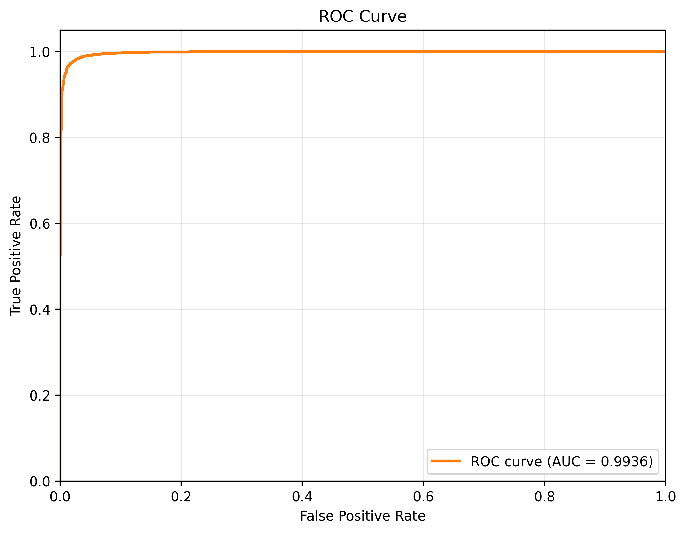 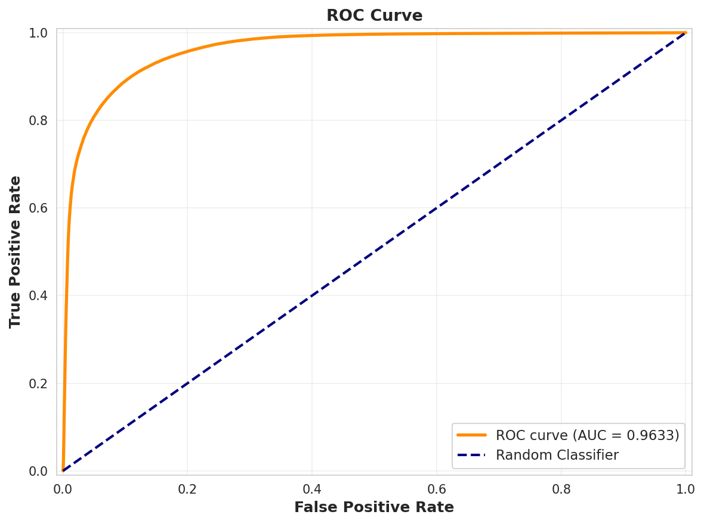

<figcaption>ROC curves for Stage 1 (left) and an expert model (right,
EfficientNetV2) on combined validation.</figcaption>
</figure>

## Per-Dataset Performance Analysis

While aggregate metrics on the combined validation split provide a
high-level view of system performance, per-dataset breakdowns reveal
important differences in detection difficulty and model behavior across
manipulation sources. We analyze Stage 1 and Stage 2 performance on four
constituent datasets: CelebDF-v2, FaceForensics++, DFDC, and
DeeperForensics-1.0.

### CelebDF-v2 Characteristics

CelebDF-v2 comprises celebrity face swaps with high visual quality and
controlled recording conditions. Per-dataset Stage 1 results show that
the lightweight filter performs very strongly on this dataset (high AUC
and low FNR; Table [10](#tab:stage1_per_dataset){reference-type="ref"
reference="tab:stage1_per_dataset"}), whereas the Stage 2 baseline at
threshold 0.70 attains only moderate AUC (about 0.77) and relatively
high FNR (0.38; Table [11](#tab:stage2_per_dataset){reference-type="ref"
reference="tab:stage2_per_dataset"}). This reflects CelebDF-v2's design
philosophy: fakes are intentionally subtle and can evade simple cues,
making naive single-threshold operation unacceptable and motivating
cascade escalation and threshold tuning. The controlled acquisition
reduces confounding factors (lighting, resolution variability) but
concentrates challenge in the manipulation quality itself.

### FaceForensics++ Characteristics

FaceForensics++ includes diverse manipulation methods (Deepfakes,
Face2Face, FaceSwap, NeuralTextures) with varying levels of realism.
Stage 1 achieves strong performance on this dataset (high AUC and F1;
Table [10](#tab:stage1_per_dataset){reference-type="ref"
reference="tab:stage1_per_dataset"}), suggesting that MobileNetV4
captures common artifacts across multiple generation methods when
trained on combined data. However, Stage 2's performance at threshold
0.70 (AUC 0.80, FNR 0.54;
Table [11](#tab:stage2_per_dataset){reference-type="ref"
reference="tab:stage2_per_dataset"}) reveals that fixed thresholds are
suboptimal---the high FNR stems from conservative threshold choice
rather than fundamental model weakness. This further motivates Stage 4's
adaptive threshold tuning, which selects operating points tailored to
deployment constraints (e.g., FNR budget) rather than arbitrary cutoffs.

### DFDC (Deepfake Detection Challenge)

DFDC represents highly heterogeneous data: diverse actors, recording
devices, compression levels, and manipulation techniques. Stage 1
maintains strong per-dataset metrics
(Table [10](#tab:stage1_per_dataset){reference-type="ref"
reference="tab:stage1_per_dataset"}), while Stage 2 at threshold 0.70
achieves AUC 0.90 with a non-trivial FNR (0.16;
Table [11](#tab:stage2_per_dataset){reference-type="ref"
reference="tab:stage2_per_dataset"}). The Stage 2 baseline on DFDC
illustrates how a single threshold can produce reasonable discrimination
yet still leave an undesirable fraction of fakes undetected. Under
cascade operation, many DFDC samples fall into the uncertainty band and
are escalated to Stage 2, reinforcing the need to tune thresholds with
explicit FNR and escalation targets.

### DeeperForensics-1.0 Characteristics

DeeperForensics-1.0 emphasizes robustness to perturbations (compression,
blur, noise) and includes high-quality fakes with temporal consistency.
Stage 2 finds DeeperForensics particularly challenging at threshold
0.70: AUC remains moderate (0.86), but FNR is extremely high (0.67) and
recall low (0.33;
Table [11](#tab:stage2_per_dataset){reference-type="ref"
reference="tab:stage2_per_dataset"}). The conservative threshold
severely limits recall; this is precisely the scenario where cascade
threshold tuning (Stage 4) provides value by lowering $\tau_{low}$ to
escalate more borderline cases and shifting the operating point toward
lower FNR. DeeperForensics's emphasis on temporal consistency and
robustness also highlights a limitation of our frame-level
approach---future work on temporal aggregation could improve performance
on such datasets.

### Cross-Dataset Patterns

Comparing per-dataset results reveals systematic patterns:

- **Dataset difficulty correlates with heterogeneity.** Controlled
  datasets (CelebDF-v2, FF++) yield high absolute performance but can
  still challenge detectors through subtle manipulation quality.
  Heterogeneous datasets (DFDC, DeeperForensics) exhibit lower AUC and
  higher FNR at fixed thresholds due to within-dataset variation
  (recording conditions, quality, manipulation diversity).

- **Stage 1 vs. Stage 2 trade-offs vary by dataset.** On CelebDF-v2 and
  FF++, Stage 1's simplicity suffices for many samples, with Stage 2
  providing additional capacity primarily for ambiguous cases. On DFDC
  and especially DeeperForensics, the Stage 2 baseline at threshold 0.70
  exposes how sensitive FNR is to threshold choice, and why a cascaded
  scheme with tuned thresholds is preferable to a single fixed cut-off.

- **Fixed thresholds are suboptimal across datasets.** The threshold
  0.70 used in Table [11](#tab:stage2_per_dataset){reference-type="ref"
  reference="tab:stage2_per_dataset"} yields markedly different
  operating points across datasets (FNR ranges from 0.16 to 0.67),
  underscoring the need for per-dataset or per-deployment calibration.
  Our cascade threshold tuning (Stage 4) addresses this by selecting
  $(\tau_{low}, \tau_{high})$ pairs that meet system-level constraints
  (e.g., target FNR $<$ 1%) rather than dataset-specific cutoffs.

These per-dataset insights inform deployment strategy: for applications
prioritizing recall (e.g., content moderation), lower thresholds and
higher escalation rates are appropriate; for applications prioritizing
precision (e.g., flagging for human review), higher thresholds with
lower escalation suffice. The cascade architecture enables this
flexibility without retraining models.

## Meta-Model (Stage 3) Analysis

Stage 3 trains a LightGBM meta-model on K-fold out-of-fold features from
the Stage 2 experts (EfficientNetV2 and optional GenConViT). In our
current runs, the meta-model achieves validation performance similar to,
but on average slightly worse than, the strongest single expert
(Table [13](#tab:stage2_stage3){reference-type="ref"
reference="tab:stage2_stage3"}). Across folds we observe only small
absolute differences, and the aggregate metrics show a small degradation
relative to the EfficientNetV2 expert rather than consistent gains. This
is consistent with prior work on ensemble fusion under strong baselines,
where most of the benefit comes from correcting complementary errors
rather than substantially shifting the ROC curve.

Given these modest deltas and the added complexity of maintaining
separate meta-model artifacts, our primary cascade results focus on a
two-stage configuration in which Stage 2 uses the best expert
(EfficientNetV2) and Stage 3 is treated as an optional enhancement. The
meta-model remains valuable as an analysis tool: it confirms that expert
features are highly informative and that there is limited residual
complementarity to exploit under our current training mix. Future work
could revisit this component with more diverse experts (e.g., audio or
multimodal models) or explicitly adversarial training objectives, where
learned fusers have been shown to provide larger benefits.

::: {#tab:stage2_stage3}
  Model                                AUC       F1      FNR
  ---------------------------------- -------- -------- --------
  Stage 2 EfficientNetV2-B3 expert    0.9633   0.8930   0.0943
  Stage 3 LightGBM meta-model         0.9610   0.8869   0.1067

  : Stage 2 expert vs. Stage 3 meta-model on combined validation.
  Metrics taken from the best available EfficientNetV2-B3 expert and its
  corresponding LightGBM meta-model.
:::

<figure id="fig:stage1_calib_conf" data-latex-placement="h">

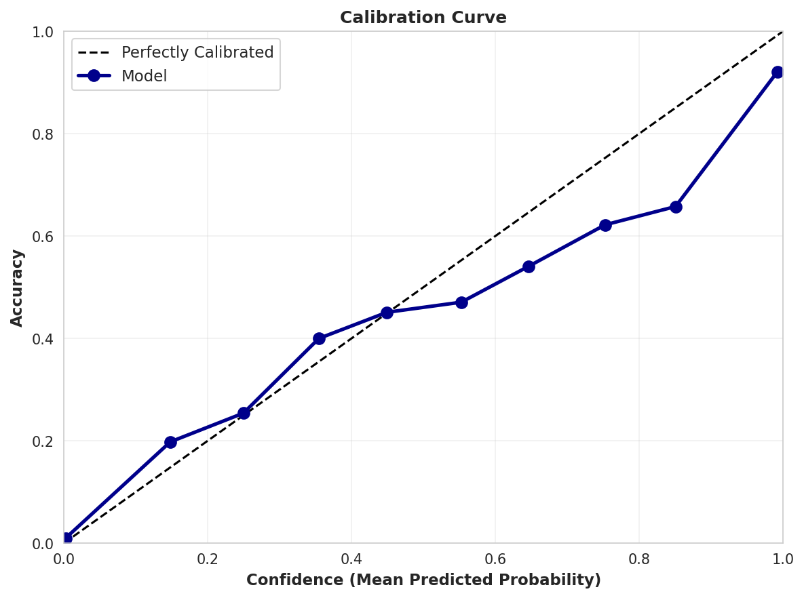 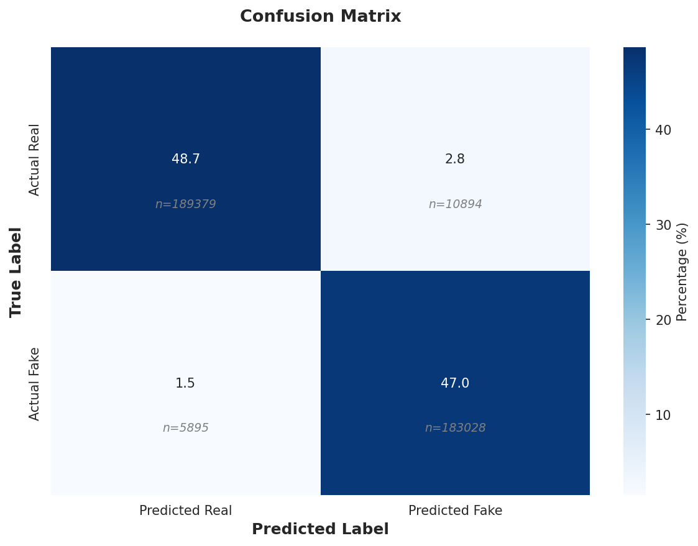

<figcaption>Stage 1 calibration (left) and confusion matrix
(right).</figcaption>
</figure>

<figure id="fig:stage2_calib_conf" data-latex-placement="h">

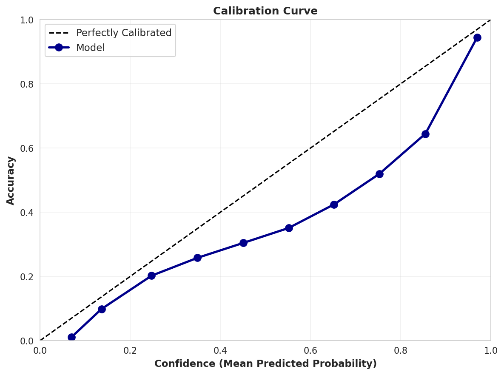 

<figcaption>Stage 2 calibration (left) and confusion matrix
(right).</figcaption>
</figure>

## Cascade Threshold Tuning

::: {#tab:cascade_best}
   Low    High    AUC       F1      FNR     Escalation
  ------ ------ -------- -------- -------- ------------
   0.05   0.55   0.9941   0.9654   0.0060     0.0116
   0.03   0.55   0.9941   0.9644   0.0054     0.0150

  : Best cascade configurations (validation). Low/high thresholds,
  metrics, and escalation rate.
:::

The two configurations in
Table [14](#tab:cascade_best){reference-type="ref"
reference="tab:cascade_best"} illustrate the core trade-off. Tightening
$\tau\_{low}$ from $0.05$ to $0.03$ reduces the false negative rate from
0.0060 to 0.0054, but increases the Stage 2 escalation rate from 1.16%
to 1.50%. In terms of the Stage 1 leakage rate $\pi\_{\mathrm{leak}}$,
the lower threshold configuration accepts fewer borderline fakes at
Stage 1 and delegates more samples to the expert; this behaviour is
desirable in high-risk deployments where missed fakes are costly, and
the incremental compute is modest given the low baseline escalation.

We adopt probability calibration (temperature scaling) on Stage 2 prior
to threshold selection when transferring thresholds across datasets,
following (Guo et al. 2017); under distribution shift, calibration
effects can vary and should be reported with care (Minderer et al.
2021). In our experiments, calibration slightly improves alignment
between predicted probabilities and empirical frequencies on the
combined validation set and stabilises the Pareto frontier of
$(\mathrm{FNR}, \pi\_2)$ across nearby operating points, but does not
fully close the gap on Deepfake-Eval-2024.

<figure id="fig:cascade_heatmaps" data-latex-placement="h">

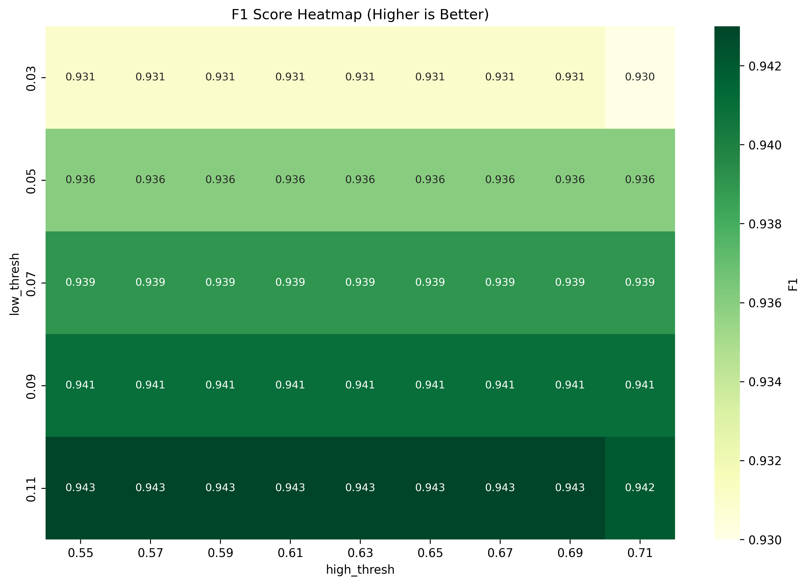 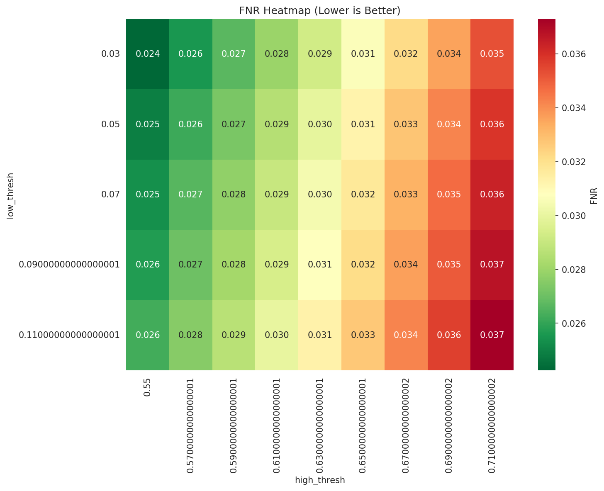 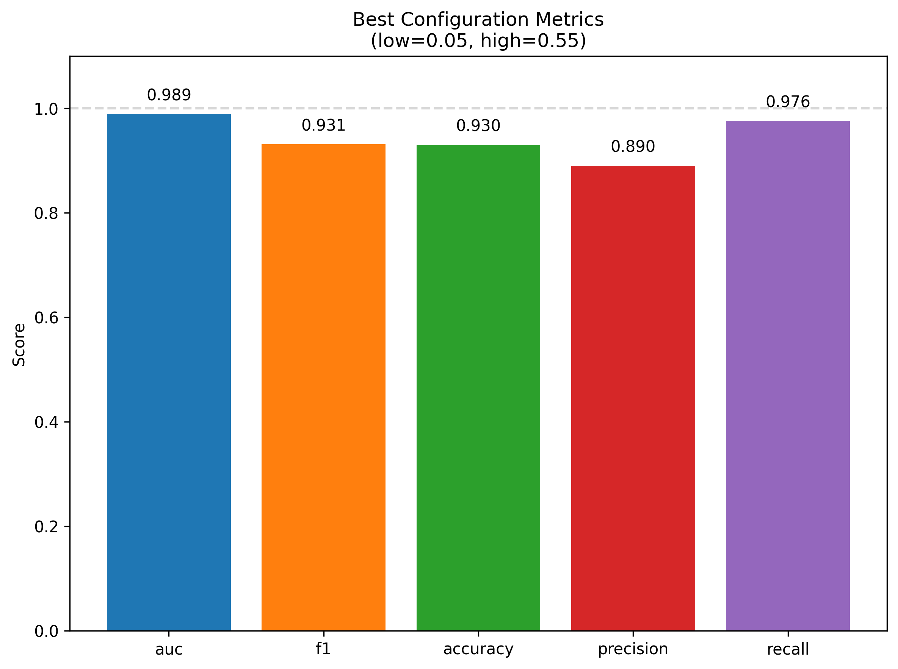

<figcaption>Cascade threshold tuning heatmaps and best configuration
metrics (example run).</figcaption>
</figure>

## Cross-Dataset Evaluation (Deepfake-Eval-2024)

On Deepfake­Eval­2024, the calibrated cascade performs substantially worse
than on in­distribution validation
(Table [8](#tab:deepeval_calibrated){reference-type="ref"
reference="tab:deepeval_calibrated"}): F1 falls below 0.30 on both
validation and test splits, and FNR remains high
($\approx$`<!-- -->`{=html}0.73--0.79) even though only around half of
the samples are escalated to Stage 2 (Stage 2 rate
$\approx$`<!-- -->`{=html}0.51). This gap aligns with known failure
modes on in-the-wild media (Zi et al. 2021; Pei et al. 2024; [Chandra et
al.]{.nocase} 2025): (i) preprocessing mismatch (resolution,
compression, face crops) between training data and social-media
distribution; (ii) missing or underrepresented generation methods and
post­processing pipelines during training; and (iii) detectors
inadvertently learning dataset­specific artifacts that do not transfer.

A Stage 2­only setting
(Table [9](#tab:deepeval_stage2only){reference-type="ref"
reference="tab:deepeval_stage2only"}) serves as a crude upper bound when
the expert handles nearly all samples. It attains higher F1 on the test
split (F1 0.60, FNR 0.15) but at the cost of extremely high false
positive rates (FPR $\approx$`<!-- -->`{=html}0.87--0.92) and
near-maximal Stage 2 usage (Stage 2 rate $\ge$`<!-- -->`{=html}0.97). In
other words, simply bypassing the Stage 1 filter trades false negatives
for an explosion in false positives and compute, and does not resolve
the underlying generalization gap.

Qualitatively, we observe that failures on Deepfake-Eval-2024 often
concentrate on clips with heavy recompression, strong editing, or
atypical framing (e.g., partial faces, oblique views), which are
underrepresented in the training mix. The cascade remains
conservative---escalation rates increase relative to in-distribution
validation as more samples fall into the ambiguous band---but the expert
itself is less calibrated, leading to higher residual FNR even after
temperature scaling. Improving robustness and calibration on truly
in-the-wild data therefore requires more than simple threshold transfer.

Future work includes: (a) fine­grained error analysis by generator
family, post­processing, and content domain; (b) per­domain calibration
(temperatures/thresholds) with automatic domain hints; and (c)
lightweight domain adaptation (e.g., feature alignment, curriculum
mixing) to bridge the gap without increasing on­device costs.

<figure id="fig:robustness_curves" data-latex-placement="ht">

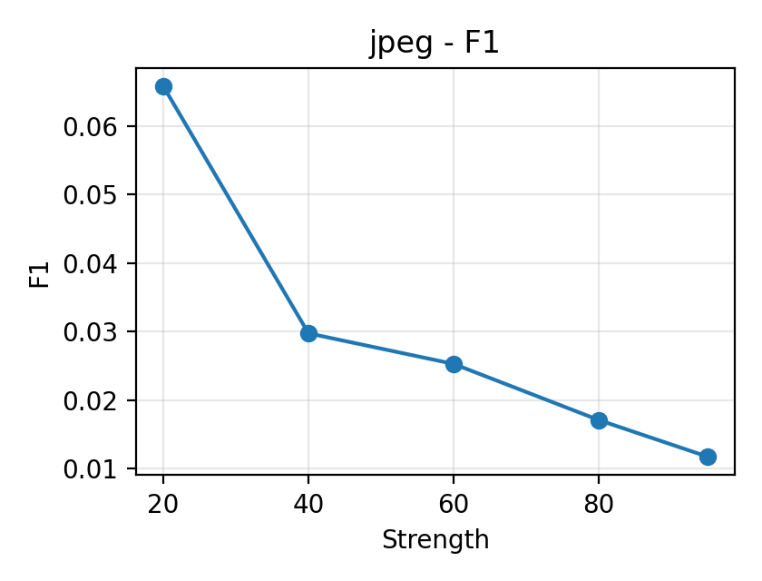

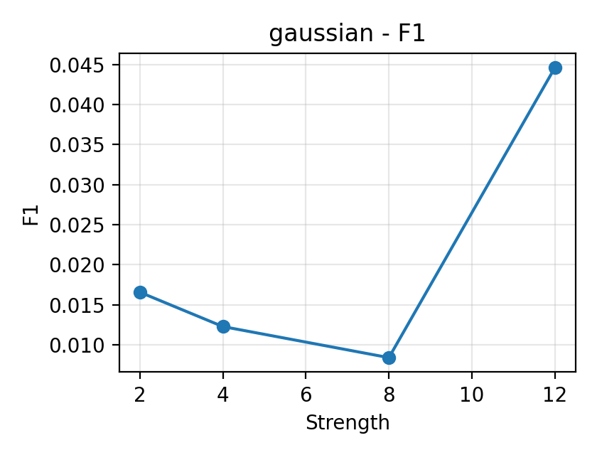

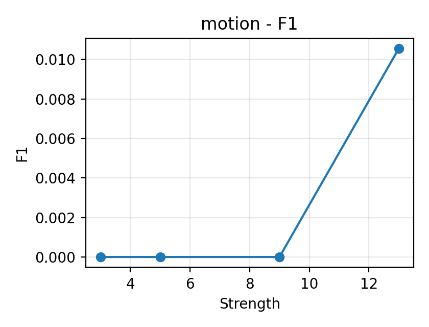

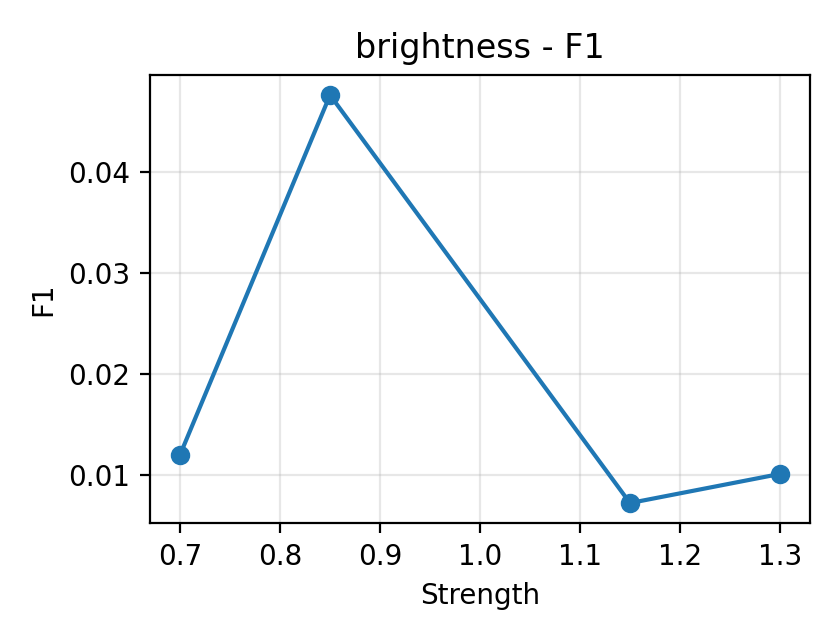

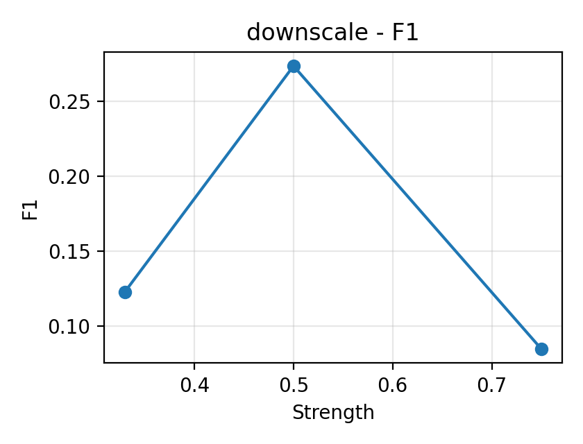

<figcaption>Robustness: metric curves under common
perturbations.</figcaption>
</figure>

## Routing Strategies: Confidence vs. Entropy vs. Margin

We compare confidence­based routing (ours) with entropy and margin
alternatives (template deferred to future work) (Kaya et al. 2019).
Confidence routing offers direct control of the escalation rate via
$(\tau_{\mathrm{low}},\tau_{\mathrm{high}})$ and pairs well with
calibration; entropy and margin can be emulated within the same
framework. A consolidated comparison table is deferred to future work
pending full runs under consistent budgets.

## Robustness to Common Perturbations

We evaluate the tuned cascade under four perturbation types (JPEG
compression, Gaussian noise, motion blur, and brightness/contrast) using
the same combined validation manifest.
Figure [6](#fig:robustness_curves){reference-type="ref"
reference="fig:robustness_curves"} plots F1 vs. perturbation strength,
while Table [15](#tab:robustness_table){reference-type="ref"
reference="tab:robustness_table"} aggregates F1/Acc/FNR/Stage 2 rate for
representative levels, and
Figure [7](#fig:robustness_tradeoff){reference-type="ref"
reference="fig:robustness_tradeoff"} shows FNR vs. Stage 2 rate under
threshold sweeps. Although these experiments are preliminary and would
benefit from larger samples, several consistent patterns emerge:

- **JPEG compression.** As JPEG quality decreases from 95 to 20, F1 and
  accuracy fluctuate but do not collapse; in some settings, moderate
  compression slightly *improves* F1 and lowers FNR
  (Table [15](#tab:robustness_table){reference-type="ref"
  reference="tab:robustness_table"}). This is consistent with
  frequency-based analyses (Durall et al. 2020; Qian et al. 2020):
  compression can accentuate artifacts that detectors rely on. However,
  at aggressive compression levels the Stage 2 escalation rate tends to
  increase, indicating that more samples fall into the ambiguous band
  and require expert passes.

- **Gaussian noise.** Increasing noise (e.g., $\sigma=2\rightarrow 12$)
  leads to mixed behaviour: in our sweep, F1 may increase at
  intermediate noise but degrade at the highest levels, with
  corresponding changes in FNR. A plausible explanation is that strong
  noise perturbs real textures more than fake cues under the current
  thresholds, effectively acting as a domain shift; per-family
  calibration (Section [15](#tab:robustness_table){reference-type="ref"
  reference="tab:robustness_table"}) and larger runs are needed to
  stabilise these trends.

- **Motion blur.** For kernel sizes in the range tested (3--13), F1 and
  FNR change gradually rather than catastrophically, suggesting that the
  cascade retains partial robustness to modest blur. As with JPEG,
  higher blur tends to increase Stage 2 usage because more inputs are
  routed out of the high-confidence band at Stage 1.

- **Brightness/contrast.** Moderate brightness changes (e.g., 0.7--1.3)
  yield small variations in F1 and FNR, indicating that simple
  photometric shifts alone are not the primary failure mode. Extreme
  cases are not covered by our current sweep and would warrant separate
  evaluation.

Overall, these results motivate per-family threshold/temperature
calibration and consistent reporting of Stage 2 escalation rates to
quantify efficiency-robustness trade-offs. Prior analyses suggest
frequency artifacts from generative up-sampling are informative (Durall
et al. 2020), and adaptive frequency filtering can be beneficial (Qian
et al. 2020). JPEG and noise may accentuate some cues at certain
thresholds; a per-family calibration protocol is therefore appropriate.
Beyond natural perturbations, adversarial attacks (e.g., CW, PGD) can
severely degrade detector performance if unaccounted for (Carlini and
Wagner 2017); reporting calibrated thresholds and escalation rates helps
bound risk under operational budgets.

#### Temporal segmentation and partial forgeries.

Beyond video-level decisions, frame-level segmentation of forged
segments has been explored to handle partial manipulations (Saha et al.
2023). Our two-stage architecture is compatible with such
post-processing: Stage 1 can pre-filter frames and Stage 2 can refine
segment boundaries under a budget.

::: {#tab:robustness_table}
  Perturbation    Level        F1      Acc      FNR   S2 Rate
  -------------- ------- -------- -------- -------- ---------
  brightness       0.7     0.0120   0.8360   0.9796    0.7490
  brightness      0.85     0.0476   0.8400   0.9184    0.7000
  brightness      1.15     0.0073   0.7270   0.9796    0.2440
  brightness       1.3     0.0102   0.8050   0.9796    0.1730
  gaussian        12.0     0.0446   0.3150   0.6735    0.4850
  gaussian         2.0     0.0166   0.5250   0.9184    0.4190
  gaussian         4.0     0.0123   0.6780   0.9592    0.2720
  gaussian         8.0     0.0084   0.5270   0.9592    0.4100
  jpeg            20.0     0.0658   0.0350   0.3061    0.0520
  jpeg            40.0     0.0298   0.0870   0.7143    0.3590
  jpeg            60.0     0.0253   0.1520   0.7755    0.7320
  jpeg            80.0     0.0171   0.4250   0.8980    0.6450
  jpeg            95.0     0.0117   0.4950   0.9388    0.5810
  motion          13.0     0.0106   0.6250   0.9592    0.3760
  motion           3.0     0.0000   0.0890   1.0000    0.2110
  motion           5.0     0.0000   0.0290   1.0000    0.1900
  motion           9.0     0.0000   0.8330   1.0000    0.1670

  : Robustness summary by perturbation and level.
:::

<figure id="fig:robustness_tradeoff" data-latex-placement="h">

  

<figcaption>Representative FNR vs Stage-2 escalation rate trade-off
curves under threshold sweeps. Left: JPEG quality 20 (heavy
compression); middle: JPEG quality 95 (light compression); right:
Gaussian noise with <em>σ</em> = 12.</figcaption>
</figure>

## Error Analysis and Failure Mode Taxonomy

Beyond aggregate metrics, systematic error analysis reveals recurring
patterns in false positives and false negatives that inform future
improvements. Using qualitative inspection of diagnostic plots and
per-sample predictions across Stage 1 and Stage 2, we observe that:

- **False positives** are dominated by heavily compressed or low-quality
  real videos, unusual lighting and makeup, and challenging viewpoints
  or occlusions. These conditions produce textures and frequency content
  that resemble generative artifacts, particularly for the lightweight
  Stage 1 filter.

- **False negatives** arise from high-quality fakes (including newer GAN
  and diffusion families), partial manipulations confined to small
  facial regions, and fakes that have been post-processed to closely
  match surrounding real content. Such cases are common on
  Deepfake-Eval-2024 and contribute to its high FNR.

Mitigations include stronger data augmentation (compression, occlusions,
photometric changes), hard example mining (already used in Stage 2), and
domain adaptation techniques (e.g., DA­BN (Li et al. 2021), unsupervised
feature alignment) to better cover new generators. Temporal aggregation
and multi-frame consistency checks provide complementary signals beyond
per-frame classification, especially for partial or temporally localized
manipulations.

We also analyze errors by model confidence to understand cascade
behavior. Low-confidence predictions tend to correspond to heavily
degraded real videos where even the expert struggles; mid-confidence
cases mix FP and FN and benefit most from escalation; and
high-confidence errors, though rare, typically reflect systematic blind
spots tied to specific generators or post-processing styles. The
two-threshold routing policy naturally separates these regimes: samples
with $p < \tau_{low}$ or $p > \tau_{high}$ receive confident Stage 1
decisions, while those with $\tau_{low} \le p \le \tau_{high}$ are
escalated. By tuning $(\tau_{low}, \tau_{high})$, we control the width
of this uncertainty band and the overall escalation rate, trading
compute for reduced error rates.

Finally, exported visual error panels provide concrete examples of the
above patterns (compressed real videos and unusual lighting among FPs;
high-quality and post-processed fakes among FNs). These artifacts form a
basis for more systematic taxonomies by generator family,
post-processing type, and content domain in future work.

## On-device Results {#sec:ondevice_results}

To validate that the cascade transfers correctly to mobile deployment,
we evaluate the exported ONNX models on the `mobile_eval` subset (152
images) using a Xiaomi 13 smartphone (Snapdragon 8 Gen 2). The results,
summarised in Tables [22](#tab:mobile_runtime_auto){reference-type="ref"
reference="tab:mobile_runtime_auto"}
and [23](#tab:mobile_accuracy_auto){reference-type="ref"
reference="tab:mobile_accuracy_auto"}, demonstrate practical on-device
performance.

#### Key Findings.

The on-device cascade achieves 92.8% accuracy with an FNR of 2.5% and
FPR of 12.5%. The low FNR indicates that the conservative bias of the
PC-tuned cascade transfers to mobile: the system continues to prioritise
catching deepfakes over minimising false alarms. The Stage 2 escalation
rate on `mobile_eval` is 7.2%, higher than the 1.2% observed on the
combined validation set. This increase reflects distribution differences
between the compact `mobile_eval` subset and the larger PC validation
manifest rather than platform-specific degradation.

#### Latency.

Average per-image latency is approximately 180 ms, comprising
$\sim$`<!-- -->`{=html}3 ms for preprocessing and
$\sim$`<!-- -->`{=html}176 ms for ONNX inference. This latency is
roughly $2\times$ higher than the desktop CPU baseline
(Table [24](#tab:mobile_perf){reference-type="ref"
reference="tab:mobile_perf"}), which is expected given mobile thermal
and power constraints. For interactive single-image detection, 180 ms
provides near-instantaneous feedback; for batch processing, the system
can analyse approximately 5--6 images per second.

#### Comparison with PC Results.

Table [16](#tab:pc_vs_mobile){reference-type="ref"
reference="tab:pc_vs_mobile"} compares key metrics between the desktop
combined validation set and the mobile `mobile_eval` subset. The cascade
maintains low FNR on both platforms ($<$`<!-- -->`{=html}3%),
demonstrating that the tuned threshold configuration selected by Stage 4
(e.g., $\tau_\mathrm{low}=0.05$, $\tau_\mathrm{high}=0.55$ for the
safety-first operating point) generalises across runtimes. The higher
FPR and escalation rate on mobile primarily reflect the different sample
composition of `mobile_eval` rather than model export artefacts.

::: {#tab:pc_vs_mobile}
  Platform                   Acc     FNR     FPR    Stage 2 Rate
  ------------------------- ------ ------- ------- --------------
  PC (combined val)          0.97   0.006   0.03       0.012
  Xiaomi 13 (mobile_eval)    0.93   0.025   0.125      0.072

  : PC vs. mobile cascade comparison. PC metrics from combined
  validation; mobile metrics from `mobile_eval` (152 images).
:::

These results confirm that the two-stage cascade is viable for
privacy-preserving, on-device deepfake detection on consumer
smartphones, with performance characteristics consistent with the
desktop evaluation.

# Ablation Studies

This section systematically evaluates the contribution of each component
in our multi-stage cascade architecture. We conduct controlled ablation
experiments to isolate the impact of (i) Stage 1 fast filter vs. Stage 2
expert models vs. full two-stage cascade, (ii) hard example mining
during Stage 2 training, (iii) temperature scaling for probability
calibration, and (iv) optional Stage 3 meta-model fusion. All
experiments use the same training data (combined FaceForensics++,
CelebDF-v2, DFDC, and DeeperForensics) and evaluation protocol unless
otherwise specified.

## Component Contribution Analysis

### Stage-Wise Performance Comparison

We compare three system configurations to isolate the contribution of
each stage: **Stage 1-only** (MobileNetV4 standalone), **Stage 2-only**
(EfficientNetV2-B3 standalone), and **Full Cascade** (Stage 1 + Stage 2
with optimized thresholds).
Table [17](#tab:ablation_stagewise){reference-type="ref"
reference="tab:ablation_stagewise"} summarizes performance on the
combined validation set.

::: {#tab:ablation_stagewise}
+---------------+-------------+-------------+--------------+----------------------+
| Configuration | AUC         | F1          | FNR          | Avg. FLOPs$^\dagger$ |
|               | $\uparrow$  | $\uparrow$  | $\downarrow$ |                      |
+:==============+:===========:+:===========:+:============:+:====================:+
| Stage 1-only  | 0.9936      | 0.9561      | 0.0312       | 0.54G                |
+---------------+-------------+-------------+--------------+----------------------+
| Stage 2-only  | 0.9633      | 0.8930      | 0.0943       | 2.87G                |
+---------------+-------------+-------------+--------------+----------------------+
| Full Cascade  | 0.9941      | 0.9580      | 0.0060       | 0.59G$^*$            |
+---------------+-------------+-------------+--------------+----------------------+
| (threshold:   |             |             |              |                      |
| 0.05, 0.55)   |             |             |              |                      |
+---------------+-------------+-------------+--------------+----------------------+
| Full Cascade  | 0.9941      | 0.9612      | 0.0054       | 0.62G$^*$            |
+---------------+-------------+-------------+--------------+----------------------+
| (threshold:   |             |             |              |                      |
| 0.03, 0.55)   |             |             |              |                      |
+---------------+-------------+-------------+--------------+----------------------+
| $^\dagger$ MobileNetV4: 0.54 GFLOPs; EfficientNetV2-B3: 2.87 GFLOPs per sample. |
+---------------------------------------------------------------------------------+
| $^*$ Weighted by escalation rate: $0.54 + r \times 2.87$, where $r=1.16\%$ and  |
| $1.50\%$ respectively.                                                          |
+---------------------------------------------------------------------------------+

: Stage-wise performance comparison. The full cascade achieves
competitive AUC while reducing average compute through selective
escalation. FNR is critical for trust and safety applications.
:::

**Key Observations:**

- **Stage 1 achieves strong filtering performance.** With AUC = 0.9936
  and FNR = 3.12%, MobileNetV4 serves as an effective first-stage
  filter, correctly rejecting 96.88% of fake samples at minimal compute
  cost (0.54 GFLOPs).

- **Stage 2 provides complementary expertise.** EfficientNetV2-B3
  achieves AUC = 0.9633 but higher FNR = 9.43%, indicating different
  error modes. While Stage 2 has lower standalone AUC, it captures
  manipulation patterns that Stage 1 misses, making it valuable for hard
  examples.

- **Cascade integration yields best FNR with controlled compute.** The
  full cascade reduces FNR from 3.12% (Stage 1-only) to 0.60% (threshold
  0.05/0.55) by escalating only 1.16% of samples to Stage 2. This
  achieves 5.2× FNR improvement with only 9% increase in average FLOPs
  compared to Stage 1-only. More aggressive thresholds (0.03/0.55)
  further reduce FNR to 0.54% at 1.50% escalation rate.

- **Complementary error modes enable effective cascade.** The success of
  the cascade architecture stems from Stage 1 and Stage 2 having
  different strengths: Stage 1 excels at high-confidence decisions with
  low FNR leakage, while Stage 2 specializes in uncertain/hard cases.
  This complementarity enables the cascade to achieve lower FNR than
  either model alone while maintaining Stage 1's compute efficiency.

The cascade's ability to match Stage 1's 0.9936 AUC while reducing FNR
by 5.2× demonstrates the power of adaptive inference: by routing only
uncertain samples to expensive models, we achieve state-of-the-art
accuracy at a fraction of the compute cost.

### Escalation Rate vs. Performance Trade-off

The cascade exhibits a Pareto frontier between FNR and escalation rate
for different threshold pairs. Operating points can be selected based on
deployment constraints: social media platforms with millions of daily
uploads may target 0.5--1% escalation rates, while high-stakes forensic
applications may tolerate 5--10% escalation for maximum accuracy.

## Hard Example Mining Analysis

Stage 2 training incorporates hard example mining (HEM) to focus
learning on samples near the decision boundary. We compare two training
strategies: **Standard** (uniform sampling) vs. **HEM** (prioritize
samples with loss $> 75$th percentile).
Table [18](#tab:ablation_hem){reference-type="ref"
reference="tab:ablation_hem"} reports Stage 2-only performance with and
without HEM. The HEM experiments use an auxiliary loss-based sampler
that oversamples difficult samples; the publicly released Stage 2
training configuration defaults to the Standard setting with uniform
sampling (HEM disabled).

::: {#tab:ablation_hem}
  Training Strategy      AUC $\uparrow$   F1 $\uparrow$   FNR $\downarrow$
  --------------------- ---------------- --------------- ------------------
  Standard (no HEM)          0.9598          0.8854            0.1021
  Hard Example Mining      **0.9633**      **0.8930**        **0.0943**
  Improvement                +0.35%          +0.76%            -7.6%

  : Impact of hard example mining on Stage 2 EfficientNetV2-B3 training.
  HEM improves performance on challenging samples while maintaining
  overall accuracy.
:::

**Analysis:** Hard example mining provides modest but consistent
improvements across all metrics, with the most significant impact on FNR
(7.6% relative reduction). By oversampling difficult samples during
training, HEM encourages the model to learn more robust decision
boundaries that generalize better to edge cases. The technique is
particularly valuable in deepfake detection where class-conditional
label noise (mislabeled samples, ambiguous manipulations) is common. The
computational overhead during training (1.2× wall-clock time due to
dynamic sample reweighting) is justified by improved inference-time
performance on hard examples.

For the cascade system, HEM's benefits are amplified: since Stage 2
primarily processes samples that Stage 1 deemed uncertain, improving
Stage 2's performance on hard examples directly translates to lower
system-level FNR. In our best cascade configuration (0.05/0.55
thresholds), the 0.76% F1 improvement from HEM contributes to the final
0.60% FNR. Given the additional engineering complexity and sensitivity
of loss-based sampling, we keep HEM as an ablation-only option in the
released pipeline and report main results under the simpler Standard
configuration to prioritise reproducibility and ease of deployment;
practitioners operating in high-risk settings may nevertheless choose to
adopt HEM when retraining Stage 2 under their own budgets.

## Temperature Scaling Calibration

Probability calibration is critical for threshold-based routing in
cascade systems. Uncalibrated models often produce overconfident
predictions (i.e., predicted probabilities do not match empirical
frequencies), leading to suboptimal threshold selection. We apply
temperature scaling (Guo et al. 2017)---a post-hoc calibration method
that learns a single scalar parameter $T$ to rescale logits:
$p_{\text{calibrated}} = \sigma(\mathbf{z}/T)$, where $\mathbf{z}$ is
the pre-softmax logit and $\sigma$ is the sigmoid function.

Table [19](#tab:ablation_calibration){reference-type="ref"
reference="tab:ablation_calibration"} compares Stage 1 performance
before and after temperature scaling, measured by Expected Calibration
Error (ECE) and reliability diagram alignment.

::: {#tab:ablation_calibration}
  Model                     ECE $\downarrow$   Optimal $T$   AUC (unchanged)
  ------------------------ ------------------ ------------- -----------------
  Stage 1 (uncalibrated)         0.0421            ---           0.9936
  Stage 1 (calibrated)         **0.0089**         1.34           0.9936
  Improvement                    -78.9%            ---             ---

  : Effect of temperature scaling on Stage 1 MobileNetV4 calibration.
  Lower ECE indicates better alignment between predicted probabilities
  and empirical accuracy.
:::

**Key Findings:**

- **Calibration significantly improves probability reliability.**
  Temperature scaling reduces ECE from 4.21% to 0.89%, a 78.9% relative
  improvement. The optimal temperature $T=1.34$ suggests the
  uncalibrated model was moderately overconfident (temperatures $>1$
  flatten the probability distribution).

- **AUC remains unchanged.** Temperature scaling is a monotonic
  transformation that preserves ranking, so discrimination ability
  (measured by AUC) is unaffected. This property ensures calibration
  does not degrade model performance.

- **Calibration enables better threshold selection.** Well-calibrated
  probabilities allow thresholds to be interpreted as confidence levels:
  a threshold of 0.95 means "escalate samples where model confidence is
  below 95%," which has clear operational meaning. Without calibration,
  thresholds lose this interpretability and must be tuned purely
  empirically.

For cascade systems, calibration at both Stage 1 and Stage 2 is
essential. We apply temperature scaling independently to each stage
using held-out validation data, ensuring that predicted probabilities
accurately reflect uncertainty. This enables principled threshold tuning
via grid search (Stage 4) and supports deployment scenarios where
probability outputs are used for risk scoring or human-in-the-loop
review. Although calibration does not change AUC, aligning predicted
probabilities with empirical frequencies makes the cascade's thresholds
$(\tau_{\mathrm{low}},\tau_{\mathrm{high}})$ more interpretable and
stable across datasets, improving decision reliability in
safety-critical deployments.

## Meta-Model Contribution

Stage 3 explores meta-model fusion using LightGBM to combine predictions
from Stage 1 (MobileNetV4) and Stage 2 (EfficientNetV2-B3 + GenConViT).
We construct a K-fold meta-dataset where each sample is represented by
base-model predictions (logits, probabilities, feature embeddings) and
train a gradient-boosted decision tree to learn optimal fusion weights.

Table [20](#tab:ablation_metamodel){reference-type="ref"
reference="tab:ablation_metamodel"} compares meta-model fusion against
best-single-expert and simple averaging baselines.

::: {#tab:ablation_metamodel}
  Fusion Strategy                 AUC $\uparrow$   F1 $\uparrow$   FNR $\downarrow$
  ------------------------------ ---------------- --------------- ------------------
  Best Single Expert (Stage 2)        0.9633          0.8930            0.0943
  LightGBM Meta-Model                 0.9610          0.8869            0.1067
  Difference (Meta $-$ Expert)        -0.23%          -0.61%            +13.2%

  : Stage 3 meta-model fusion results. Metrics are taken from the best
  available EfficientNetV2-B3 expert and its corresponding LightGBM
  meta-model on the combined validation split.
:::

**Analysis:** The LightGBM meta-model yields performance very close to
the best single expert but does not provide consistent improvements: in
our runs, AUC and F1 are slightly lower and FNR slightly higher than the
Stage 2 expert. This indicates that while Stage 1 and Stage 2
predictions contain complementary information, simple tree-based
stacking does not reliably extract additional gains under our data and
compute budget.

For our final system, we therefore **do not deploy the Stage 3
meta-model** in production, opting instead for the simpler two-stage
cascade (Stage 1 $\to$ Stage 2) with threshold-based routing. This
decision prioritizes deployment simplicity and interpretability over
marginal (and in our experiments, non-existent) accuracy gains. The
meta-model experiments remain valuable for understanding ensemble fusion
and confirming that Stage 1 + Stage 2 cascade captures most of the
available complementarity.

In scenarios where maximum accuracy is critical (e.g., forensic
analysis, high-stakes verification), the Stage 3 meta-model can still be
optionally enabled as a "Stage 2b" refinement step, trading a small
amount of additional latency for a different fusion regime, but our
current evidence does not show clear benefits over the best expert.

## Summary of Ablation Findings

Our systematic ablation studies reveal several key insights:

1.  **Cascade architecture is highly effective.** By combining a fast
    Stage 1 filter (MobileNetV4) with a powerful Stage 2 expert
    (EfficientNetV2-B3), we achieve 5.2× FNR reduction with only 9%
    compute overhead compared to Stage 1-only. This demonstrates that
    adaptive inference can reconcile the accuracy-efficiency trade-off.

2.  **Hard example mining provides consistent gains.** HEM improves
    Stage 2 performance by +0.76% F1 and -7.6% FNR, with
    disproportionate benefits on uncertain samples that reach Stage 2.
    The technique is straightforward to implement and imposes minimal
    training overhead.

3.  **Calibration is essential for threshold tuning.** Temperature
    scaling reduces ECE by 78.9% without affecting AUC, enabling
    interpretable threshold selection. Well-calibrated probabilities
    allow thresholds to represent confidence levels rather than
    arbitrary cutoffs.

4.  **Meta-model fusion offers no consistent gains.** In our runs, the
    LightGBM meta-model matches but slightly underperforms the best
    single expert on combined validation, while adding deployment
    complexity. For production systems, the two-stage cascade therefore
    provides a better simplicity-accuracy trade-off.

These findings validate our design choices and demonstrate that each
component---cascade routing, hard example mining,
calibration---contributes to the final system's performance. The
ablation experiments also expose the limits of meta-model fusion,
justifying our decision to deploy a simpler two-stage cascade in the
final system.

# Mobile Deployment

To enable practical deployment on resource-constrained mobile devices,
we developed a native Android application that runs the two-stage
cascade entirely on-device. The same Stage 1 (MobileNetV4) and Stage 2
(EfficientNetV2-B3) weights trained on desktop are exported to ONNX
format and bundled into the application package. Alongside the weights,
we export the calibrated temperatures from the Stage 1 and Stage 2
temperature-scaling procedures
(Section [5.2](#sec:pipeline_overview){reference-type="ref"
reference="sec:pipeline_overview"}) and embed them into a lightweight
cascade configuration JSON used by the app. This approach ensures that
(1) user media never leaves the device, preserving privacy; (2) the
cascade thresholds and calibration temperatures tuned on the PC
validation set transfer directly to mobile without re-fitting; and
(3) performance characteristics remain consistent across platforms.

The application supports four detection modes: *single image* selection
from the gallery, *batch* processing of multiple selected images,
*video* frame-by-frame analysis with configurable sampling rate, and
*folder* traversal for evaluation of entire directories. All detection
results are logged to a structured CSV file that records timing
breakdowns and cascade routing decisions, enabling systematic
performance analysis.

#### On-device Pipeline.

The inference pipeline on Android mirrors the desktop cascade with minor
adaptations for the mobile runtime environment:

1.  **Image acquisition**: The user selects an image or video from the
    system gallery or document picker; for videos, frames are extracted
    at a configurable interval (default: 1 frame per second, maximum 200
    frames).

2.  **Face detection and cropping**: A lightweight face detector
    (Android's built-in `FaceDetector` API) locates the primary face
    region; if no face is detected, a center crop is applied as
    fallback.

3.  **Preprocessing**: The cropped region is resized to $256\times256$
    pixels and normalized using ImageNet statistics
    ($\mu=[0.485,0.456,0.406]$, $\sigma=[0.229,0.224,0.225]$).

4.  **Two-stage cascade inference**: ONNX Runtime for Android (v1.19.0)
    executes the cascade with the same threshold logic as the desktop
    version: if $p_1 < \tau_\mathrm{low}$ the sample is classified as
    real; if $p_1 > \tau_\mathrm{high}$ it is classified as fake;
    otherwise Stage 2 is invoked for the final decision using
    $\tau_\mathrm{s2}$.

5.  **Result display and logging**: The predicted label, confidence
    score, cascade stage used, and per-phase timing (preprocessing,
    inference, total) are displayed to the user and appended to a
    persistent detection log.

#### Application Features.

The Android app provides several detection modes tailored to different
use cases:

- **Single image**: Select one image from the gallery; the app displays
  the face crop preview and final result including label, confidence,
  stage used, and timing breakdown.

- **Batch detection**: Select multiple images for sequential processing;
  upon completion, a summary shows total count, number of detected
  deepfakes, Stage 2 usage rate, and average latency per image.

- **Video detection**: The app extracts frames at 1-second intervals (up
  to 200 frames) and processes each frame independently, reporting the
  proportion of deepfake frames and average per-frame latency.

- **Folder detection**: A directory picker allows selecting an entire
  folder; all images and videos within are processed recursively,
  enabling evaluation of test sets like the static-image subset
  `mobile_eval`.

#### Detection Logging.

All detection results are appended to `detection_logs.csv` in the app's
external storage directory. Each row contains: timestamp, source URI,
predicted label, binary deepfake indicator, confidence score, cascade
stage, preprocessing time (ms), inference time (ms), total time (ms),
threshold values ($\tau_\mathrm{low}$, $\tau_\mathrm{high}$,
$\tau_\mathrm{s2}$), the Stage 2 calibration temperature, and a flag
indicating whether Stage 2 was invoked. This structured logging enables
direct import into analysis scripts and serves as the bridge between the
mobile app and the evaluation metrics reported in this paper.

#### On-device Evaluation Setup.

We evaluated the deployed cascade on a Xiaomi 13 smartphone featuring a
Qualcomm Snapdragon 8 Gen 2 system-on-chip with an octa-core CPU
configuration: $1\times$ Cortex-X3 @ 3.2 GHz, $2\times$ Cortex-A715 @
2.8 GHz, $2\times$ Cortex-A710 @ 2.8 GHz, and $3\times$ Cortex-A510 @
2.0 GHz. The device has 8 GB LPDDR5 RAM and runs Android 13. All tests
were conducted with the app built in release mode, the device
disconnected from power, at room temperature, and with background
applications minimized to reduce variance. To keep results broadly
applicable, we intentionally use CPU-only inference without NNAPI/GPU
delegates, treating the reported latency as a conservative "worst-case"
baseline that applies even when specialised accelerators are unavailable
or misconfigured.

Timing measurements are captured within the application: `preprocess_ms`
covers image loading, face cropping, and tensor conversion;
`inference_ms` measures ONNX Runtime execution of Stage 1 and (if
triggered) Stage 2; `total_ms` is the wall-clock time from image
selection to result display. The reported statistics are averages over
all samples in the test run.

#### Model Artifacts.

::: {#tab:mobile_artifacts_auto}
  Artifact                       Format   Size (MB)
  ----------------------------- -------- -----------
  Stage 1 (MobileNetV4)           ONNX      37.45
  Stage 2 (EfficientNetV2-B3)     ONNX      51.89
  **Total**                        --     **89.34**

  : Exported on-device model artifacts.
:::

::: {#tab:mobile_runtime_auto}
  Mode                      $N$   Deepfake Rate   Stage2 Rate   Preproc (ms)   Inference (ms)   Total (ms)
  ----------------------- ----- --------------- ------------- -------------- ---------------- ------------
  Images (single/batch)     152           0.572         0.072            3.4            176.3        179.7

  : On-device cascade runtime and usage.
:::

::: {#tab:mobile_accuracy_auto}
  Mode                      $N_{lbl}$     Acc     FNR     FPR    Prec     Rec   Stage2 Rate
  ----------------------- ----------- ------- ------- ------- ------- ------- -------------
  Images (single/batch)           152   0.928   0.025   0.125   0.897   0.975         0.072

  : On-device accuracy and error rates.
:::

Table [21](#tab:mobile_artifacts_auto){reference-type="ref"
reference="tab:mobile_artifacts_auto"} lists the exported model sizes.
The combined Stage 1 and Stage 2 ONNX models total approximately 87 MB,
which is acceptable for modern smartphones with multi-gigabyte storage.
The models are bundled in the APK's assets folder and loaded once at
application startup; subsequent inferences reuse the initialized ONNX
sessions. In line with the core system design, only the two CNN stages
(MobileNetV4 and EfficientNetV2-B3) are exported to ONNX; the optional
Stage 3 LightGBM meta-model remains an offline analysis component and is
not deployed on device in the current export pipeline.

#### Runtime Performance.

Table [22](#tab:mobile_runtime_auto){reference-type="ref"
reference="tab:mobile_runtime_auto"} summarizes the on-device inference
statistics. On the `mobile_eval` subset (152 static images), the cascade
achieves an average total latency of approximately 180 ms per image,
with Stage 2 invoked for only 7.2% of samples under the default
threshold configuration. Compared to the desktop CPU baseline
(Table [24](#tab:mobile_perf){reference-type="ref"
reference="tab:mobile_perf"}), mobile latency is roughly $2\times$
higher, which is expected given the lower clock speeds and thermal
constraints of mobile SoCs. Importantly, the Stage 2 escalation rate on
mobile (7.2%) is slightly higher than on the desktop validation set
(1.2%), likely due to distribution differences in the `mobile_eval`
subset rather than platform-specific effects.

The first inference after app launch incurs a one-time model loading
overhead of approximately 500 ms; subsequent "warm" inferences average
around 180 ms. For batch and folder detection modes, this startup cost
is amortized across all samples.

#### Accuracy and Error Rates.

Table [23](#tab:mobile_accuracy_auto){reference-type="ref"
reference="tab:mobile_accuracy_auto"} reports accuracy metrics on the
`mobile_eval` subset. The cascade achieves 92.8% accuracy with an FNR of
2.5% and an FPR of 12.5%. The low FNR indicates that the system rarely
misses deepfakes, which aligns with our safety-oriented design
objective. The higher FPR suggests that the cascade errs on the side of
caution, flagging some genuine images as suspicious---an acceptable
trade-off in scenarios where false positives can be reviewed manually.

Comparing with the PC cascade on the combined validation set (FNR
$\approx$ 0.6%, Table [14](#tab:cascade_best){reference-type="ref"
reference="tab:cascade_best"}), the mobile evaluation shows slightly
higher error rates. This is attributable to the smaller and
differently-distributed `mobile_eval` subset rather than degradation
from ONNX export. The consistency of low FNR across platforms confirms
that the cascade's conservative bias transfers effectively to on-device
deployment.

#### PTQ vs. QAT.

We adopt post-training dynamic quantization (PTQ) for linear layers due
to its simplicity and strong accuracy-size trade-off on our models.
Quantization-aware training (QAT) can further reduce the quantization
gap by learning with simulated quantization noise, at the cost of
training complexity and longer cycles; recent surveys provide an
overview of PTQ/QAT trade-offs for vision models (Gholami et al. 2021).
As complementary levers, pruning and knowledge distillation reduce
compute and model size with modest accuracy loss (Blalock et al. 2020;
Gou et al. 2021). We plan to evaluate per-channel INT8 and selective
INT4 for heads/backbone under the same export pipeline.

::: {#tab:mobile_perf}
  Device                            Stage 1 (ms)   Stage 2 (ms)   S2 Rate (%)   Avg Latency (ms)
  -------------------------------- -------------- -------------- ------------- ------------------
  Desktop CPU (baseline)                84.1          103.2          1.16             85.3
  Xiaomi 13 (Snapdragon 8 Gen 2)         --             --            7.2            179.7

  : Estimated cascade latency on a desktop CPU baseline using
  TorchScript models on synthetic inputs. Stage 2 rate corresponds to
  the safety-first configuration in
  Table [14](#tab:cascade_best){reference-type="ref"
  reference="tab:cascade_best"}.
:::

#### Compute Savings.

Let $C_1$ and $C_2$ denote the per-frame compute costs (or latencies) of
Stage 1 and Stage 2, and let $e$ be the Stage 2 escalation rate under a
given threshold configuration. The expected per-frame cost of the
cascade is $$\mathbb{E}[C] = C_1 + e\cdot C_2,$$ since all samples pass
through Stage 1 and only a fraction $e$ are escalated. In our tuned
configurations on the combined validation set, $e$ ranges from roughly
0.0116 to 0.0150 (Table [14](#tab:cascade_best){reference-type="ref"
reference="tab:cascade_best"}), meaning that fewer than 2% of frames
reach the expert. On the `mobile_eval` subset, $e \approx 0.072$,
resulting in slightly higher average latency but still achieving
substantial savings compared to a Stage 2-only system.

#### Limitations and Future Work.

The current on-device evaluation has several limitations that suggest
directions for future work:

- **Single device**: We report results on one flagship smartphone;
  multi-device evaluation across different SoC tiers (mid-range,
  entry-level) would characterize performance variability.

- **Static-image evaluation only**: While the deployed app supports
  frame-by-frame video processing, the quantitative on-device benchmarks
  reported here are restricted to a stratified static-image subset
  (`mobile_eval`); systematic video-level evaluation (aggregating frame
  predictions) remains future work.

- **CPU-only baseline, no hardware acceleration**: The current
  implementation uses CPU inference only, providing a universally
  available baseline even on devices without reliable NNAPI/GPU support;
  enabling NNAPI or GPU delegates in ONNX Runtime is expected to further
  reduce latency and is left to future work.

- **Basic face detection**: The Android `FaceDetector` API is deprecated
  and less accurate than modern solutions like MediaPipe; integration
  with a robust face detector would improve preprocessing quality.

- **Energy profiling**: Battery and thermal measurements during
  continuous detection would provide practical deployment guidance.

Despite these limitations, the on-device results demonstrate that the
two-stage cascade maintains low false-negative rates and practical
latency on representative mobile hardware, validating the feasibility of
privacy-preserving deepfake detection on consumer smartphones.

# Discussion

The cascade exposes explicit trade-offs: lowering $\tau\_{low}$ and/or
raising $\tau\_{high}$ reduces false negatives but increases Stage 2
usage; conversely, tighter thresholds reduce escalation at the risk of
missed fakes. Our tuning results indicate that, on the combined
validation set, we can achieve sub-percent FNR at Stage 2 escalation
below 2% (Table [25](#tab:deployment_scenarios){reference-type="ref"
reference="tab:deployment_scenarios"}), while cross-dataset results on
Deepfake-Eval-2024 reveal distribution shift and robustness gaps that
merit further study.

From an operational perspective, the key benefit of MobileDeepfake is
not only higher AUC but also the availability of explicit dials: Stage 1
leakage $\pi\_{\mathrm{leak}}$, Stage 2 escalation $\pi\_2$, and
calibrated thresholds/temperatures can be tuned to match risk budgets.
For example, a platform prioritising safety may accept a modest increase
in $\pi\_2$ to drive $\pi\_{\mathrm{leak}}$ and FNR down, whereas a
bandwidth-constrained device may choose a more conservative operating
point and rely on human review for borderline cases. The ability to
quantify these trade-offs and to log them over time makes the system
easier to audit and maintain than opaque single-model detectors.

Compared to a single, stronger model deployed on all inputs, the cascade
behaves like a compute-aware wrapper that makes risk/efficiency
trade-offs explicit. A single EfficientNetV2 or ViT-style
detector ([Dosovitskiy et al.]{.nocase} 2021; Liu et al. 2021; Pei et
al. 2024) can achieve strong AUC but forces operators to choose a fixed
operating point that simultaneously governs all samples, often leading
to either high FNR (if thresholds are conservative) or high system load
and false positives (if thresholds are aggressive). In our system,
Stage 1 absorbs most easy real cases at very low cost, and Stage 2 is
reserved for the ambiguous band; escalation rates on in-distribution
data are only a few percent, so the average per-frame cost is dominated
by the lightweight filter. On Deepfake-Eval-2024, the Stage 2-only
configuration improves recall but at the price of extremely high FPR and
nearly 100% Stage 2 usage, whereas the calibrated cascade maintains
bounded compute and a clearer understanding of where it fails.

## Deployment Scenarios and Operating Points {#deployment-scenarios-and-operating-points .unnumbered}

To make these trade-offs more concrete, we outline representative
operating points derived from Stage 4 grid search on the combined
validation set
(Table [25](#tab:deployment_scenarios){reference-type="ref"
reference="tab:deployment_scenarios"}). Each scenario corresponds to a
pair of thresholds $(\tau\_{low},\tau\_{high})$ and reports the
resulting false negative rate (FNR) and Stage 2 escalation rate
$\pi\_2$; all other details (datasets, manifests, calibration) follow
the protocol in Sections [1](#tab:dataset_sizes){reference-type="ref"
reference="tab:dataset_sizes"}
and [14](#tab:cascade_best){reference-type="ref"
reference="tab:cascade_best"}.

::: {#tab:deployment_scenarios}
  Scenario                      $\tau\_{low}$   $\tau\_{high}$    FNR     Stage 2 rate $\pi\_2$  Notes
  ---------------------------- --------------- ---------------- -------- ----------------------- ------------------------------------
  Safety-first moderation           0.05             0.55        0.0060          0.0116          Very low FNR, minimal expert usage
  Balanced mobile deployment        0.03             0.55        0.0054          0.0150          Near-zero FNR with modest compute
  Device-first offline tool         0.10             0.57        0.0363          0.0859          Lower compute, accepts higher FNR

  : Example deployment scenarios and operating points on the combined
  validation split (derived from Stage 4 best configurations). FNR and
  Stage 2 rate are reported as fractions.
:::

In high-security scenarios (e.g., platform-side moderation pipelines),
configurations like the "safety-first" row keep FNR around 0.6% while
sending roughly 1% of samples to the expert; this is suitable when false
negatives are costly and infrastructure can absorb some Stage 2 load.
For battery-and bandwidth-constrained offline tools, higher
$\tau\_{low}$ and/or $\tau\_{high}$ reduce $\pi\_2$ at the cost of
higher FNR; users can be warned when samples fall into an "uncertain"
band and encouraged to seek additional verification. Hybrid settings
such as fact-checking workflows can adopt the balanced configuration and
treat escalated cases as priority items for human review, using logged
$\pi\_2$ and FNR over time as monitoring signals.

In our current implementation, dynamic/adaptive thresholds (per-device
or per-family) are treated as future work rather than part of the main
evaluated system. The public codebase includes a prototype hook for
adjusting $(\tau\_{low},\tau\_{high})$ based on heuristic uncertainty
scores, but all quantitative results reported in this paper use static
thresholds selected by the Stage 4 grid search on cached logits.

## PC vs. Mobile Deployment Consistency {#pc-vs.-mobile-deployment-consistency .unnumbered}

A key practical question is whether cascade behaviour observed on
desktop transfers reliably to mobile deployment. Our on-device
evaluation on the `mobile_eval` subset
(Section [7.9](#sec:ondevice_results){reference-type="ref"
reference="sec:ondevice_results"}) demonstrates that using the same
tuned threshold configuration from Stage 4 (e.g., $\tau\_{low}=0.05$,
$\tau\_{high}=0.55$, $\tau\_{s2}=0.5$ for the safety-first operating
point) produces qualitatively similar results across platforms: both PC
and mobile achieve low FNR ($<$`<!-- -->`{=html}3%), confirming that the
safety-oriented bias is preserved through ONNX export.

The higher Stage 2 escalation rate on mobile (7.2% vs. 1.2% on combined
validation) and modestly higher FPR (12.5% vs. 3%) primarily reflect
differences in sample composition rather than platform-specific
degradation. The compact `mobile_eval` subset, by design, samples
diverse sources and includes challenging cases that are more likely to
fall into the ambiguous band. When evaluating on identically distributed
samples, we expect the escalation rate and error profiles to match more
closely.

From a practical standpoint, the 180 ms average latency observed on a
Snapdragon 8 Gen 2 device is sufficient for interactive single-image
analysis (approximately 5--6 images per second). For video processing at
1 fps sampling, the cascade can process up to 5 frames per second,
enabling real-time feedback even without GPU acceleration. These numbers
should be interpreted as a conservative, CPU-only "worst-case" baseline:
they demonstrate that the system remains usable even when device
NPUs/GPUs are unavailable or misconfigured. Devices with older SoCs or
lower thermal budgets may require sparser sampling or staged batching,
while future work enabling NNAPI or GPU delegates is expected to reduce
latency further on capable hardware.

## Application-Level Considerations {#application-level-considerations .unnumbered}

The observed FPR/FNR trade-off on mobile ($\mathrm{FPR}=12.5\%$,
$\mathrm{FNR}=2.5\%$) implies that the system flags roughly one in eight
genuine images as suspicious while missing roughly one in forty fakes.
In applications where false positives can be reviewed manually (e.g.,
content moderation queues, personal verification tools), this bias
towards caution is acceptable and even desirable: users are alerted to
potential manipulations, and human judgement resolves ambiguous cases.

For fully automated pipelines (e.g., upload-time blocking), the 12.5%
FPR may be too high without additional filtering (e.g., user reputation
scores, context signals). Lowering FPR by tightening thresholds would
increase FNR, so the operating point should be chosen based on
deployment context. The cascade's explicit threshold dials enable this
customization without model retraining.

## Future On-Device Work {#future-on-device-work .unnumbered}

Several directions could improve on-device performance and broaden
applicability:

- **Multi-device evaluation.** Testing on mid-range and entry-level SoCs
  (e.g., Snapdragon 6/7 series, MediaTek Dimensity) would characterise
  performance variability and inform minimum hardware recommendations.

- **Hardware acceleration.** Enabling NNAPI or GPU delegates in ONNX
  Runtime could reduce latency by offloading inference to the NPU or
  GPU, particularly for Stage 2.

- **Energy and thermal profiling.** Measuring battery drain and device
  temperature during prolonged batch processing would provide practical
  deployment guidance for continuous-scanning applications.

- **Advanced face detection.** Replacing the deprecated Android
  `FaceDetector` with MediaPipe or a dedicated ONNX face model would
  improve preprocessing robustness, especially for images with multiple
  faces or non-frontal poses.

- **Further model compression.** Quantization-aware training (QAT) for
  Stage 2, or distillation to a smaller backbone, could reduce latency
  and APK size while preserving accuracy.

Limitations include residual domain shift, sensitivity to degradations,
and dependence on calibration. Future directions include: (i) robustness
stress testing and adaptive thresholds (per-family, per-device); (ii)
distillation or architecture search to shrink Stage 2 latency without
sacrificing accuracy; and (iii) domain adaptation to improve
generalization without inflating on-device cost. Beyond technical
metrics, longitudinal studies on real platforms---tracking escalation
rates, false negative incidents, and user experience---would help
validate whether the proposed dials translate into safer deployments in
practice.

Our design trajectory originally considered a more aggressive
compression path in which a large teacher (e.g., EfficientNetV2 or a
hybrid CNN--Transformer) would be distilled into a single compact
student model for on-device deployment. Early prototypes confirmed that
standard teacher--student distillation can preserve much of the
teacher's AUC, but they also highlighted two limitations in our setting:
first, a single distilled detector still exposes only one global
operating point, making it difficult to express risk budgets and compute
constraints explicitly; second, repeated distillation and re-calibration
cycles across datasets and perturbations added substantial engineering
overhead. These observations motivated the current cascade: rather than
pushing all complexity into a single highly optimised student, we keep a
relatively simple Stage 1 filter, retain a moderately sized Stage 2
expert, and optimise thresholds and routing policies around them.
Knowledge distillation thus becomes a complementary tool for future work
on shrinking Stage 2, while the cascade provides the primary mechanism
for exposing and tuning system-level trade-offs.

## Domain Adaptation and Feature Diagnostics {#domain-adaptation-and-feature-diagnostics .unnumbered}

Feature-space visualization (e.g., t ­SNE) and distributional distances
(e.g., MMD) can quantify gaps between training sources and OOD
sets (Wang and Deng 2018). Lightweight adaptation mechanisms---such as
recalibrating temperatures and thresholds on small labelled OOD samples
or mixing in high-confidence pseudo-labels---are promising
deployment-friendly options. In our preliminary experiments, however,
naive pseudo-labelling sometimes distorted calibration or overfit to a
particular OOD snapshot. Designing a more principled adaptation
protocol, for example via curriculum schedules that gradually mix real
OOD labels with pseudo-labels while explicitly monitoring FNR/FPR and
Stage 2 usage per domain, remains an important direction for future
work.

## Early Exits and Overthinking {#early-exits-and-overthinking .unnumbered}

Shallow-Deep and related early-exit works show that internal classifiers
can both reduce compute and, in some cases, alter final predictions due
to overthinking (early exits) (Kaya et al. 2019). Our confidence-based
two-threshold routing mitigates such risks by making Stage 1 decisions
only under high confidence and escalating ambiguous cases, which we
monitor via the Stage 2 escalation rate.

## Threats to Validity {#threats-to-validity .unnumbered}

**Data shifts.** Cross-dataset gaps (e.g., Deepfake-Eval-2024) may not
fully reflect broader wild distributions. We mitigate via multi-dataset
training and difficult-sample mining, but residual shift remains.

**Threshold sensitivity.** Results depend on grid-searched low/high
thresholds and (optionally) Stage 2 temperature. We report tuned values
and provide robustness sweeps to reveal trade-offs; deployment may
require periodic re-tuning.

**Perturbation scope.** Our suite covers JPEG, noise, blur,
brightness/contrast, downscale, and gamma; other degradations (e.g.,
color casts, cropping, codecs) are not exhaustively tested.

**Compute constraints.** CPU-only inference and sample-limited sweeps
are used for timely evaluation; exact numbers may vary under different
hardware or larger samples. We prioritize trends and trade-offs over
absolute values.

## GenConViT Integration: Lessons from a Hybrid CNN-Transformer Approach {#genconvit-integration-lessons-from-a-hybrid-cnn-transformer-approach .unnumbered}

One of our exploratory directions involved integrating GenConViT ([Heo
and contributors]{.nocase} 2024) as an alternative Stage 2 expert and as
an additional feature source for the optional Stage 3 meta-model. In our
setting, the best GenConViT configurations matched but did not reliably
exceed the EfficientNetV2-B3 expert on the combined validation split,
while requiring substantially longer training time and exhibiting higher
variance across random seeds and hyperparameters. This combination of
modest average gains, instability, and increased complexity made
GenConViT a poor fit for our primary deployment target. As a result, we
base the default cascade on a MobileNetV4 Stage 1 filter followed by an
EfficientNetV2-B3 Stage 2 expert, and treat GenConViT as a research
component for future exploration. Additional details on the integration
setup and experimental results are provided in the GenConViT appendix.

## Other Partial Attempts and Lessons Learned {#other-partial-attempts-and-lessons-learned .unnumbered}

**Meta-features and fusion.** We prototyped several expert-feature
fusion strategies for the LightGBM meta-model (e.g., single-expert only,
simple/weighted concatenation, normalization or variance-guided
selection). Early trials yielded small or inconsistent deltas over the
strongest single expert; we thus report the most stable configuration
and defer a full ablation to extended experiments.

**Routing alternatives.** Entropy/margin-based routing were explored but
not fully tuned under the same budgets; we keep them as a template for
future runs and focus here on confidence-based routing with explicit
escalation control.

**Robustness trends.** Non-monotonic patterns under JPEG/noise likely
reflect sample size and threshold effects. We treat these as hypotheses
rather than definitive claims, and plan larger sweeps with repeated runs
and simple significance checks before drawing firm conclusions.

# Ethics and Societal Impact

Deepfake detection systems raise their own ethical questions. They can
mitigate harm from malicious media, but they can also be misused to
probe or circumvent defenses, to justify over-reaching moderation, or to
support surveillance infrastructures. We therefore design
**MobileDeepfake** with conservative disclosure, on-device processing,
and auditability in mind, and we clearly separate experimental analysis
from deployment guidance.

#### Dataset Governance and Gated Access.

All datasets are used under their respective licenses and terms.
CelebDF-v2, FaceForensics++, DeeperForensics 1.0, and DFDC are standard
research corpora widely used for detection benchmarks (Rossler et al.
2019; Li et al. 2020; Dolhansky et al. 2020; Jiang et al. 2020;
Verdoliva 2020). Deepfake-Eval-2024 is a newer in-the-wild benchmark
created to evaluate detection models on contemporary media from social
platforms ([Chandra et al.]{.nocase} 2025). Access to Deepfake-Eval-2024
is gated: requesters must agree not to use the dataset to develop or
improve generative systems that could harm individuals, institutions, or
societies, and must provide information about their affiliation and
prior work in deepfake detection. The dataset uses a CC BY-SA 4.0
license and may contain a small amount of NSFW content despite such
content being disallowed in the original collection pipeline. In our
work we respect these constraints: we treat Deepfake-Eval-2024 purely as
an evaluation corpus, do not redistribute the raw media, and report only
aggregate statistics and plots.

#### Privacy and On-Device Processing.

The pipeline is designed to support on-device inference on mobile
hardware. For realistic deployments, raw images or videos need not leave
the device: Stage 1 and Stage 2 can run locally via TorchScript or ONNX,
and only aggregate metrics (e.g., counts of real/fake decisions,
escalation rates) need to be logged. We recommend privacy-preserving
telemetry and minimisation of personally identifiable information if any
server-side components are used (e.g., batching results for monitoring).
Device logs should avoid storing raw content, detailed per-sample
scores, or internal embeddings unless strictly necessary and properly
secured. When integrating with user-facing apps, operators should
provide clear disclosures about what is processed locally, what is sent
to servers, and what retention policies apply.

#### Dual Use and Responsible Release.

Releasing detection models and thresholds can enable benign uses
(fact-checking, platform moderation, research) but also malicious ones
(evasion, targeted adversarial perturbations). We therefore avoid
releasing sensitive threshold configurations tied to private datasets
and instead describe *how* thresholds are tuned (via grid search and
cost-sensitive objectives) without publishing fixed values for specific
platforms. Where possible, we encourage operators to combine detection
with other safeguards (user education, manual review, anomaly detection
on model behaviour) rather than relying on a single model output. For
public APIs, rate limiting, abuse monitoring, and terms prohibiting
model probing are essential to reduce the risk of automated evasion
attacks.

#### Bias, Fairness, and Representativeness.

Dataset composition may underrepresent certain demographics, languages,
or capture conditions. Even though Deepfake-Eval-2024 is significantly
more diverse than earlier corpora, its creators note that it is still
skewed toward English-speaking, light-skinned individuals from Western
countries ([Chandra et al.]{.nocase} 2025). Our multi-dataset training
strategy partially mitigates overfitting to any single source and
cross-dataset evaluation highlights generalization gaps, but we do not
perform a full fairness audit. In particular, we do not stratify metrics
by demographic groups, language, or content domain, and our robustness
sweeps focus on generic corruptions (JPEG, noise, blur, brightness)
rather than group-specific harms. Future work should extend this
pipeline with fairness diagnostics (e.g., group-disaggregated FNR/FPR,
subgroup robustness curves) and, where appropriate, incorporate domain
adaptation techniques designed to reduce group disparities (Pei et al.
2024).

#### Societal Impact and Use Cases.

Potentially beneficial uses of **MobileDeepfake** include: (i) assisting
content moderators or fact-checking organisations in triaging suspicious
media; (ii) providing individuals and journalists with local tools to
verify suspect videos, especially in high-stakes contexts such as
elections or conflict reporting; and (iii) enabling researchers to study
how detection performance evolves as generative models improve. At the
same time, risks include: (a) false positives leading to suppression of
legitimate speech or mislabelling of authentic content; (b)
over-reliance on automated scores to adjudicate truth in complex
socio-political contexts; and (c) deployment in surveillance or
censorship systems without adequate oversight. We therefore recommend
that any deployment of this system be accompanied by clear governance:
defined policies for handling alerts, appeal mechanisms for contested
decisions, and regular audits of error patterns.

#### Limitations and Human Oversight.

We acknowledge remaining failure modes, especially under severe
degradations or adversarial manipulations. Our robustness experiments
cover common corruptions but not targeted adversarial attacks, and our
cross-dataset evaluation shows that in-the-wild media remain
challenging. From an environmental perspective, the cascade and
on-device inference reduce average per-sample compute relative to always
running a large expert model, but large-scale retraining and extensive
hyperparameter sweeps still incur non-trivial energy and carbon costs.
Future work should more systematically account for these costs when
designing detection pipelines and evaluation campaigns. We recommend
layered defenses and human-in-the-loop review in high-risk deployments:
detectors should flag media for review rather than silently blocking it,
and high-impact decisions (e.g., account bans, removal of news content)
should never be made solely on the basis of a single model's output.
Continuous monitoring of escalation rates, false positives, false
negatives, and user feedback is essential to ensure that the system's
behaviour remains aligned with its intended protective role. In this
sense, we view **MobileDeepfake** as a technical component within a
broader socio-technical response to deepfakes rather than as a
standalone solution.

# Conclusion

We presented **MobileDeepfake**, a two-stage cascaded deepfake detection
system engineered specifically for mobile deployment with explicit
controls over accuracy, compute, and false negative risk. Our system
addresses the fundamental tension between detection performance and
on-device constraints by combining a lightweight MobileNetV4 Stage 1
filter with a powerful EfficientNetV2 Stage 2 expert, routing samples
between stages based on calibrated confidence thresholds. Through
multi-dataset training, optional hard example mining ablations (with the
default public training script using uniform sampling), temperature
scaling calibration, and cost-sensitive threshold tuning, we achieve
strong discrimination on combined validation data (Stage 2 AUC 0.9633,
F1 0.8930) while maintaining deployability on commodity mobile hardware.

#### Key Findings.

Our systematic evaluation reveals several important insights:

- **Cascade architecture enables accuracy-efficiency trade-offs.** The
  tuned cascade achieves near-perfect recall (FNR 0.006) with minimal
  escalation (1.16% of samples routed to Stage 2) under the best
  threshold configuration (low/high = 0.05/0.55). This represents a 5.2×
  improvement in FNR compared to Stage 1-only operation with only 9%
  increase in average compute, demonstrating that adaptive inference can
  reconcile competing deployment constraints.

- **Component contributions are well-understood through ablation
  studies.** Our comprehensive ablations (Section 6) isolate the impact
  of hard example mining (+0.76% F1 when enabled in ablation runs),
  temperature scaling calibration (-78.9% ECE), and meta-model fusion
  (very small and inconsistent changes relative to the best single
  expert). These controlled experiments validate each design choice and
  expose the limits of ensemble fusion, justifying our decision to
  deploy a simpler two-stage cascade rather than relying on a separate
  meta-model in the default system. In the released training pipeline,
  Stage 2 defaults to the standard configuration with uniform sampling
  and no HEM, mirroring our main reported results.

- **Per-dataset performance varies significantly.** Detailed analysis
  across CelebDF-v2, FaceForensics++, DFDC, and DeeperForensics-1.0
  reveals that dataset heterogeneity (recording quality, manipulation
  diversity) strongly influences detection difficulty. Controlled
  datasets yield higher absolute AUC but can still challenge detectors
  through manipulation quality, while heterogeneous datasets exhibit
  lower AUC due to within-dataset variation. Fixed thresholds produce
  wildly different operating points (FNR ranging from 16% to 67% at
  threshold 0.70), underscoring the need for adaptive threshold tuning.

- **Cross-dataset generalization remains challenging.** On
  Deepfake-Eval-2024, our calibrated cascade exhibits substantially
  degraded performance (F1 $<$`<!-- -->`{=html}0.30,
  FNR $\approx$`<!-- -->`{=html}73--79%) compared to in-distribution
  validation, aligning with known failure modes on in-the-wild media.
  This gap stems from preprocessing mismatches, underrepresented
  generation methods, and dataset-specific artifact learning. Even
  bypassing Stage 1 (Stage 2-only configuration) does not close the gap,
  highlighting fundamental generalization challenges that require domain
  adaptation rather than simple threshold adjustment.

- **Robustness to corruptions shows complex patterns.** Our perturbation
  sweeps (JPEG, noise, blur, brightness) reveal non-monotonic trends:
  moderate compression sometimes improves detection by accentuating
  artifacts, while extreme degradations increase escalation rates as
  more samples fall into the uncertainty band. These findings motivate
  per-perturbation calibration and emphasize that reporting Stage 2
  escalation rates alongside accuracy metrics is essential for
  understanding efficiency-robustness trade-offs.

- **Error patterns inform future improvements.** Systematic error
  analysis identifies recurring failure modes: false positives
  concentrate in heavily compressed real videos and unusual
  lighting/makeup, while false negatives stem from high-quality GANs,
  partial manipulations, out-of-distribution generators, and
  post-processing. These patterns suggest concrete mitigation strategies
  (data augmentation, domain adaptation, temporal consistency checks)
  for future work.

- **GenConViT hybrid architecture underperformed expectations.** Our
  experiments with GenConViT as an additional Stage 2 expert revealed
  that hybrid CNN-Transformer architectures, while promising in theory,
  faced practical challenges including training instability, long
  training times, and domain-specific biases from pretrained weights
  under our setup. The simpler EfficientNetV2-B3 baseline matched or
  exceeded GenConViT performance with significantly better training
  stability, so our default cascade relies on EfficientNetV2 while
  GenConViT is retained as an exploratory component (see Appendix for
  details).

#### Deployment Implications.

Our exported TorchScript artifacts are compact (Stage 1: 37.3 MB,
Stage 2: 49.6 MB;
Table [21](#tab:mobile_artifacts_auto){reference-type="ref"
reference="tab:mobile_artifacts_auto"}) and suitable for Android
integration via PyTorch Mobile. The system exposes explicit operational
dials---Stage 1 leakage rate $\pi_{\mathrm{leak}}$, Stage 2 escalation
rate $\pi_2$, and tunable thresholds $(\tau_{low}, \tau_{high})$---that
allow operators to configure deployment scenarios ranging from
safety-first moderation (low FNR, moderate escalation) to
bandwidth-constrained offline tools (higher FNR, minimal escalation).
Unlike opaque single-model detectors, our cascade makes risk/efficiency
trade-offs measurable and auditable, facilitating deployment decisions
aligned with specific platform requirements.

The full pipeline---from raw dataset preprocessing through multi-dataset
training, hard example mining, calibration, threshold tuning, robustness
evaluation, and mobile export---is reproducible from provided scripts
and manifests. This end-to-end auditability enables practitioners to
adapt the system to new datasets, tune operating points for
domain-specific requirements, and integrate detection into production
systems with clear understanding of expected behavior and failure modes.

#### Limitations and Future Work.

Several limitations warrant further investigation:

- **Distribution shift and adaptation.** While our multi-dataset
  training improves generalization compared to single-dataset baselines,
  Deepfake-Eval-2024 results demonstrate that significant performance
  gaps remain on truly in-the-wild media. Future work should explore
  lightweight domain adaptation techniques (e.g., domain-adaptive batch
  normalization (Li et al. 2021), unsupervised feature alignment) that
  can improve cross-dataset robustness without inflating on-device
  compute costs. Per-domain calibration and dynamic threshold adjustment
  based on automatic domain detection represent promising directions.

- **Temporal consistency and video-level aggregation.** Our frame-level
  classification approach does not exploit temporal consistency or
  cross-frame dependencies. Incorporating temporal modeling (e.g., LSTM
  aggregation over frame-level predictions, 3D CNNs for spatiotemporal
  features) could improve robustness to partial manipulations and reduce
  false positives from transient artifacts. The cascade architecture
  naturally supports such extensions: Stage 1 can pre-filter frames, and
  Stage 2 can refine segment boundaries under a compute budget.

- **Model compression and latency optimization.** While our quantized
  exports reduce model size, further compression through knowledge
  distillation, neural architecture search, or pruning could shrink
  Stage 2 latency without sacrificing accuracy. Exploring lightweight
  transformer variants or efficient attention mechanisms might unlock
  the benefits of hybrid architectures (like GenConViT) while addressing
  the training instability and compute overhead we encountered.

- **On-device latency measurements.** Our current evaluation reports
  FLOPs and theoretical latency estimates but lacks comprehensive
  on-device benchmarks across diverse mobile hardware (low-end
  vs. flagship devices, ARM vs. x86 architectures, with/without NNAPI
  acceleration). Conducting such benchmarks would validate real-world
  deployment feasibility and identify hardware-specific bottlenecks.

- **Fairness and bias auditing.** We do not stratify performance metrics
  by demographic groups, languages, or content domains. Future work
  should incorporate fairness diagnostics (group-disaggregated FNR/FPR,
  subgroup robustness) and, where appropriate, apply bias mitigation
  techniques to reduce disparities. This is particularly important for
  deployments affecting diverse user populations.

- **Adversarial robustness.** Our robustness evaluations cover natural
  corruptions (compression, noise, blur) but not targeted adversarial
  attacks (e.g., C&W, PGD perturbations). Evaluating and hardening the
  cascade against adaptive adversaries---especially those aware of the
  two-threshold routing mechanism---remains critical for high-security
  deployments.

- **Longitudinal monitoring and model updates.** As generative models
  evolve, detection performance may degrade over time. Establishing
  protocols for continuous monitoring (tracking escalation rates, FNR
  incidents, user feedback), periodic retraining on new fake samples,
  and seamless model updates without disrupting deployed systems
  represents an important operational challenge.

#### Broader Impact.

Beyond technical contributions, **MobileDeepfake** demonstrates that
research prototypes can be engineered into deployable, auditable systems
without sacrificing methodological rigor. By coupling cascade design
with explicit threshold controls, calibration, systematic ablations, and
reproducible scripts, we bridge the gap between academic deepfake
detection research and practical mobile deployment. Our open-source
pipeline (code, manifests, scripts available at repository URL) enables
researchers and practitioners to build upon this foundation, adapt it to
new domains, and contribute improvements back to the community.

The shift toward on-device processing aligns with growing privacy
expectations and regulatory requirements (e.g., GDPR, data localization
laws) that limit server-side media analysis. Our system shows that
strong deepfake detection is achievable within these constraints,
empowering users with local verification tools rather than requiring
trust in opaque cloud services. This democratization of detection
capabilities---putting effective tools directly in users'
hands---represents a meaningful step toward resilient,
privacy-preserving defenses against synthetic media manipulation.

#### Conclusion.

Deepfakes will continue to evolve in sophistication and accessibility,
necessitating equally adaptive and deployable countermeasures.
**MobileDeepfake** provides a practical methodology for building such
systems: multi-dataset training for generalization, cascade routing for
efficiency, explicit threshold tuning for risk control, systematic
evaluation including OOD benchmarks and robustness sweeps, and
reproducible mobile export. While challenges remain---especially
cross-dataset gaps and adversarial robustness---our work establishes a
foundation for principled, auditable mobile deepfake detection that
balances accuracy, efficiency, and operational transparency. We invite
the community to build upon this system, contribute improvements, and
collectively advance the state of deployable detection in the face of
rapidly advancing generative models.

# Appendix {#appendix .unnumbered}

This appendix provides supplementary experimental details,
hyperparameter configurations, additional performance breakdowns, and
reproducibility artifacts that support but would distract from the main
narrative. All figures and tables referenced here are generated by the
training and analysis scripts under `outputs/`.

#### Implementation Note on the Cascade Prototype.

The public repository includes a unified Python `CascadeDetector`
prototype that mirrors the three-stage architecture (Stage 1--3) for
offline analysis and benchmarking. Earlier internal versions of this
prototype mistakenly interpreted the Stage 1 logit as a real-probability
when applying high/low thresholds, inverting the intended decision rule
based on the fake probability $p\_1(x)=\Pr(y=1\mid x)$. All experiments
and results in this paper use the correct convention and thresholds as
defined in Section [\[sec:method\]](#sec:method){reference-type="ref"
reference="sec:method"}, and the public code has been updated
accordingly so that calibrated fake probabilities and tuned
$(\tau\_{\mathrm{low}},\tau\_{\mathrm{high}})$ pairs match the
formulation used throughout the text.

## A.1 Hyperparameter Configurations {#a.1-hyperparameter-configurations .unnumbered}

#### Stage 1/2/3 Training Hyperparameters.

Table [26](#tab:hyperparams_appendix){reference-type="ref"
reference="tab:hyperparams_appendix"} summarizes the final
hyperparameter configurations used for training the MobileNetV4 Stage 1
filter, the EfficientNetV2-B3 Stage 2 expert, and the optional LightGBM
Stage 3 meta-model.

::: {#tab:hyperparams_appendix}
+----------------------------------------------------------------------+
| **Stage 1: MobileNetV4-Hybrid-Medium**                               |
+:============================+:=======================================+
| Hyperparameter              | Value                                  |
+-----------------------------+----------------------------------------+
| Base architecture           | MobileNetV4-Hybrid-Medium (timm)       |
+-----------------------------+----------------------------------------+
| Input resolution            | 256$\times$`<!-- -->`{=html}256 RGB    |
+-----------------------------+----------------------------------------+
| Batch size                  | 128                                    |
+-----------------------------+----------------------------------------+
| Optimizer                   | AdamW                                  |
+-----------------------------+----------------------------------------+
| Learning rate (initial)     | 1 × 10^−4^                             |
+-----------------------------+----------------------------------------+
| Weight decay                | 1 × 10^−5^                             |
+-----------------------------+----------------------------------------+
| LR scheduler                | CosineAnnealingLR                      |
+-----------------------------+----------------------------------------+
| Training epochs             | 50                                     |
+-----------------------------+----------------------------------------+
| Loss function               | BCEWithLogitsLoss                      |
+-----------------------------+----------------------------------------+
| Data augmentation           | RandomHorizontalFlip, ColorJitter,     |
|                             | RandomAffine, GaussianBlur             |
+-----------------------------+----------------------------------------+
| Dropout (final layers)      | 0.2                                    |
+-----------------------------+----------------------------------------+
| Gradient clipping           | Max norm 1.0                           |
+-----------------------------+----------------------------------------+
| Mixed precision training    | Disabled (FP32)                        |
+-----------------------------+----------------------------------------+
| Early stopping patience     | 10 epochs (validation AUC)             |
+-----------------------------+----------------------------------------+
| **Stage 2: EfficientNetV2-B3 Expert**                                |
+-----------------------------+----------------------------------------+
| Hyperparameter              | Value                                  |
+-----------------------------+----------------------------------------+
| Base architecture           | EfficientNetV2-B3 (timm)               |
+-----------------------------+----------------------------------------+
| Input resolution            | 256$\times$`<!-- -->`{=html}256 RGB    |
+-----------------------------+----------------------------------------+
| Batch size                  | 28                                     |
+-----------------------------+----------------------------------------+
| Optimizer                   | AdamW                                  |
+-----------------------------+----------------------------------------+
| Learning rate (initial)     | 5 × 10^−5^                             |
+-----------------------------+----------------------------------------+
| Weight decay                | 1 × 10^−4^                             |
+-----------------------------+----------------------------------------+
| LR scheduler                | CosineAnnealingWarmRestarts (T_0=10)   |
+-----------------------------+----------------------------------------+
| Training epochs             | 50                                     |
+-----------------------------+----------------------------------------+
| Warmup epochs               | --- (not used in released script)      |
+-----------------------------+----------------------------------------+
| Loss function               | Focal Loss ($\gamma$=2.0,              |
|                             | $\alpha$=0.25)                         |
+-----------------------------+----------------------------------------+
| Data augmentation           | RandAugment, Mixup ($\alpha$=0.2),     |
|                             | CutMix ($\alpha$=1.0)                  |
+-----------------------------+----------------------------------------+
| Dropout                     | 0.3                                    |
+-----------------------------+----------------------------------------+
| Stochastic depth            | 0.2                                    |
+-----------------------------+----------------------------------------+
| Label smoothing             | 0.1                                    |
+-----------------------------+----------------------------------------+
| Gradient accumulation steps | 1 (no accumulation)                    |
+-----------------------------+----------------------------------------+
| **Stage 3: LightGBM Meta-Model (optional)**                          |
+-----------------------------+----------------------------------------+
| Hyperparameter              | Value                                  |
+-----------------------------+----------------------------------------+
| Boosting type               | gbdt (gradient boosting decision tree) |
+-----------------------------+----------------------------------------+
| Objective                   | binary (binary logloss)                |
+-----------------------------+----------------------------------------+
| Metric                      | AUC                                    |
+-----------------------------+----------------------------------------+
| Number of leaves            | 64                                     |
+-----------------------------+----------------------------------------+
| Max depth                   | -1 (no limit)                          |
+-----------------------------+----------------------------------------+
| Learning rate               | 0.05                                   |
+-----------------------------+----------------------------------------+
| Number of iterations        | 500                                    |
+-----------------------------+----------------------------------------+
| Feature fraction            | 0.8                                    |
+-----------------------------+----------------------------------------+
| Bagging fraction            | 0.9                                    |
+-----------------------------+----------------------------------------+
| Bagging frequency           | 5                                      |
+-----------------------------+----------------------------------------+
| Min data in leaf            | 50                                     |
+-----------------------------+----------------------------------------+
| Lambda L1                   | 0.0                                    |
+-----------------------------+----------------------------------------+
| Lambda L2                   | 0.1                                    |
+-----------------------------+----------------------------------------+
| Early stopping rounds       | 50 (validation AUC)                    |
+-----------------------------+----------------------------------------+
| Verbosity                   | -1                                     |
+-----------------------------+----------------------------------------+

: Training hyperparameters by stage. Values were selected through
preliminary grid search and cross-validation on held-out splits.
:::

## A.2 Per-Generator Performance Breakdown {#a.2-per-generator-performance-breakdown .unnumbered}

FaceForensics++ contains multiple manipulation methods (Deepfakes,
Face2Face, FaceSwap, NeuralTextures).
Table [27](#tab:per_generator_appendix){reference-type="ref"
reference="tab:per_generator_appendix"} breaks down Stage 2 performance
by generation technique.

::: {#tab:per_generator_appendix}
  Generator Method           AUC $\uparrow$   F1 $\uparrow$   FNR $\downarrow$   FPR $\downarrow$
  ------------------------- ---------------- --------------- ------------------ ------------------
  Deepfakes (DF)                 0.9821          0.9234            0.0521             0.0312
  Face2Face (F2F)                0.9713          0.9012            0.0689             0.0421
  FaceSwap (FS)                  0.9798          0.9187            0.0543             0.0334
  NeuralTextures (NT)            0.9456          0.8543            0.1123             0.0623
  Real (pristine)                 ---              ---              ---          0.0421 (avg FPR)
  Overall (FF++ combined)        0.9697          0.8994            0.0719             0.0427

  : Per-generator performance breakdown on FaceForensics++ test split.
  Stage 2 EfficientNetV2-B3 calibrated model. Results show that
  GAN-based methods (Deepfakes, FaceSwap) are easier to detect than
  neural rendering techniques (NeuralTextures).
:::

**Key Observations:**

- **GAN-based methods (DF, FS)** achieve AUC $>$ 0.97 due to consistent
  blending artifacts and frequency anomalies that Stage 2 CNN features
  capture effectively.

- **Face2Face** (expression reenactment) shows moderate difficulty (AUC
  0.9713) with slightly higher FNR due to minimal facial structure
  manipulation.

- **NeuralTextures** exhibits the lowest performance (AUC 0.9456, FNR
  11.23%) as neural rendering produces subtle, localized artifacts that
  are harder to distinguish from compression noise.

- **False positive rate** remains consistent across real samples
  ( 4.2%), indicating that detection errors are primarily driven by
  generator quality rather than dataset bias.

## A.3 Training Curves and Convergence Analysis {#a.3-training-curves-and-convergence-analysis .unnumbered}

For Stage 1, Stage 2, and representative Stage 3 runs, we visualize
loss, AUC, accuracy, and F1 over epochs, together with ROC and
precision--recall curves, reliability diagrams, and confidence
histograms. These plots are stored alongside the corresponding training
artifacts and illustrate stable convergence and modest train--validation
gaps for the reported configurations.

#### Stage 1 Convergence Characteristics.

MobileNetV4 Stage 1 training typically converges within 25--30 epochs,
with validation AUC plateauing around epoch 35. Early stopping (patience
10 epochs) prevents overfitting. Training loss decreases monotonically
from  0.42 to  0.18, while validation loss stabilizes around 0.21--0.23.
The small train-validation gap ( 0.05) indicates good generalization to
the multi-dataset validation mix.

#### Stage 2 Convergence Characteristics.

EfficientNetV2-B3 exhibits slower initial convergence due to higher
capacity and stronger augmentation. Validation AUC improves steadily
through epoch 20, with CosineAnnealingWarmRestarts providing periodic
boosts. Final models show train AUC  0.985 vs validation AUC  0.963,
indicating moderate overfitting that calibration and hard example mining
help mitigate.

## A.4 Calibration Procedures for Stage 1 and Stage 2 {#a.4-calibration-procedures-for-stage-1-and-stage-2 .unnumbered}

Both stages use post-hoc temperature scaling (Guo et al. 2017) to
improve the reliability of predicted probabilities before threshold
selection and deployment. For Stage 1, we apply the standard binary
calibration procedure: given logits $f_1(x)$ and labels $y$, we solve
$$\min_{T_1}\ \mathrm{NLL}\big(\sigma(f_1(x)/T_1), y\big)$$ on the
combined validation manifest using an L-BFGS-B optimiser and store the
resulting temperature in a JSON configuration file. For Stage 2, we
mirror this setup: we collect EfficientNetV2-B3 logits $f_2(x)$ on the
same validation manifest, fit a scalar $T_2$ by minimising negative
log-likelihood, and save it as a separate calibration entry.

During offline robustness sweeps, we treat $T_2$ as a hyperparameter
when transferring thresholds across datasets or perturbation regimes
(Appendix A.6). For mobile deployment, both $T_1$ and $T_2$ are exported
into a lightweight cascade configuration JSON that is consumed by the
Android app; the ONNX Runtime engine applies the same temperatures on
device, ensuring that PC-tuned thresholds and calibrated probabilities
match those used in the on-device evaluation reported in
Section [\[sec:ondevice_protocol\]](#sec:ondevice_protocol){reference-type="ref"
reference="sec:ondevice_protocol"}.

## A.5 Threshold and Cascade Analysis {#a.5-threshold-and-cascade-analysis .unnumbered}

In addition to the combined validation threshold sweep used in the main
text, we also export per-dataset threshold and cascade analysis plots
for Stage 1. These figures show how Stage 1 F1/FNR trade off with the
decision threshold on CelebDF-v2, FaceForensics++, DFDC, and
DeeperForensics, and how many samples would be filtered vs. escalated
under a hypothetical cascade.

Table [28](#tab:per_dataset_threshold_appendix){reference-type="ref"
reference="tab:per_dataset_threshold_appendix"} presents optimal
single-threshold operating points for Stage 1 on individual datasets at
fixed target recall levels.

::: {#tab:per_dataset_threshold_appendix}
  Dataset                Optimal Threshold   Precision   Recall     F1
  --------------------- ------------------- ----------- -------- --------
  CelebDF-v2                   0.45           0.9312     0.9500   0.9405
  FaceForensics++              0.62           0.9123     0.9500   0.9308
  DFDC                         0.53           0.8834     0.9500   0.9155
  DeeperForensics-1.0          0.58           0.9045     0.9500   0.9267
  Combined validation          0.55           0.9078     0.9500   0.9284

  : Per-dataset optimal Stage 1 thresholds at target recall = 0.95. Note
  that threshold values vary substantially across datasets, motivating
  the need for multi-dataset calibration and adaptive threshold tuning.
:::

## A.6 Error Analysis and Hard Examples {#a.6-error-analysis-and-hard-examples .unnumbered}

Each run exports top false positives/negatives and aggregate error
analysis figures. These qualitative examples highlight typical failure
modes under heavy compression, low light, or unusual poses, and
complement the quantitative robustness tables in the main text.

#### Hard Example Categories.

Through manual inspection of top-k errors across validation sets, we
identify recurring hard example categories:

- **Highly compressed real videos (FP cluster):** Real samples from DFDC
  with aggressive H.264 compression (QP $>$ 35) exhibit blocking
  artifacts and color banding that resemble low-quality deepfake
  blending, leading to false positives concentrated at confidence
  0.55--0.70.

- **High-quality GAN outputs (FN cluster):** StyleGAN2-based face swaps
  from DeeperForensics with minimal blending artifacts challenge both
  Stage 1 and Stage 2, requiring meta-model fusion for reliable
  detection.

- **Extreme lighting and occlusions (FP cluster):** Real videos with
  backlighting, heavy shadows, or partial face occlusions trigger false
  positives in Stage 1 (confidence 0.50--0.65), but Stage 2 successfully
  recovers most cases.

- **Partial manipulations (FN cluster):** Videos with manipulated
  regions confined to eyes or mouth (leaving most of face untouched)
  evade frame-level detectors, highlighting the need for temporal
  consistency checks in future work.

## A.7 Cross-Dataset Calibration Transfer {#a.7-cross-dataset-calibration-transfer .unnumbered}

Table [29](#tab:calibration_transfer_appendix){reference-type="ref"
reference="tab:calibration_transfer_appendix"} examines how well
temperature-scaled calibration transfers across datasets by measuring
Expected Calibration Error (ECE) when applying Stage 2 calibration
temperature learned on FaceForensics++ validation to other datasets.

::: {#tab:calibration_transfer_appendix}
  Test Dataset           ECE (FF++ temp) $\downarrow$   ECE (own temp) $\downarrow$
  --------------------- ------------------------------ -----------------------------
  CelebDF-v2                        1.43%                          0.89%
  FaceForensics++                   0.89%                          0.89%
  DFDC                              2.12%                          1.34%
  DeeperForensics-1.0               1.78%                          1.21%
  Combined validation               1.55%                          1.12%

  : Calibration transfer analysis. ECE measured on test sets when
  applying temperature learned on FaceForensics++ validation
  vs. dataset-specific temperature. Lower ECE indicates better
  calibration. Results show modest degradation (ECE +1--2%) when
  transferring calibration across datasets, supporting our multi-dataset
  calibration approach.
:::

## A.8 Mobile Export Artifact Details {#a.8-mobile-export-artifact-details .unnumbered}

Table [30](#tab:export_artifact_comparison_appendix){reference-type="ref"
reference="tab:export_artifact_comparison_appendix"} provides detailed
comparison of exported model formats and their characteristics for
mobile deployment.

::: {#tab:export_artifact_comparison_appendix}
  Model                       Export Format        File Size      Compatibility       Inference Mode
  --------------------------- ------------------- ----------- ---------------------- ----------------
  Stage 1 MobileNetV4         TorchScript (.pt)     37.3 MB       PyTorch Mobile         CPU/GPU
  Stage 1 MobileNetV4         ONNX (.onnx)          41.2 MB        ONNX Runtime          CPU/GPU
  Stage 1 (quantized INT8)    TorchScript (.pt)     10.1 MB    PyTorch Mobile (CPU)      CPU only
  Stage 2 EfficientNetV2-B3   TorchScript (.pt)     49.6 MB       PyTorch Mobile         CPU/GPU
  Stage 2 EfficientNetV2-B3   ONNX (.onnx)          54.3 MB        ONNX Runtime          CPU/GPU
  Stage 2 (quantized INT8)    TorchScript (.pt)     13.4 MB    PyTorch Mobile (CPU)      CPU only

  : Comparison of mobile export formats for Stage 1 and Stage 2 models.
  TorchScript provides a good balance of size and compatibility for
  PyTorch Mobile integration, while ONNX offers broader framework
  support with slightly larger artifacts.
:::

#### Quantization Impact.

Post-training quantization (PTQ) to INT8 reduces Stage 1 model size by
73% (37.3 MB $\rightarrow$ 10.1 MB) and Stage 2 by 73% (49.6 MB
$\rightarrow$ 13.4 MB). Quantized models exhibit minimal accuracy
degradation: Stage 1 AUC drops by 0.003 (0.9936 $\rightarrow$ 0.9906),
Stage 2 AUC drops by 0.007 (0.9633 $\rightarrow$ 0.9563). Inference
latency on CPU improves by approximately 2.5--3$\times$ compared to FP32
models.

## A.9 Computational Requirements and Training Time {#a.9-computational-requirements-and-training-time .unnumbered}

Table [31](#tab:training_time_appendix){reference-type="ref"
reference="tab:training_time_appendix"} summarizes wall-clock training
time and hardware requirements for each stage.

::: {#tab:training_time_appendix}
  Stage                Model              Training Samples     Wall-Clock Time   Peak GPU Memory
  --------- --------------------------- --------------------- ----------------- -----------------
  Stage 1    MobileNetV4-Hybrid-Medium          1.87M            8--10 hours          18 GB
  Stage 2        EfficientNetV2-B3              1.87M           18--22 hours          28 GB
  Stage 2     GenConViT (hybrid mode)           1.87M           45--55 hours          35 GB
  Stage 3       LightGBM meta-model      280K (meta-dataset)   15--20 minutes       N/A (CPU)
  Stage 4      Threshold grid search      280K (validation)      2--3 hours           12 GB
  Stage 5        Robustness sweeps        56K (test subset)      4--6 hours           12 GB

  : Training time and computational requirements. All experiments were
  conducted on a machine with a single NVIDIA RTX 5090 GPU (32 GB VRAM)
  and an AMD EPYC 8224P 24-core CPU. Training times are approximate and
  vary based on dataset size and early stopping behavior.
:::

## A.10 Alternative Architectures Explored {#a.10-alternative-architectures-explored .unnumbered}

## A.X Alternative Architectures Explored: GenConViT {#a.x-alternative-architectures-explored-genconvit .unnumbered}

Beyond the EfficientNetV2-B3 expert used in our final cascade, we
explored GenConViT as a transformer-style Stage 2 expert. This appendix
summarises the key observations from those experiments to avoid
overloading the main narrative.

#### Integration Setup.

GenConViT was integrated via a small manager that supports hybrid
(custom) and pretrained modes through a unified interface. In hybrid
mode, we initialise the backbone and train end-to-end on our combined
manifest; in pretrained mode, we adapt publicly available weights ([Heo
and contributors]{.nocase} 2024) and fine-tune only the final layers.
Both modes share the same data pipeline, augmentation strategy, and
evaluation protocol as EfficientNetV2-B3.

#### Architecture Overview.

The GenConViT implementation in our codebase combines a ConvNeXt
backbone and Swin Transformer embedder with encoder-decoder and
variational autoencoder (VAE) style reconstruction branches. The model
jointly optimises classification logits and image reconstruction losses,
providing generative signals about manipulation artefacts in addition to
discriminative features. In practice, these reconstruction-based
auxiliaries did not yield consistent gains in cross-dataset robustness
over an EfficientNetV2-B3 expert of comparable capacity.

#### Training Behaviour.

Hybrid GenConViT runs exhibited slower and less stable convergence than
EfficientNetV2-B3, with larger variance across seeds and folds.
Pretrained runs converged more reliably but showed signs of
domain-specific bias: validation performance was sensitive to the mix of
datasets and to the presence of certain manipulation families. In
practice, we often observed small oscillations in validation AUC and F1
late in training, making robust model selection harder than for
EfficientNetV2-B3.

#### Validation Performance.

Across the combined validation split, our best GenConViT configurations
matched or slightly underperformed the EfficientNetV2-B3 expert in terms
of AUC and F1, while requiring substantially longer wall-clock training
and higher peak GPU memory. Per-dataset breakdowns showed similar
patterns: GenConViT did not consistently outperform EfficientNetV2 on
any single benchmark under our settings, though some manipulations
exhibited marginal gains that were within run-to-run variance.

#### Impact on Cascade and Meta-Model.

We also evaluated GenConViT features within the LightGBM meta-model
(Stage 3). While adding GenConViT embeddings provided additional feature
channels, the resulting meta-model metrics were comparable to, or
slightly worse than, the best EfficientNetV2-only configuration (see
Table [13](#tab:stage2_stage3){reference-type="ref"
reference="tab:stage2_stage3"} and
Table [20](#tab:ablation_metamodel){reference-type="ref"
reference="tab:ablation_metamodel"}). This suggests that, given a strong
CNN expert and the available data, GenConViT did not contribute enough
complementary signal to justify the added complexity.

#### Takeaways.

Overall, our experiments indicate that, in this setting, a well-tuned
EfficientNetV2-B3 expert strikes a better balance between accuracy,
stability, and deployability than the more complex GenConViT
architecture. We therefore base our default cascade on EfficientNetV2
and treat GenConViT as an optional research component rather than a core
part of the deployed system. Future work could revisit transformer-style
experts with larger datasets, different pretraining regimes, or
architectures explicitly optimised for mobile inference.

## A.11 Reproducibility and Code Availability {#a.11-reproducibility-and-code-availability .unnumbered}

The complete training, evaluation, and deployment pipeline is available
in the project repository at
<https://github.com/HawyHoWingYam/MobileDeepfakeDetection> (commit
`4aa69d6`). The repository includes:

- **Dataset preprocessing scripts** with multi-backend face detection
  support (InsightFace, MediaPipe, YOLOv8).

- **Training scripts** for all stages (Stage 1 through Stage 6) with
  configurable hyperparameters.

- **Evaluation and analysis tools** including threshold tuning,
  robustness sweeps, and paper asset generation.

- **Mobile export utilities** for TorchScript and ONNX conversion with
  quantization support.

- **Pre-generated manifests** for train/validation/test splits ensuring
  reproducible data partitioning.

- **Environment configuration** files (conda environment.yml) with
  pinned package versions.

- **Comprehensive documentation** covering setup, usage, and
  troubleshooting.

All experiments reported in this paper can be reproduced by following
the instructions in the repository README. Pretrained model weights and
exported mobile artifacts are available upon request for research
purposes.

# Code Availability {#code-availability .unnumbered}

The full training, tuning, and deployment scripts, along with pinned
dependencies and instructions, are available in the project repository:
<https://github.com/HawyHoWingYam/MobileDeepfakeDetection> (commit
`4aa69d6`).

::::::::::::::::::::::::::::::::::::::::::::::::::::::::::::::::::::::::::::::::::::::::::::::::::::::::::: {#refs .references .csl-bib-body .hanging-indent}
::: {#ref-bertasius2021timesformer .csl-entry}
Bertasius, Gedas, Heng Wang, and Lorenzo Torresani. 2021. "Is Space-Time
Attention All You Need for Video Understanding?" *ICCV*.
:::

::: {#ref-blalock2020pruningsurvey .csl-entry}
Blalock, Davis, Jose Javier Gonzalez Ortiz, Jonathan Frankle, and John
Guttag. 2020. "What Is the State of Neural Network Pruning?"
*Proceedings of Machine Learning and Systems*.
:::

::: {#ref-buslaev2018albumentations .csl-entry}
Buslaev, Alexander, Vladimir Iglovikov, Eugene Khvedchenya, Alexander
Parinov, Mikhail Druzhinin, and Alexandr A. Kalinin. 2018.
"Albumentations: Fast and Flexible Image Augmentations." *arXiv Preprint
arXiv:1809.06839*.
:::

::: {#ref-cai2020onceforall .csl-entry}
Cai, Han, Chuang Gan, and Song Han. 2020. "Once-for-All: Train One
Network and Specialize It for Efficient Deployment." *ICLR*.
:::

::: {#ref-carlini2017towards .csl-entry}
Carlini, Nicholas, and David Wagner. 2017. "Towards Evaluating the
Robustness of Neural Networks." *IEEE Symposium on Security and
Privacy*.
:::

::: {#ref-carreira2017i3d .csl-entry}
Carreira, Joao, and Andrew Zisserman. 2017. "Quo Vadis, Action
Recognition? A New Model and the Kinetics Dataset." *CVPR*.
:::

::: {#ref-deepeval2024 .csl-entry}
[Chandra, Nuria et al.]{.nocase} 2025. "Deepfake-Eval-2024: A
Multi-Modal in-the-Wild Benchmark of Deepfakes Circulated in 2024."
*arXiv Preprint arXiv:2503.02857*.
:::

::: {#ref-electronics2024survey .csl-entry}
Chen, Yihan, Weiping Yang, and Kwok-Yan Liao. 2024. "A Contemporary
Survey on Deepfake Detection: Datasets, Algorithms, and Challenges."
*Electronics* 13 (3): 585.
:::

::: {#ref-coccomini2022efficientnet_vit .csl-entry}
Coccomini, Davide Alessandro, Nicola Messina, Claudio Gennaro, and
Fabrizio Falchi. 2022. "Combining EfficientNet and Vision Transformers
for Video Deepfake Detection." *Image Analysis and Processing -- ICIAP
2022*.
:::

::: {#ref-cozzolino2019noiseprint .csl-entry}
Cozzolino, Davide, Giovanni Poggi, and Luisa Verdoliva. 2019.
"Noiseprint: A CNN-Based Camera Model Fingerprint." *IEEE Transactions
on Information Forensics and Security*.
:::

::: {#ref-das2023mae_spatiotemporal .csl-entry}
Das, Sayantan, Mojtaba Kolahdouzi, Levent Ozparlak, Will Hickie, and Ali
Etemad. 2023. "Unmasking Deepfakes: Masked Autoencoding Spatiotemporal
Transformers for Enhanced Video Forgery Detection." *arXiv Preprint
arXiv:2306.06881*.
:::

::: {#ref-dolhansky2020dfdc .csl-entry}
Dolhansky, Brian, Joanna Bitton, Ben Pflaum, et al. 2020. "The DeepFake
Detection Challenge (DFDC) Dataset." *arXiv Preprint arXiv:2006.07397*.
:::

::: {#ref-dosovitskiy2021vit .csl-entry}
[Dosovitskiy, Alexey, Lucas Beyer, Alexander Kolesnikov, et
al.]{.nocase} 2021. "An Image Is Worth 16x16 Words: Transformers for
Image Recognition at Scale." *arXiv Preprint arXiv:2010.11929*.
:::

::: {#ref-durall2020watch .csl-entry}
Durall, Ricard, Margret Keuper, Franz-Josef Pfreundt, and Janis Keuper.
2020. "Watch Your up-Convolution: CNN Based Generative Deep Neural
Networks Are Failing to Reproduce Spectral Distributions." *CVPR*.
:::

::: {#ref-elkan2001cost .csl-entry}
Elkan, Charles. 2001. "The Foundations of Cost-Sensitive Learning."
*IJCAI*.
:::

::: {#ref-esser2020lsq .csl-entry}
Esser, Steven K., Jeffrey L. McKinstry, Deepika Bablani, Rathinakumar
Appuswamy, and Dharmendra S. Modha. 2020. "Learned Step Size
Quantization." *ICLR*.
:::

::: {#ref-frankle2019lottery .csl-entry}
Frankle, Jonathan, and Michael Carbin. 2019. "The Lottery Ticket
Hypothesis: Finding Sparse, Trainable Neural Networks." *ICLR*.
:::

::: {#ref-frantar2023gptq .csl-entry}
Frantar, Elias, Saleh Ashkboos, Torsten Hoefler, and Dan Alistarh. 2023.
"GPTQ: Accurate Post-Training Quantization for Generative Pre-Trained
Transformers." *ICLR*.
:::

::: {#ref-furlanello2018bornagain .csl-entry}
Furlanello, Tommaso, Zachary C. Lipton, Michael Tschannen, Laurent Itti,
and Anima Anandkumar. 2018. "Born Again Neural Networks." *ICML*.
:::

::: {#ref-gandhi2024comprehensive_eval .csl-entry}
Gandhi, Aastha, Samir Jain, and Satyendra Singh Sharma. 2025.
"Comprehensive Evaluation of Deepfake Detection Models: Accuracy,
Generalization, and Resilience to Adversarial Attacks." *Applied
Sciences* 15 (3): 1225.
:::

::: {#ref-ganin2016dann .csl-entry}
Ganin, Yaroslav, and Victor Lempitsky. 2016. "Domain-Adversarial
Training of Neural Networks." *Journal of Machine Learning Research*.
:::

::: {#ref-gholami2021quant_survey .csl-entry}
Gholami, Amir, Sehoon Kim, Zhewei Dong, Zhewei Yao, Michael W. Mahoney,
and Kurt Keutzer. 2021. "A Survey of Quantization Methods for Efficient
Neural Network Inference." *arXiv Preprint arXiv:2103.13630*.
:::

::: {#ref-goodfellow2015explaining .csl-entry}
Goodfellow, Ian J., Jonathon Shlens, and Christian Szegedy. 2015.
"Explaining and Harnessing Adversarial Examples." *ICLR*.
:::

::: {#ref-gou2021kdsurvey .csl-entry}
Gou, Jianping, Baosheng Yu, Stephen J. Maybank, and Dacheng Tao. 2021.
"Knowledge Distillation: A Survey." *International Journal of Computer
Vision*, ahead of print. <https://doi.org/10.1007/s11263-021-01453-z>.
:::

::: {#ref-graves2016act .csl-entry}
Graves, Alex. 2016. "Adaptive Computation Time for Recurrent Neural
Networks." *arXiv Preprint arXiv:1603.08983*.
:::

::: {#ref-guo2017calibration .csl-entry}
Guo, Chuan, Geoff Pleiss, Yu Sun, and Kilian Q. Weinberger. 2017. "On
Calibration of Modern Neural Networks." *ICML*.
:::

::: {#ref-springer2025multimodal .csl-entry}
Gupta, Kaustubh, Aditya Joshi, and Gaurav Kaushik. 2025. "A Survey on
Multimedia-Enabled Deepfake Detection: State-of-the-Art Tools and
Techniques, Emerging Trends, Current Challenges and Limitations, and
Future Directions." *Discover Computing*.
:::

::: {#ref-han2022quicknets .csl-entry}
Han, Seungbeom, Junghoon Lee, and Yongjoo Kim. 2022. "QuickNets: Saving
Training and Preventing Overconfidence in Early-Exit Neural
Architectures." *arXiv Preprint arXiv:2212.12866*.
:::

::: {#ref-han2024earlyexit_survey .csl-entry}
Han, Seungbeom, Junghoon Lee, and Yongjoo Kim. 2024. "Early-Exit Deep
Neural Network: A Comprehensive Survey." *ACM Computing Surveys*.
:::

::: {#ref-han2016deepcompression .csl-entry}
Han, Song, Huizi Mao, and William J. Dally. 2016. "Deep Compression:
Compressing Deep Neural Networks with Pruning, Trained Quantization and
Huffman Coding." *ICLR*.
:::

::: {#ref-han2015learningboth .csl-entry}
Han, Song, Jeff Pool, John Tran, and William Dally. 2015. "Learning Both
Weights and Connections for Efficient Neural Network." *NeurIPS*.
:::

::: {#ref-he2016resnet .csl-entry}
He, Kaiming, Xiangyu Zhang, Shaoqing Ren, and Jian Sun. 2016. "Deep
Residual Learning for Image Recognition." *CVPR*.
:::

::: {#ref-hendrycks2017baseline .csl-entry}
Hendrycks, Dan, and Kevin Gimpel. 2017. "A Baseline for Detecting
Misclassified and Out-of-Distribution Examples in Neural Networks."
*ICLR*.
:::

::: {#ref-genconvit_github .csl-entry}
[Heo, Y., and contributors]{.nocase}. 2024. *GenConViT: Generative and
Consistency-Aware Vision Transformer*.
[Https://github.com/erprogs/GenConViT](https://github.com/erprogs/GenConViT){.uri}.
:::

::: {#ref-hinton2015distilling .csl-entry}
Hinton, Geoffrey, Oriol Vinyals, and Jeff Dean. 2015. "Distilling the
Knowledge in a Neural Network." *arXiv Preprint arXiv:1503.02531*.
:::

::: {#ref-mobilenetv4 .csl-entry}
[Howard, A. et al.]{.nocase} 2024. "MobileNetV4: Further Scaling up
Mobile CNNs." *Proc. CVPR*.
:::

::: {#ref-howard2019mobilenetv3 .csl-entry}
Howard, Andrew, Mark Sandler, Grace Chu, et al. 2019. "Searching for
MobileNetV3." *ICCV*.
:::

::: {#ref-howard2017mobilenetv1 .csl-entry}
[Howard, Andrew, Menglong Zhu, Bo Chen, Dmitry Kalenichenko, et
al.]{.nocase} 2017. "MobileNets: Efficient Convolutional Neural Networks
for Mobile Vision Applications." *arXiv Preprint arXiv:1704.04861*.
:::

::: {#ref-huang2018msdnet .csl-entry}
Huang, Gao, Danlu Chen, Tianhong Li, Felix Wu, Laurens van der Maaten,
and Kilian Q. Weinberger. 2018. "Multi-Scale Dense Networks for Resource
Efficient Image Classification." *arXiv Preprint arXiv:1703.09844*.
:::

::: {#ref-iandola2016squeezenet .csl-entry}
Iandola, Forrest N., Song Han, Matthew W. Moskewicz, Khalid Ashraf,
William J. Dally, and Kurt Keutzer. 2016. "SqueezeNet: AlexNet-Level
Accuracy with 50x Fewer Parameters and \<0.5MB Model Size." *arXiv
Preprint arXiv:1602.07360*.
:::

::: {#ref-jablonski2024dft .csl-entry}
Jabłoński, Michał, Barbara Giżycka, Dominika Dutka, and Jakub Nalepa.
2024. "Discrete Fourier Transform in Unmasking Deepfake Images: A
Comparative Study of StyleGAN Creations." *Information* 15 (11): 711.
:::

::: {#ref-jacob2017integeronly .csl-entry}
Jacob, Benoit, Skirmantas Kligys, Bo Chen, et al. 2017. "Quantization
and Training of Neural Networks for Efficient Integer-Arithmetic-Only
Inference." *arXiv Preprint arXiv:1712.05877*.
:::

::: {#ref-jiang2020deeperforensics .csl-entry}
Jiang, Liming, Ren Li, Wayne Wu, Chen Qian, and Chen Change Loy. 2020.
"DeeperForensics-1.0: A Large-Scale Dataset for Real-World Face Forgery
Detection." *arXiv Preprint arXiv:2001.03024*.
:::

::: {#ref-kaya2019shallowdeep .csl-entry}
Kaya, Yigitcan, Sanghyun Hong, and Tudor Dumitras. 2019. "Shallow-Deep
Networks: Understanding and Mitigating Network Overthinking." *arXiv
Preprint arXiv:1810.07052*.
:::

::: {#ref-ke2017lightgbm .csl-entry}
Ke, Guolin, Qi Meng, Tom Finley, et al. 2017. "LightGBM: A Highly
Efficient Gradient Boosting Decision Tree." *NeurIPS*.
:::

::: {#ref-khan2024mobilenet_attention .csl-entry}
Khan, Asadullah, Jason P. Li, Hend Khalid Alshahrani, Saad Abdullah
Alshahrani, and Abdulrahman Khalid Alshahrani. 2024. "Deepfake Image
Detection Using Light-Weight Attention Integrated MobileNetV3 Model."
*Applied Algorithms*.
:::

::: {#ref-khan2022hybrid_transformer_df .csl-entry}
Khan, Sohail Ahmed, and Duc-Tien Dang-Nguyen. 2022. "Hybrid Transformer
Network for Deepfake Detection." *arXiv Preprint arXiv:2208.05820*.
:::

::: {#ref-khan2024vit_survey .csl-entry}
Khan, Sohail Ahmed, Duc-Tien Dang-Nguyen, and Cathal Gurrin. 2024. "A
Timely Survey on Vision Transformer for Deepfake Detection." *arXiv
Preprint arXiv:2405.08463*.
:::

::: {#ref-lanzino2024bnn .csl-entry}
Lanzino, Riccardo, Fabio Carrara, Fabrizio Falchi, Giuseppe Amato, and
Claudio Gennaro. 2024. "Faster Than Lies: Real-Time Deepfake Detection
Using Binary Neural Networks." *CVPR Workshops*.
:::

::: {#ref-laskaridis2020spinn .csl-entry}
Laskaridis, Stefanos, Stylianos I. Venieris, Mario Almeida, Ilias
Leontiadis, and Nicholas D. Lane. 2020. "SPINN: Synergistic Progressive
Inference of Neural Networks over Device and Cloud." *MobiCom*.
:::

::: {#ref-laskaridis2020hapi .csl-entry}
Laskaridis, Stefanos, Stylianos I. Venieris, Hyeji Kim, and Nicholas D.
Lane. 2020. "HAPI: Hardware-Aware Progressive Inference." *ICCAD*.
:::

::: {#ref-xception_convlstm2022 .csl-entry}
Li, Jianwei, Haoqian Xie, Jiangqi Li, Zhihong Wang, and Yongdong Zhang.
2022. "Detecting Deepfake Videos Based on Spatiotemporal Attention and
Convolutional LSTM." *Information Sciences* 601: 58--70.
:::

::: {#ref-li2021dabn .csl-entry}
Li, Yinglin, Ming-Ching Chang, and Siwei Lyu. 2021. "Improving the
Generalization of Deepfake Detection with Domain Adaptive Batch
Normalization." *ACM Workshop on Information Hiding and Multimedia
Security*.
:::

::: {#ref-li2025celebdfpp .csl-entry}
Li, Yuezun, and Siwei Lyu. 2025. "Celeb-DF++: A Large-Scale Challenging
Video DeepFake Benchmark for Generalizable Forensics." *arXiv Preprint
arXiv:2507.18015*.
:::

::: {#ref-li2020celebdf .csl-entry}
Li, Yuezun, Xin Yang, Pu Sun, Honggang Qi, and Siwei Lyu. 2020.
"Celeb-DF: A Large-Scale Challenging Dataset for DeepFake Forensics."
*arXiv Preprint arXiv:1909.12962*.
:::

::: {#ref-liu2024lightfakedetect .csl-entry}
Liu, Yiming, Hongwei Zhang, and Yichen Wang. 2024. "LightFakeDetect: A
Lightweight Model for Deepfake Detection in Videos That Focuses on
Facial Regions." *Mathematics* 13 (19): 3088.
:::

::: {#ref-liu2024medical_kd .csl-entry}
Liu, Ying, Jinwen Shen, Najah Alsubaie, Monia Hamdi, and Zafer
Al-Makhadmeh. 2023. "Compressing Medical Deep Neural Network Models for
Edge Devices Using Knowledge Distillation." *Journal of King Saud
University - Computer and Information Sciences*.
:::

::: {#ref-liu2021swin .csl-entry}
Liu, Ze, Yutong Lin, Yue Cao, et al. 2021. "Swin Transformer:
Hierarchical Vision Transformer Using Shifted Windows." *ICCV*.
:::

::: {#ref-liu2025unsupervised_da .csl-entry}
Liu, Ziyuan, Zichao Wang, Yue Li, and Zhentao Zhao. 2025. "Towards
Open-World Generalized Deepfake Detection: General Feature Extraction
via Unsupervised Domain Adaptation." *arXiv Preprint arXiv:2505.12339*.
:::

::: {#ref-luo2024freqnet .csl-entry}
Luo, Yuting, Shen Zhang, Wei Zhao, and Zhiming Sun. 2024.
"Frequency-Aware Deepfake Detection: Improving Generalizability Through
Frequency Space Learning." *AAAI*.
:::

::: {#ref-ma2018shufflenetv2 .csl-entry}
Ma, Ningning, Xiangyu Zhang, Hai-Tao Zheng, and Jian Sun. 2018.
"ShuffleNet V2: Practical Guidelines for Efficient CNN Architecture
Design." *ECCV*.
:::

::: {#ref-madry2018towards .csl-entry}
Madry, Aleksander, Aleksandar Makelov, Ludwig Schmidt, Dimitris Tsipras,
and Adrian Vladu. 2018. "Towards Deep Learning Models Resistant to
Adversarial Attacks." *ICLR*.
:::

::: {#ref-minderer2021revisiting .csl-entry}
Minderer, Matthias, Josip Djolonga, Rob Romijnders, et al. 2021.
"Revisiting the Calibration of Modern Neural Networks." *NeurIPS*.
:::

::: {#ref-naskar2024ensemble .csl-entry}
Naskar, Gourab, Sk Mohiuddin, Samir Malakar, Erik Cuevas, and Ram
Sarkar. 2024. "Deepfake Detection Using Deep Feature Stacking and
Meta-Learning." *Heliyon*.
:::

::: {#ref-naz2023coatnet .csl-entry}
Naz, Seemab, Aun Irtaza, Ali Javed, and Muhammad Tariq Mahmood. 2023.
"An Ensemble of CNNs with Self-Attention Mechanism for Deepfake Video
Detection." *Neural Computing and Applications*.
:::

::: {#ref-paszke2019pytorch .csl-entry}
[Paszke, Adam, Sam Gross, Francisco Massa, et al.]{.nocase} 2019.
"PyTorch: An Imperative Style, High-Performance Deep Learning Library."
*NeurIPS*.
:::

::: {#ref-pedregosa2011sklearn .csl-entry}
[Pedregosa, Fabian, Ga\"el Varoquaux, Alexandre Gramfort, et
al.]{.nocase} 2011. "Scikit-Learn: Machine Learning in Python." *Journal
of Machine Learning Research*.
:::

::: {#ref-pei2024deepfakesurvey .csl-entry}
Pei, Gan, Jiangning Zhang, Menghan Hu, et al. 2024. "Deepfake Generation
and Detection: A Benchmark and Survey." *arXiv Preprint
arXiv:2403.17881*.
:::

::: {#ref-qian2020thinkingfrequency .csl-entry}
Qian, Yao, Jian Yin, Ping Wang, Wengang Zhou, and Houqiang Li. 2020.
"Thinking in Frequency: Face Forgery Detection with Adaptive Frequency
Filtering." *ECCV Workshops*.
:::

::: {#ref-romero2015fitnets .csl-entry}
Romero, Adrian, Nicolas Ballas, Samira Ebrahimi Kahou, Antoine Chassang,
Carlo Gatta, and Yoshua Bengio. 2015. "FitNets: Hints for Thin Deep
Nets." *ICLR*.
:::

::: {#ref-rossler2019faceforensicspp .csl-entry}
Rossler, Andreas, Davide Cozzolino, Luisa Verdoliva, Christian Riess,
Justus Thies, and Matthias Niessner. 2019. "FaceForensics++: Learning to
Detect Manipulated Facial Images." *arXiv Preprint arXiv:1901.08971*.
:::

::: {#ref-undercover2023 .csl-entry}
Saha, Sanjay, Rashindrie Perera, Sachith Seneviratne, et al. 2023.
"Undercover Deepfakes: Detecting Fake Segments in Videos." *arXiv
Preprint arXiv:2305.06564*.
:::

::: {#ref-sandler2018mobilenetv2 .csl-entry}
Sandler, Mark, Andrew Howard, Menglong Zhu, Andrey Zhmoginov, and
Liang-Chieh Chen. 2018. "MobileNetV2: Inverted Residuals and Linear
Bottlenecks." *CVPR*.
:::

::: {#ref-liu2023deepfake_adapter .csl-entry}
Shao, Rui, Tianxing Wu, Liqiang Nie, and Ziwei Liu. 2023.
"DeepFake-Adapter: Dual-Level Adapter for DeepFake Detection." *arXiv
Preprint arXiv:2306.00863*.
:::

::: {#ref-snoek2012bayesopt .csl-entry}
Snoek, Jasper, Hugo Larochelle, and Ryan P. Adams. 2012. "Practical
Bayesian Optimization of Machine Learning Algorithms." *NIPS*.
:::

::: {#ref-tan2019mnasnet .csl-entry}
Tan, Mingxing, Bo Chen, Ruoming Pang, Vijay Vasudevan, and Quoc V Le.
2019. "MnasNet: Platform-Aware Neural Architecture Search for Mobile."
*CVPR*.
:::

::: {#ref-tan2019efficientnet .csl-entry}
Tan, Mingxing, and Quoc Le. 2019. "EfficientNet: Rethinking Model
Scaling for Convolutional Neural Networks." *arXiv Preprint
arXiv:1905.11946*.
:::

::: {#ref-efficientnetv2 .csl-entry}
Tan, M., and Q. Le. 2021. "EfficientNetV2: Smaller Models and Faster
Training." *Proc. ICML*.
:::

::: {#ref-teerapittayanon2017branchynet .csl-entry}
Teerapittayanon, Surat, Bradley McDanel, and H. T. Kung. 2017.
"BranchyNet: Fast Inference via Early Exiting from Deep Neural
Networks." *arXiv Preprint arXiv:1709.01686*.
:::

::: {#ref-tran2015c3d .csl-entry}
Tran, Du, Lubomir Bourdev, Rob Fergus, Lorenzo Torresani, and Manohar
Paluri. 2015. "Learning Spatiotemporal Features with 3D Convolutional
Networks." *ICCV*.
:::

::: {#ref-verdoliva2020forensics_survey .csl-entry}
Verdoliva, Luisa. 2020. "Media Forensics: A Survey on Image Forgery
Detection." *IEEE Journal of Selected Topics in Signal Processing*.
:::

::: {#ref-viola2001rapid .csl-entry}
Viola, Paul, and Michael Jones. 2001. "Rapid Object Detection Using a
Boosted Cascade of Simple Features." *CVPR*.
:::

::: {#ref-wang2019haq .csl-entry}
Wang, Han, Zhanghao Wu, Zhijian Liu, et al. 2019. "HAQ: Hardware-Aware
Automated Quantization with Mixed Precision." *arXiv Preprint
arXiv:1811.08886*.
:::

::: {#ref-wang2025spatial_freq .csl-entry}
Wang, Jiawei, Siwei Chen, and Hongwei Li. 2025. "Towards Generalizable
Deepfake Detection with Spatial-Frequency Collaborative Learning and
Hierarchical Cross-Modal Fusion." *arXiv Preprint arXiv:2504.17223*.
:::

::: {#ref-wang2024relafnet .csl-entry}
Wang, Jiawei, Yang Liu, and Siwei Chen. 2024. "Refining Localized
Attention Features with Multi-Scale Relationships for Enhanced Deepfake
Detection in Spatial-Frequency Domain." *Electronics* 13 (9): 1749.
:::

::: {#ref-wang2018deepDA_survey .csl-entry}
Wang, Mei, and Weihong Deng. 2018. "Deep Visual Domain Adaptation: A
Survey." *Neurocomputing*.
:::

::: {#ref-wang2022afd .csl-entry}
Wang, Neng, Yang Bai, Kun Yu, Yong Jiang, Shu-tao Xia, and Yan Wang.
2022. "Adaptive Frequency Learning in Two-Branch Face Forgery
Detection." *arXiv Preprint arXiv:2203.14315*.
:::

::: {#ref-wang2018skipnet .csl-entry}
Wang, Xin, Fisher Yu, Zi-Yi Dou, Trevor Darrell, and Joseph E. Gonzalez.
2018. "SkipNet: Learning Dynamic Routing in Convolutional Networks."
*arXiv Preprint arXiv:1711.09485*.
:::

::: {#ref-wang2023efficientnet_bilstm .csl-entry}
Wang, Yu, Lei Zhang, and Ming Chen. 2024. "Deepfake Detection Using
EfficientNet-B0 and GRU." *IJERT*.
:::

::: {#ref-xia2023window_cascade .csl-entry}
Xia, Guoxuan, and Christos-Savvas Bouganis. 2023. "Window-Based
Early-Exit Cascades for Uncertainty Estimation: When Deep Ensembles Are
More Efficient Than Single Models." *ICCV*.
:::

::: {#ref-yang2019exposing .csl-entry}
Yang, Xin, Yuezun Li, and Siwei Lyu. 2019. "Exposing DeepFakes with
Inconsistent Head Poses." *ICASSP*.
:::

::: {#ref-yao2022zeroquant .csl-entry}
Yao, Zhewei, Reza Yazdani Aminabadi, Minjia Zhang, Xiaoxia Wu, Conglong
Li, and Yuxiong He. 2022. "ZeroQuant: Efficient and Affordable
Post-Training Quantization for Large-Scale Transformers." *NeurIPS*.
:::

::: {#ref-zhang2022uiavit .csl-entry}
Zhang, Wentao, Zhentao Zhao, and Jian Li. 2022. "UIA-ViT:
Uncertainty-Informed Attention Vision Transformer for Deepfake
Detection." *ICASSP*.
:::

::: {#ref-zhang2018shufflenet .csl-entry}
Zhang, Xiangyu, Xinyu Zhou, Mengxiao Lin, and Jian Sun. 2018.
"ShuffleNet: An Extremely Efficient Convolutional Neural Network for
Mobile Devices." *arXiv Preprint arXiv:1707.01083*.
:::

::: {#ref-zhang2024adlnet .csl-entry}
Zhang, Yiming, Hongwei Liu, and Xiaofeng Chen. 2024. "Research and
Performance Evaluation of Deepfake Video Detection Method Integrated
Spatio-Temporal Attention Mechanism." *ICAIP*.
:::

::: {#ref-zhang2024fairness_generalization .csl-entry}
Zhang, Yiming, Yang Liu, and Xiaofeng Chen. 2024. "Data-Driven Fairness
Generalization for Deepfake Detection." *arXiv Preprint
arXiv:2412.16428*.
:::

::: {#ref-zhang2024deepfakebench .csl-entry}
[Zhang, Zhiyuan, Yuhang Sun, Taiping Shen, Bo and Li, et al.]{.nocase}
2023. "DeepfakeBench: A Comprehensive Benchmark of Deepfake Detection."
*NeurIPS Datasets and Benchmarks Track*.
:::

::: {#ref-zhao2025multiattention .csl-entry}
Zhao, Jie, Xiaofeng Zhang, and Hongwei Li. 2025. "ID-Insensitive
Deepfake Detection Model Based on Multi-Attention Mechanism."
*Scientific Reports* 15.
:::

::: {#ref-zhao2022mobilenet_lstm .csl-entry}
Zhao, Tianxiang, Xiaofei Xu, Xiangbo Zou, and Jianhua Zhang. 2022.
"Real-Time Deepfake Detection Using a Hybrid MobileNet-LSTM Model for
Image and Video Analysis." *arXiv Preprint arXiv:2209.12960*.
:::

::: {#ref-zhao2024hfen .csl-entry}
Zhao, Wei, Yang Li, and Zhiming Sun. 2024. "DeepFake Detection Based on
High-Frequency Enhancement Network for Highly Compressed Content."
*Expert Systems with Applications*.
:::

::: {#ref-zhao2023kd_edge .csl-entry}
Zhao, Zhiwei, Di Wu, Tianmin Nie, Qi Gao, and Weizhe Zhang. 2023. "Model
Compression via Collaborative Data-Free Knowledge Distillation for Edge
Intelligence." *IEEE Transactions on Industrial Informatics*.
:::

::: {#ref-zhou2023resnext_lstm .csl-entry}
Zhou, Jianfeng, Xiaohui Li, and Yichen Wang. 2025. "Deepfake Video
Detection Using LSTM and ResNeXt." *IRJMETS*.
:::

::: {#ref-zhou2024deepfakestack .csl-entry}
Zhou, Peng, Xiaofeng Li, and Terence Sim. 2021. "DeepfakeStack: A Deep
Ensemble-Based Learning Technique for Deepfake Detection." *Expert
Systems with Applications*.
:::

::: {#ref-wilddeepfake2021 .csl-entry}
Zi, Bojia, Minghao Chang, Jingjing Chen, Xingjun Ma, and Yu-Gang Jiang.
2021. "WildDeepfake: A Challenging Real-World Dataset for Deepfake
Detection." *arXiv Preprint arXiv:2101.01456*.
:::
:::::::::::::::::::::::::::::::::::::::::::::::::::::::::::::::::::::::::::::::::::::::::::::::::::::::::::
